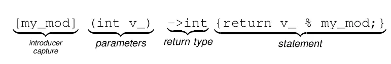

# C++ 람다 표현식 - lambda



## 기본 문법

- \[] : 개시자 (외부 변수 캡쳐 가능)
- () : 매개변수 선언 (생략 가능 매개변수 필요 없을때)
- ->: 반환 타입
- {} : 함수 동작
- () : 함수 호출시 인자 (생략 가능 - 호출 시에만 사용)

```cpp
[](int a, int b)
{
	cout << "sum2 lambda : " << a + b << endl;
}
(30, 40);
```
## 문법 유형

람다 표현식 생성. **함수를 만들기만 한 것**  
\[](int a, intb) {return a + b};  
  
람다 표현식 사용. **함수를 만들고 호출한 것**  
\[](int a, intb) {return a + b} (10, 20);

매개변수 **없는** 람다 표현식 : \[] { cout << " 인자 없음 " << endl; };  
매개변수 **있는** 람다 표현식 : \[] (int a, int b, int c) { cout << a << b << c << endl; };  
매개변수 **없고** 반환 **있는** 람다 : \[] { return 200; };  
매개변수 **있고** 반환 **있는** 람다 : \[] (int a, int b) { return a * b; } ;  

## 캡쳐 사용법

캡처는 **외부**에 정의 되어있는 **변수**나 **상수**를 **람다 내부**에서 **사용**하기 위해 쓴다.  
*매개변수가 있긴 하지만 모든 변수, 상수를 매개변수로 전달 할 수도 없으며 제약이 있는 경우도 있기 때문에.*

**\[result1, result2\]**: 변수 result1, result2를 **복사**해서 람다 함수 내부에서 사용  
**\[&result1, &result2]**:변수 result1, result2 를 **참조**해서 람다 함수 내부에서 사용  
**\[result3, &result4]**: 변수 result3은 **복사** result4는 **참조**해서 람다 함수 내부에서 사용  
**\[=]**: 모든 외부 변수 **복사**해서 람다 함수 내부에서 사용  
**\[&]**: 모든 외부 변수 **참조**해서 람다 함수 내부에서 사용   
**\[&, result3]**: 모든 외부 변수를 **참조**로 사용하지만, **result3만 복사**로 사용  
**\[=, &result3]**: 모든 외부 변수 를 **복사**로 사용하지만, **result3만 참조**로 사용  


## 람다와 auto

람다 함수의 정의를 우리는 auto를 이용해서 특정 변수에 넣어둘 수 있습니다.
```cpp
auto func1 = [] (int a, int b) { return a * b };              #람다 함수 저장
cout << "func1(2, 10) : " << func1(2, 10) << endl << endl;    #람다 함수 사용
```

## 람다의 쓰임

함수에서 매개변수로 함수를 넘겨주는 경우가 있습니다. 
이럴때 이번 한번 사용하고 버리는 1회성 함수가 필요할 때 사용합니다.

정렬을 위해 3번째인자를 함수로 받은 모습.
```cpp
sort(arr3.begin(), arr3.end(), [](int a, int b) {return a > b; });
```