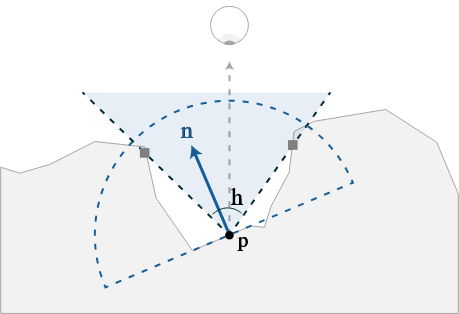

[A Comparative Study of Screen-Space Ambient Occlusion Methods](https://frederikaalund.com/a-comparative-study-of-screen-space-ambient-occlusion-methods/)

---

## Ambient Occlusion
기준이 되는 점에서 노멀 방향으로 반원을 그려 광선을 쏴 차폐되는 정도와 거리를 계산한다. 이 때문에 연산 비용이 커 최적화가 중요한 게임에서는 쓰기 힘들다. 그래서 나온 것이 SSAO다.

## SSAO
SSAO는 [Deferred Rendering](../../Game/game-optimization-02/main.md#deferred-rendering)의 G-buffer 단계에서 depth-buffer로 연산되기 때문에 씬의 복잡도에서 자유롭다.

### Unreal Engine 4
샘플을 단일 점으로 쓰지 않고, 두 점을 한 쌍으로 연산한다. 샘플을 실제 표면에 투영하여 기준 점에서부터 두 벡터의 각도를 계산한다.
적은 수의 샘플로 좋은 AO를 얻을 수 있다.
