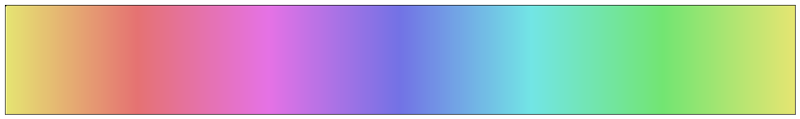
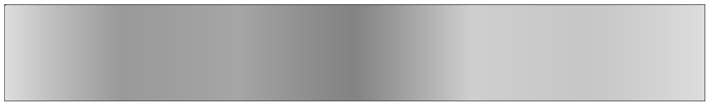
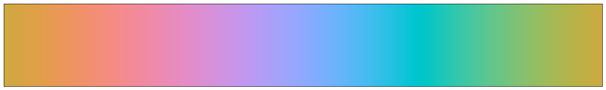
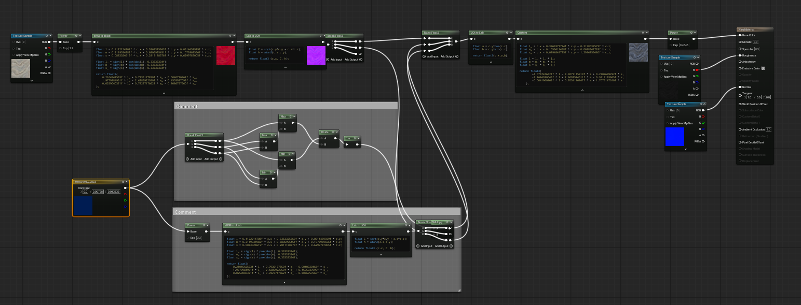
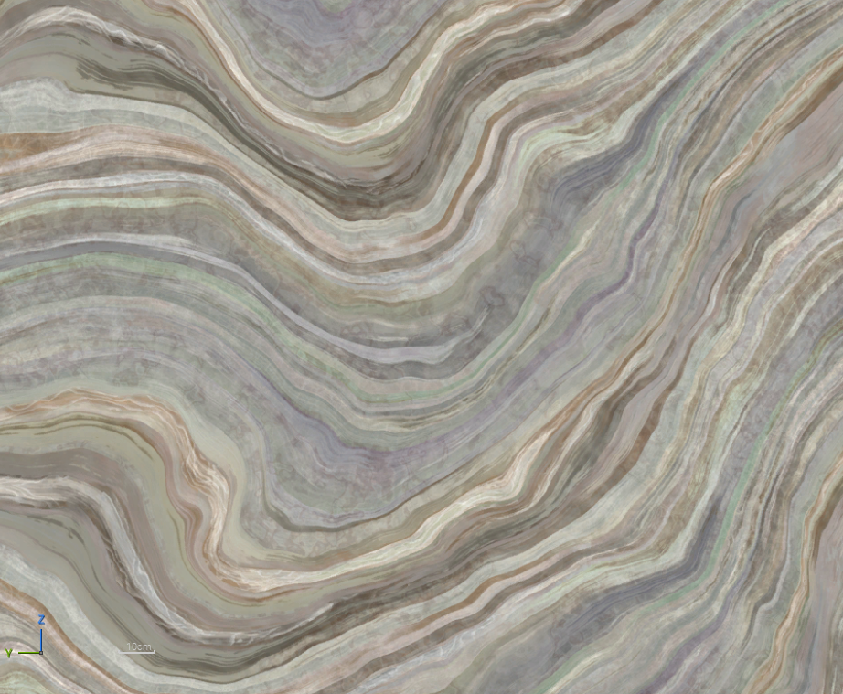
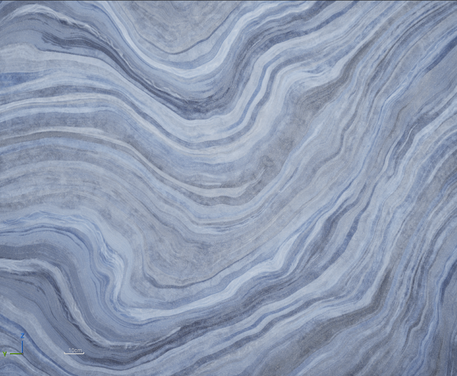
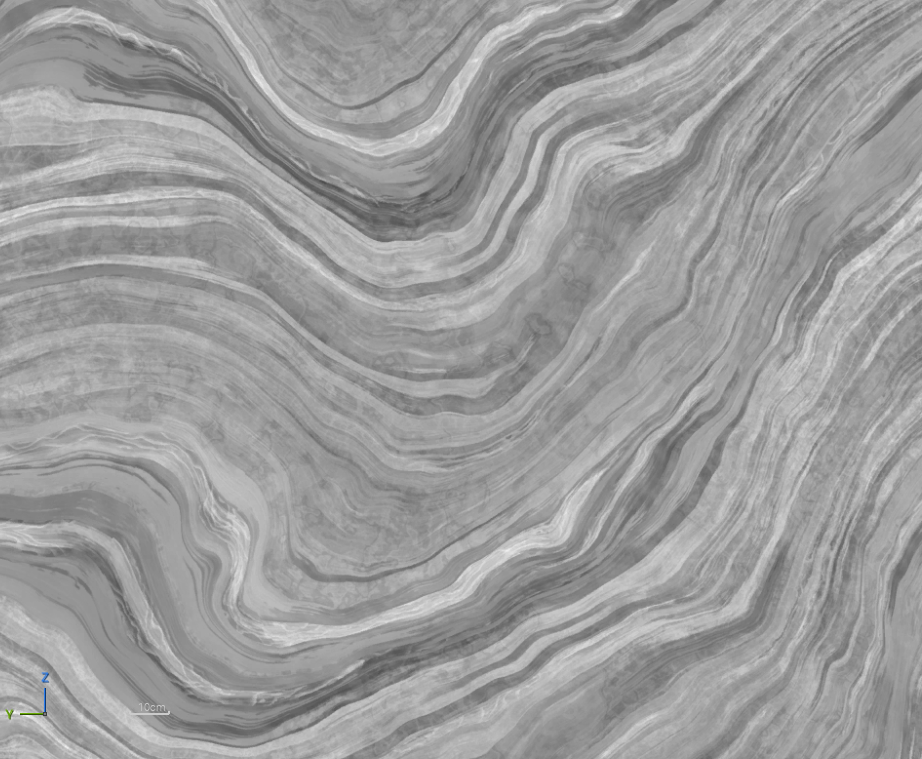
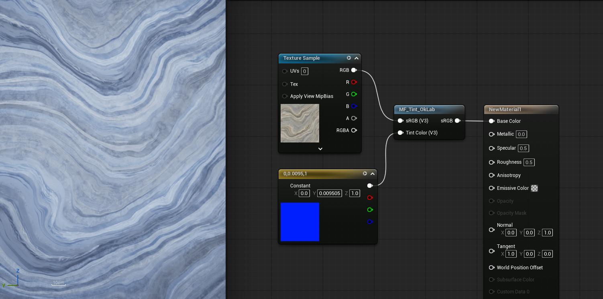

https://bottosson.github.io/posts/oklab/

---

## Perceptually uniform color

$HSV$, $RGB$ 같은 기존의 색공간은 밝기를 유지한 채 색상을 바꾸는 것이 어렵고 인간의 시각과 거리감이 있는 그라데이션을 가진다.
$Lab$(CIELAB)은 이러한 문제점을 개선하여 만들어진 색공간이다.

gradient로 보면 색공간의 밝기 처리가 확연하게 차이 난다.
**RGB gradient**


**OKLab gradient**


## $OKLab$, $OKLCh$

기존의 $Lab$의 단점을 보완하여 나온 것이 $OKLab$이다.

- $L$ = 지각적 밝기
- $a$ = 초록/빨강 축
- $b$ = 파랑/노랑 축

Lab는 바로 사용할 수도 있지만 a, b와 같은 축을 사람이 조절하기에는 어려움이 있기 때문에 사용하기 편리하게 치환하는 $LCh$가 필요하다.

- $L$ = 지각적 밝기
- $C$ = 채도
- $h$ = 색상

### $Lab$ $\rightarrow$ $LCh$

$C = \sqrt{a^2+b^2}$
$h = atan2(b,a)$


### $Lch$ $\rightarrow$ $Lab$


$a = Ccos(h)$
$b = Csin(h)$


## Implementation to Unreal


$RGB$ $\rightarrow$ $Linear$ $\rightarrow$ $Lab$ $\rightarrow$ **색조정** $\rightarrow$ $LCh$ $\rightarrow$ $Lab$ $\rightarrow$ $Linear$ $\rightarrow$ $RGB$

### $RGBs$ $\rightarrow$ $Lab$ $\rightarrow$ $RGBs$
```
float3 linear_srgb_to_oklab(float3 c)                      
  {                                                                                                  
      float l = 0.4122214708f * c.r + 0.5363325363f * c.g + 0.0514459929f * c.b;
      float m = 0.2119034982f * c.r + 0.6806995451f * c.g + 0.1073969566f * c.b;
      float s = 0.0883024619f * c.r + 0.2817188376f * c.g + 0.6299787005f * c.b;                       
   
      float l_ = pow(abs(l), 1.0f / 3.0f);                                                             
      float m_ = pow(abs(m), 1.0f / 3.0f);     
      float s_ = pow(abs(s), 1.0f / 3.0f);

      return float3(
          0.2104542553f * l_ + 0.7936177850f * m_ - 0.0040720468f * s_,
          1.9779984951f * l_ - 2.4285922050f * m_ + 0.4505937099f * s_,
          0.0259040371f * l_ + 0.7827717662f * m_ - 0.8086757660f * s_
      );
  }

  float3 oklab_to_linear_srgb(float3 c)
  {
      float l_ = c.x + 0.3963377774f * c.y + 0.2158037573f * c.z;
      float m_ = c.x - 0.1055613458f * c.y - 0.0638541728f * c.z;
      float s_ = c.x - 0.0894841775f * c.y - 1.2914855480f * c.z;

      float l = l_ * l_ * l_;
      float m = m_ * m_ * m_;
      float s = s_ * s_ * s_;

      return float3(
          +4.0767416621f * l - 3.3077115913f * m + 0.2309699292f * s,
          -1.2684380046f * l + 2.6097574011f * m - 0.3413193965f * s,
          -0.0041960863f * l - 0.7034186147f * m + 1.7076147010f * s
      );
  }
```

### Unreal
**Unreal**에서는 $Lab, LCh$을 통해서 **Tint color**를 크게 개선할 수 있다.
일단은 확인을 위해서 Custom 노드에 하드 코드를 적용시켜 보았다.
중간의 노드들은 TintColor의 채도를 구해 $LCh$의 chroma에 적용시켜 주는 수식이다.

$
C = 1 - Min(R,G,B)/Max(R,G,B)
$


명도의 차이가 거의 없이 Tint color가 적용된 모습.
 | |
--- | --- |
 |  |

## Result

