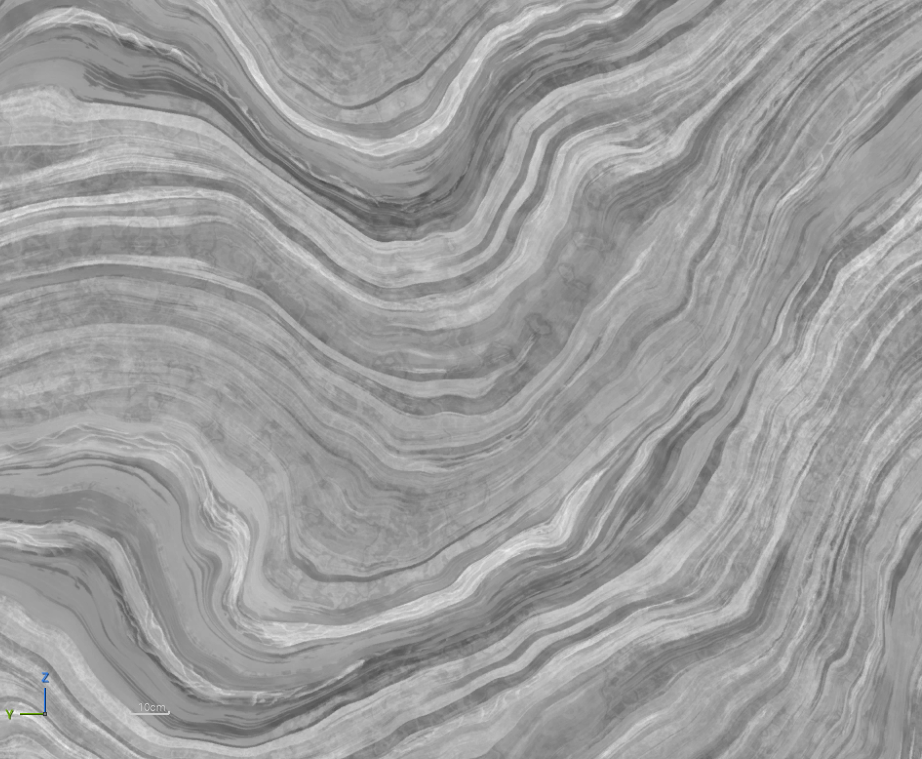

[All Shaders get Color Wrong](https://www.youtube.com/watch?v=Y2Rv6GPG_NQ)
[Here's Bjorn's blog](https://bottosson.github.io/posts/oklab/)

---

## Oklab ?

OKlab은 Björn Ottosson 이 발표한 색 공간 개념으로 단순한 물리적 수치를 보다 인간의 눈이 색을 어떻게 구분하고 느끼는지를 기준으로 설계된 색 공간이다.

- $L$ - 인지된 밝기
- $a$ - 초록/빨강 축
- $b$ - 파랑/노랑 축

$Lab$ 는 $LCh$ 로 표현될 수 도 있다.

- $L$ - 인지된 밝기
- $C$ - 채도 $(chroma)$
- $h$ - 색상 $(hue)$

### 수식
$Lab$ $\rightarrow$ $LCh$
>$C$ = $\sqrt{a^2 + b^2}, h = atan2(b,a)$

$LCh$ $\rightarrow$ $Lab$
>$a = Ccos(h), b=Csin(h)$


## HSV와 비교

두 그라디언트를 비교하면 Oklab이 조금 더 밝기 측에서 고른 그라디언트를 가진 것을 볼 수 있다. 반면 HSV는 yellow 와 cyan 에서 비교적 밝은 밝기를 보인다.

OkLab gradient

HSV gradient 

HSV gradient - lightness


## Implement

linear sRGB 를 Oklab으로 변환하고 돌아가는 HLSL 코드이다. [위의 설명](#수식)으로 따르면 $sRGB$ 를 $LCh$ 까지 변환 가능하다.
>C++버전은 [원본](https://bottosson.github.io/posts/oklab/#converting-from-linear-srgb-to-oklab) 참조

```HLSL
float3 linear_srgb_to_oklab(float3 c) 
{
    float l = 0.4122214708f * c.x + 0.5363325363f * c.y + 0.0514459929f * c.z;
    float m = 0.2119034982f * c.x + 0.6806995451f * c.y + 0.1073969566f * c.z;
    float s = 0.0883024619f * c.x + 0.2817188376f * c.y + 0.6299787005f * c.z;

    float l_ = sign(l) * pow(abs(l), 0.33333334f);
    float m_ = sign(m) * pow(abs(m), 0.33333334f);
    float s_ = sign(s) * pow(abs(s), 0.33333334f);

    return float3(
        0.2104542553f * l_ + 0.7936177850f * m_ - 0.0040720468f * s_,
        1.9779984951f * l_ - 2.4285922050f * m_ + 0.4505937099f * s_,
        0.0259040371f * l_ + 0.7827717662f * m_ - 0.8086757660f * s_
    );
}

float3 oklab_to_linear_srgb(float3 c) 
{
    float l_ = c.x + 0.3963377774f * c.y + 0.2158037573f * c.z;
    float m_ = c.x - 0.1055613458f * c.y - 0.0638541728f * c.z;
    float s_ = c.x - 0.0894841775f * c.y - 1.2914855480f * c.z;

    float l = l_ * l_ * l_;
    float m = m_ * m_ * m_;
    float s = s_ * s_ * s_;

    return float3(
        +4.0767416621f * l - 3.3077115913f * m + 0.2309699292f * s,
        -1.2684380046f * l + 2.6097574011f * m - 0.3413193965f * s,
        -0.0041960863f * l - 0.7034186147f * m + 1.7076147010f * s
    );
}

```
### Unreal 에서의 응용

기존의 Multiply 방식은 명도에 상관 없이 색상을 곱하기 때문에 어두워지거나 밝게 타는 부정확성을 지닌다. OkLab은 명도를 최대한 유지하면서 올바른 Tint 컬러를 적용시킬 수 있게 해준다.
 |  |
--- | --- |
 |  |
original | OkLab Tint |

```
sRGB -> Lab -> LCh -> tint 조절 -> LCh -> sRGB
```


OkLab 중간에 tint 의 Saturate 값과 기존의 chroma 값을 곱해서 채도를 구한다. 색상의 채도(saturate)를 구하는 방식은 아래와 같다.

$S = \dfrac{Max-Min}{Max}$

$Min = Min(R,G,B), Max = Max(R,G,B)$

## Result
Material Function으로 만들어 놓고 쓰면 좋을 것 같다.
