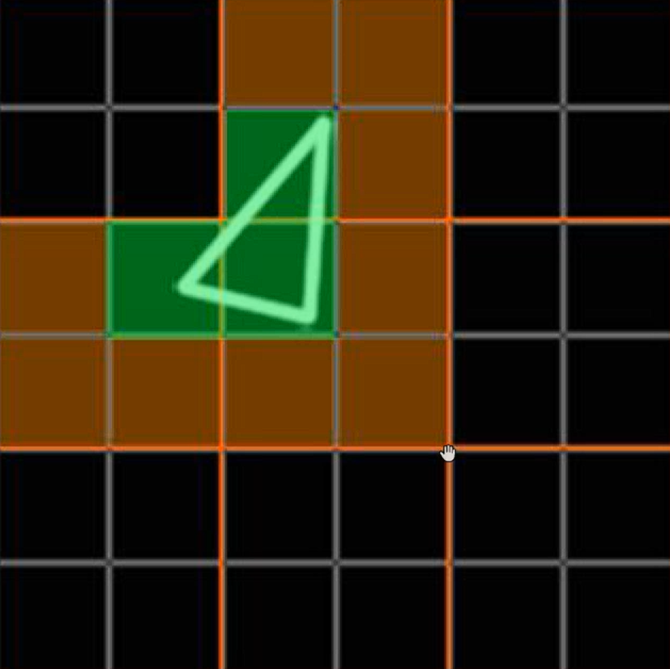
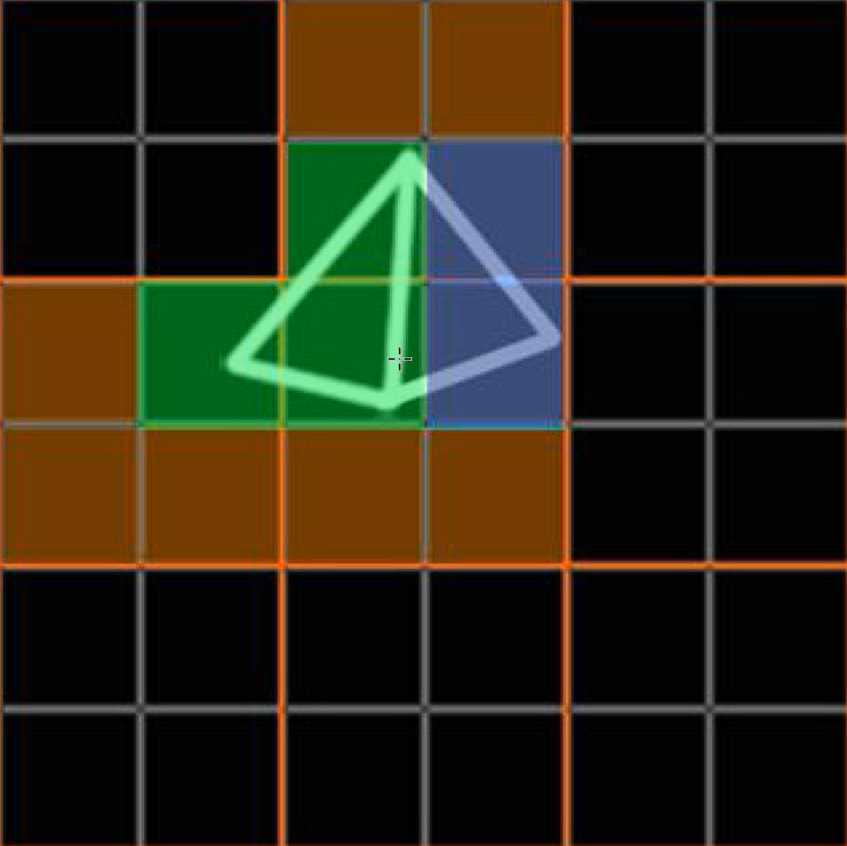
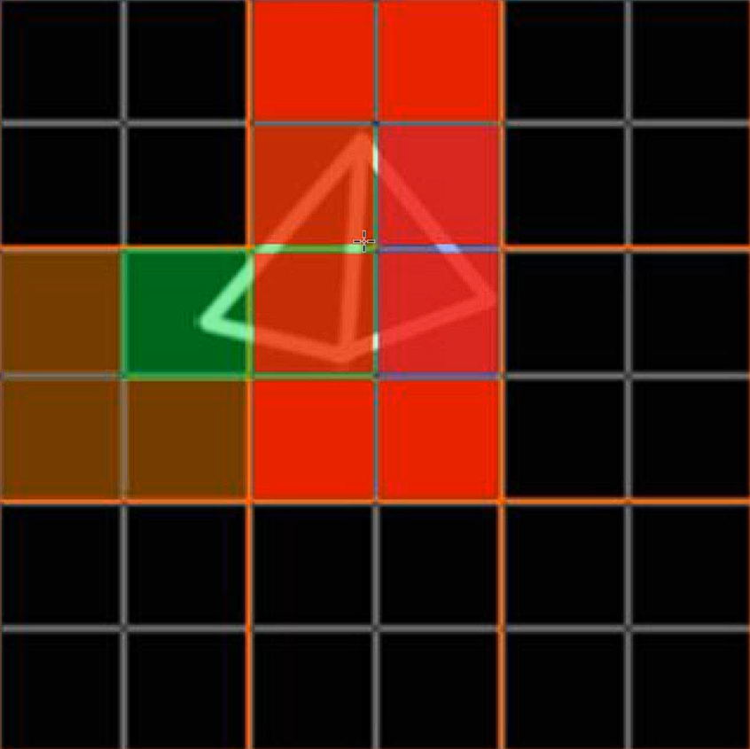
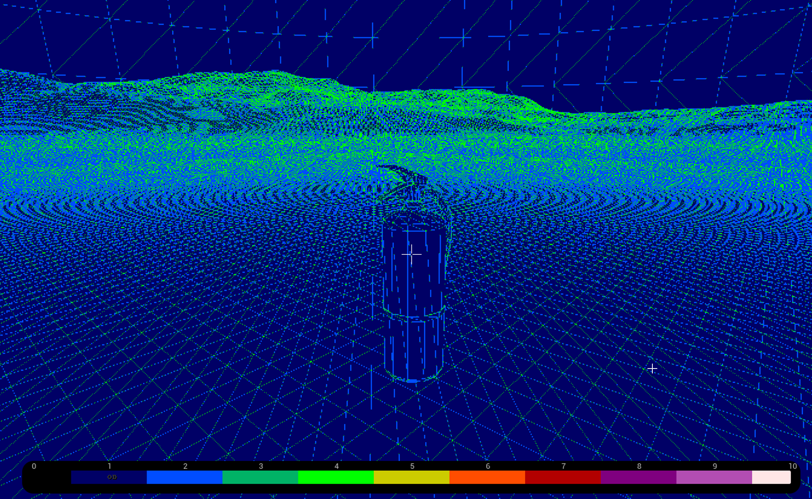
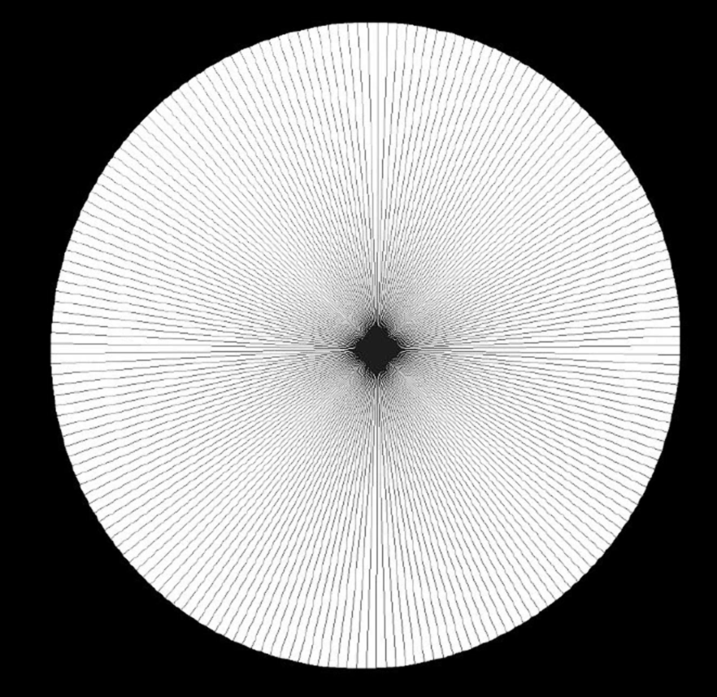

[Rasterization, Overshading, and the GBuffer](https://dev.epicgames.com/community/learning/courses/EGR/unreal-engine-an-in-depth-look-at-real-time-rendering/aPo/rasterization-overshading-and-the-gbuffer)

---

## Overshading
### Rasterizing

- 픽셀 그리드로 버텍스 정보를 렌더링 하는것
- 1개의 픽셀에는 **무조건 1개의 polygon만 존재 한다.**
- 100,000개의 폴리곤이 아주 멀리 있어 1픽셀 만큼의 크기로 보인다면 그 1픽셀엔 1개의 폴리곤만 렌더된다.

하드웨어는 렌더할때 항상 2x2 픽셀 쿼드 가 사용 된다. 아주 작은 1픽셀 짜리 오브젝트를 렌더링 한다고 해도 4개의 픽셀이 그룹으로 연산된다.
초록색 - 폴리곤 영역
주황색 - 연산되는 픽셀


이와 같은 원리로 근접한 폴리곤 에서 overshading이 발생 한다.
|
--- | --- |
추가 폴리곤 영역 | 빨간부분 - overshading |

## Visualize
```
view mode - OptimizationViewMode - Quad Overdraw
```
폴리곤이 작게 몰려있는 픽셀에서 overshading 이 많이 발생 한다.


1. 밀도가 높은 곳이 높은 비용을 가진다.
2. 거리가 멀어지면 밀도가 높아진다.
3. 아주 얇거나 작은 트라이 폴리곤은 overshading을 유발한다.

3번의 이유로 이러한 폴리곤을 가진 모델링은 좋지 않다.
