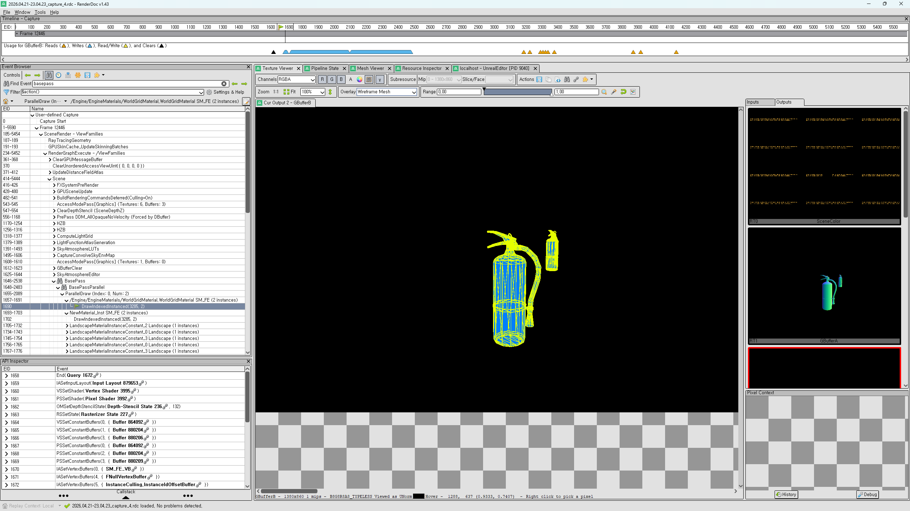

[아티스트를 위한 프로파일링](https://www.youtube.com/watch?v=EF0YpKHfbAw&t=473s)

---

RenderDoc 은 렌더뷰를 캡쳐해 화면에 그려지기 까지의 그 과정을 볼 수 있는 profiling 툴이다.


렌더링 패스를 크게 나누면 이와 같다.


### 설치

[RenderDoc 설치](https://renderdoc.org/builds)
```
plugin setting - RenderDoc 체크
project setting - RenderDoc - auto attached 체크
```
