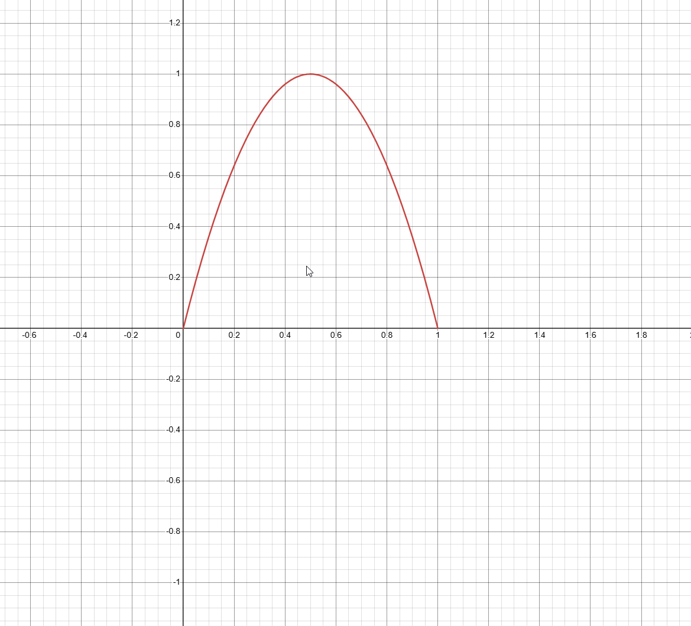
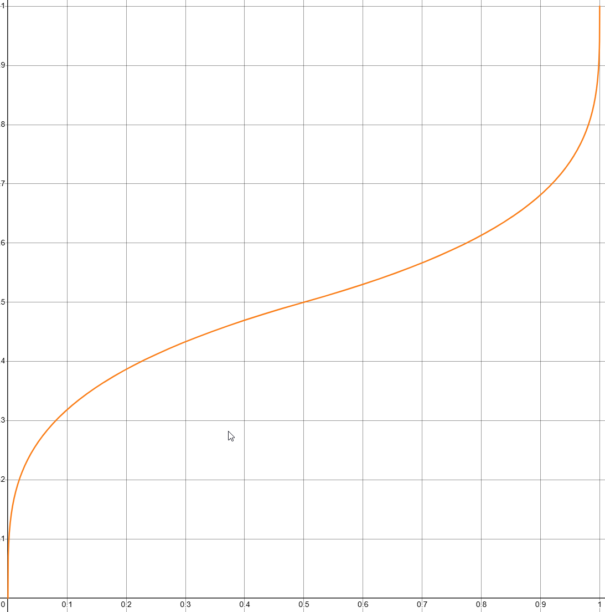
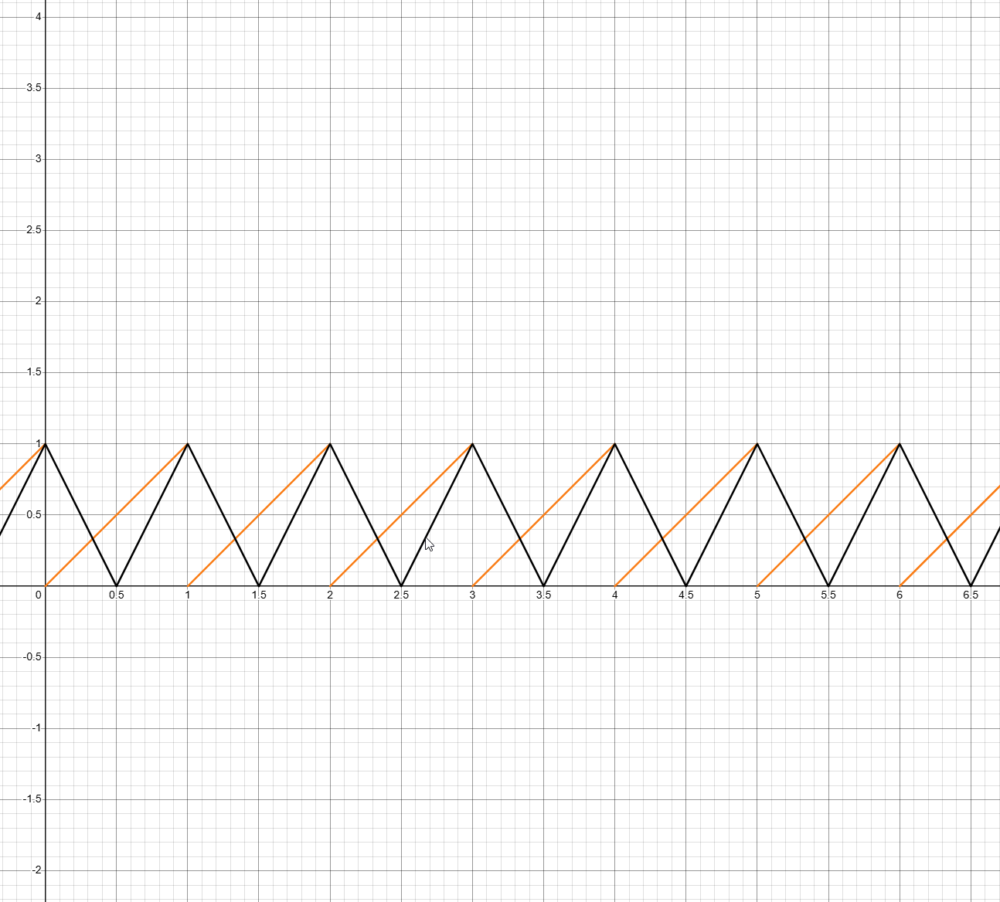
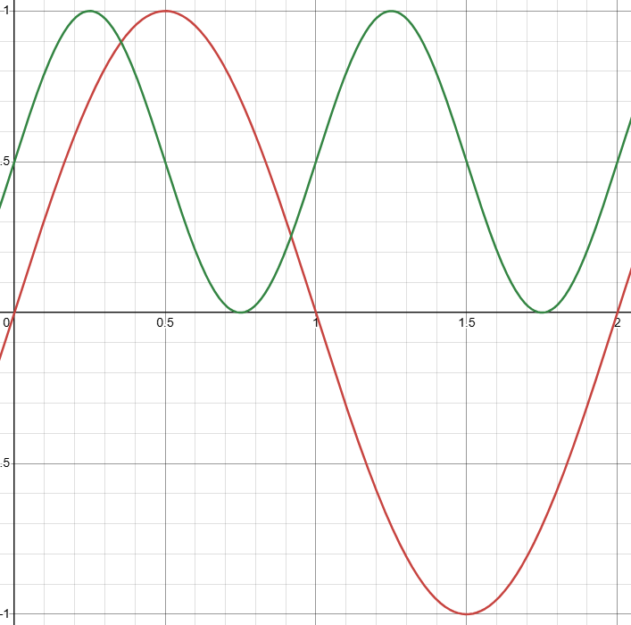
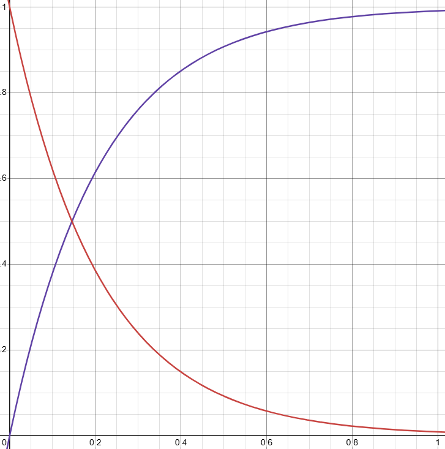

입력값 $t \in [0, 1]$을 원하는 곡선 형태로 변환하는 함수들.

## Smoothstep

$$
S(t) = 3t^2 - 2t^3
$$

양 끝에서 $S'(0) = S'(1) = 0$이라 연결이 자연스럽다. 가장 많이 쓰이는 shaping function.

Smoother step (Ken Perlin):

$$
S(t) = 6t^5 - 15t^4 + 10t^3
$$

2차 미분까지 0이라 더 부드럽다.

```hlsl
float t = saturate(t); // 0~1 클램프
float smooth  = t * t * (3.0 - 2.0 * t);
float smoother = t * t * t * (t * (t * 6.0 - 15.0) + 10.0);
```

## Power (Bias)

$$
f(t) = t^n
$$

- $n < 1$: 초반에 빠르고 후반에 느림
- $n = 1$: 선형
- $n > 1$: 초반에 느리고 후반에 빠름

```hlsl
float f = pow(t, n);
```
---
## Parabola

$$
f(t) = \left(4t(1-t)\right)^n
$$

$t = 0$과 $t = 1$에서 $0$, $t = 0.5$에서 최대값 $1$. 펄스나 bump 형태를 만들 때 유용.

```hlsl
float f = pow(4.0 * t * (1.0 - t), n);
```
---
## Gain

$$
g(t, k) =
\begin{cases}
\dfrac{f(2t,\, k)}{2} & t < 0.5 \\[6pt]
1 - \dfrac{f(2 - 2t,\, k)}{2} & t \geq 0.5
\end{cases}
, \quad f(t, k) = t^k
$$

$t = 0.5$를 기준으로 대칭인 S자 곡선. $k > 1$이면 중간이 급해지고, $k < 1$이면 중간이 평탄해진다.

```hlsl
float gain(float t, float k)
{
    float a = 0.5 * pow(2.0 * (t < 0.5 ? t : 1.0 - t), k);
    return t < 0.5 ? a : 1.0 - a;
}
```
---
## Triangle / Sawtooth Wave

Sawtooth:

$$
f(t) = \text{frac}(t \cdot n)
$$

Triangle:

$$
f(t) = \left| 2\,\text{frac}(t \cdot n) - 1 \right|
$$

반복 패턴 생성에 사용.

```hlsl
float sawtooth = frac(t * freq);
float triangle = abs(frac(t * freq) * 2.0 - 1.0);
```
---
## Sine-based

$$
f(t) = \sin(\pi t)
$$

높이를 $[0, 1]$ 범위로:

$$
f(t) = \frac{\sin(2\pi t) + 1}{2}
$$

```hlsl
float bell       = sin(t * 3.14159265);
float oscillation = (sin(t * 6.28318530) + 1.0) * 0.5;
```
---
## Exponential

감쇠:

$$
f(t) = e^{-kt}
$$

점근 상승:

$$
f(t) = 1 - e^{-kt}
$$

$k$가 클수록 변화가 빠르다. 스프링, 물리 기반 이징에 자주 쓰임.

```hlsl
float decay = exp(-k * t);
float rise  = 1.0 - exp(-k * t);
```

>[!note]
>$e$는 자연상수($\approx 2.71828$)로, $\frac{d}{dt}e^t = e^t$인(미분해도 자기 자신인) 유일한 함수다. 변화율이 현재 값에 비례하는 현상을 자연스럽게 표현한다.
