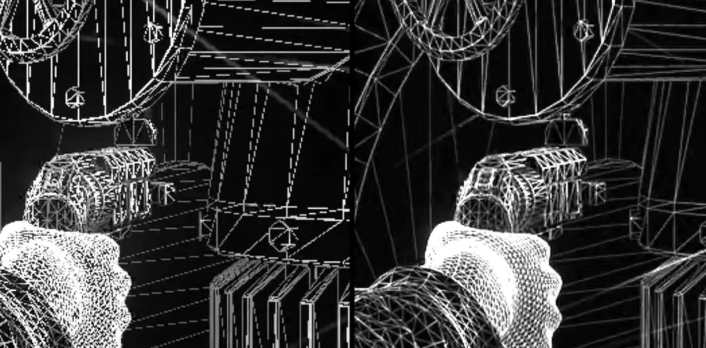
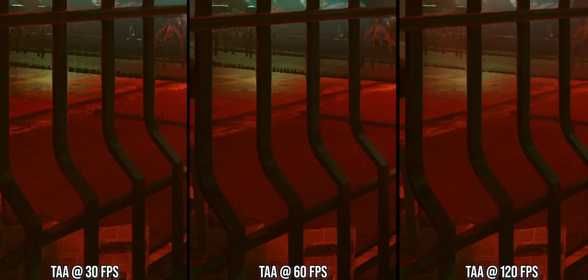
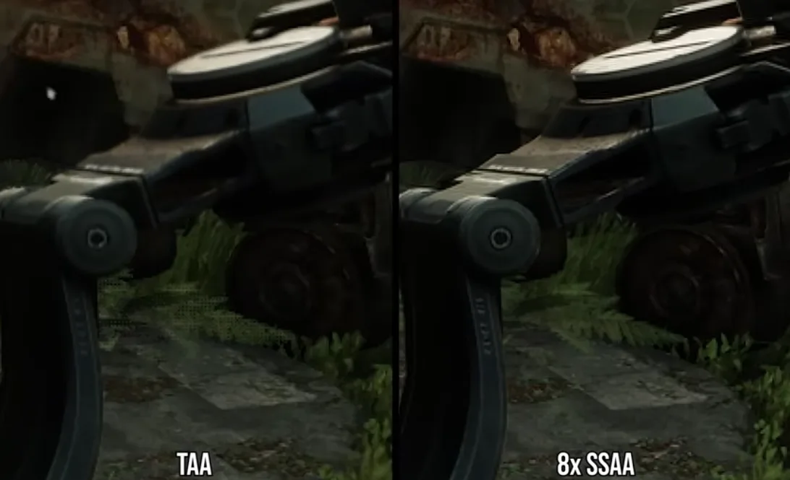
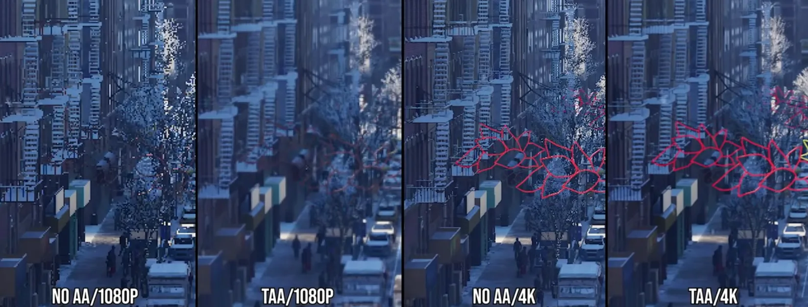
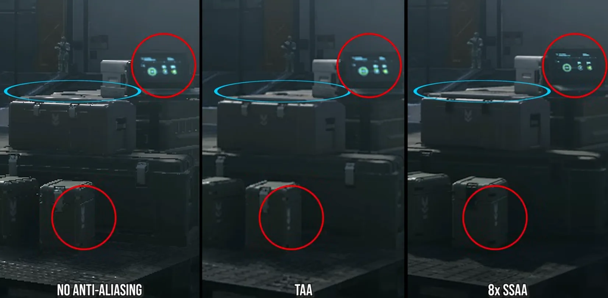

[Tech Focus: TAA - Blessing Or Curse? Temporal Anti-Aliasing Deep Dive](https://www.youtube.com/watch?v=WG8w9Yg5B3g)

---

## Super Sample AA (SSAA)
더 높은 해상도의 이미지를 현재 해상도로 압축 하는 방식
- 해상도를 배로 늘리기 때문에 FPS 차이가 심하다.

## Multi-Sample AA (MSAA)
Forward Rendering 방식에서 기하학적 가장자리(폴리곤 엣지) 부분만 처리 하여 SSAA 의 절충안으로 사용 되었다.

- 현대의 deferred rendering 에서는 호환 되지 않는다.
- 비에 젖거나 메탈 같은 특정한 쉐이딩에는 효과가 적다.

## Fast Approximate AA/Subpixel Morphological AA (FXAA/SMAA)
Deferred rendering 에 맞춰 개발된 포스트 프로세싱 단계의 안티 에일리어싱. 렌더된 씬에서 엣지를 찾아 적용하는 방식으로 속도가 빠르다.
- 화면이 움직일때는 가장자리를 잘 찾지 못한다.


## Temporal AA (TAA / Temporal Super Sampling AA)
슈퍼 샘플링을 시간축(temporal)으로 보정하여 적용 하는 방식. SSAA 와 유사한 효과를 내기 위해서 이전 프레임의 이미지를 지터링(jittering) 하여 여러 프레임에 걸쳐 픽셀 정보를 축적 한다.
기하학적 요소 뿐만아니라 셰이딩, 반사, 조명등 전반적인 이미지에 효과를 준다. 전통적인 슈퍼 샘플링은 GPU 자원을 막대하게 소모하지만, TAA는 프레임 데이터를 재활용하는 방식이라 성능 비용이 매우 낮다.


### 단점
높은 FPS 에서는 효과가 좋지만 낮은 FPS 에서는 고스팅 현상 및 지터링 오류가 쉽게 일어난다.


해상도와 거리에 대한 의존성 - 저해상도로 플레이할 수록 블러링과 고스팅 현상이 심해짐





사용자가 화면에 가까이서 플레이할 경우 알아차리기 쉽다.

## 렌더 파이프라인
```                                                                             
  [1] Vertex Shader                                                                            
         ↓                                                                                     
  [2] Primitive Assembly (삼각형 조립)                                                         
         ↓                                                                                     
  [3] Rasterization  ←─────────── 🔵 MSAA / SSAA 가 여기서 작동                                
         ↓                          (어떤 픽셀/서브픽셀을 덮는지 결정)
  [4] Pixel/Fragment Shader  ←──── 🔵 SSAA N배 실행
         ↓                          (MSAA는 1번만 실행)
  [5] Depth/Stencil Test
         ↓
  [6] Blending → Framebuffer
         ↓
  [7] Resolve (MSAA → 1×)  ←────── 🔵 MSAA 다운샘플
         ↓
  [8] Post-processing  ←────────── 🟢 FXAA / SMAA 1x
         ↓                          🟡 TAA 
  [9] Tone mapping / UI
         ↓
  [10] Present (화면 출력)
```