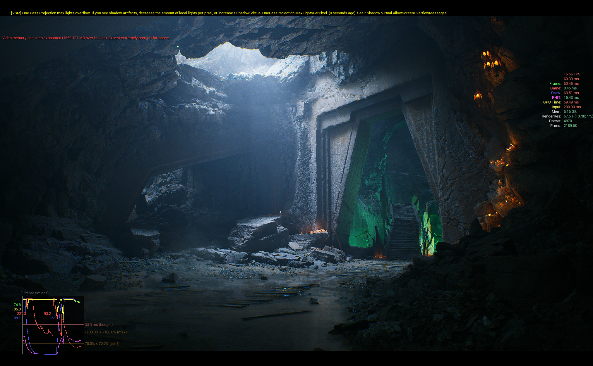

FABs 에 무료로 제공하는 `DarkRuinsMegascansSample` 씬을 최적화 해보자


## Hardware
- AMD Ryzen5 5500 6core
- NVIDIAGTX 1660 Super
- 16GB
Hardware RayTracing을 지원 하지 않기 때문에 씬의 MegaLight는 off, Reflection은 none 로 진행 한다.

일단 로직을 제외한 에셋 최적화를 우선적으로 진행한다.
최적화 이전의 stat
```
FPS: 16.56
Frame: 60.25
Draw: 60.51
GPU Time: 59.49
```

## Profiling

