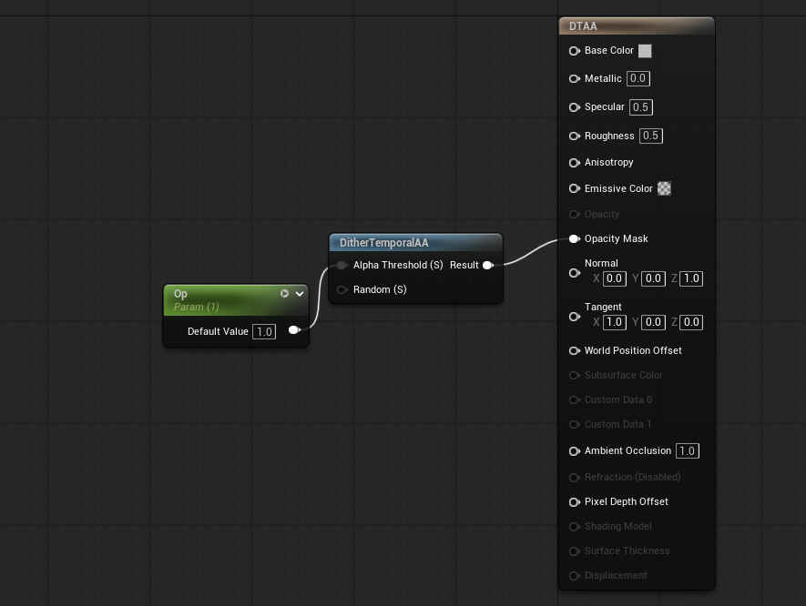

DitherTemporalAA 노드는 픽셀 점묘 패턴을 생성하는 procedural meterial function 이다. **Opaque 나 Masked 같은 불투명 메테리얼을 블렌딩할 때 주로 사용된다.**

DitherTemporalAA 는 **시간적 데이터**를 기반으로 생성되고 패턴은 프레임마다 바뀐다.
- Frame 1 : 점 패턴 생성
- Frame 2 : 패턴 들의 사이 갭을 렌더
- result : 사람 눈에 더 부드럽게 보임 -> **플리커링 현상 없음**


테스트 하는 법
```
Detail -> Blend Node -> Masked
```


### Use case

- LOD 교체시 부드럽게 블렌딩 가능
- PDO 와 조합시 메쉬간의 부드러운 블렌딩 가능 - [참조](../Pixel-Depth-Offset-(PDO)/Pixel-Depth-Offset-(PDO).md)
- foliage 블렌딩.


## Pros & Cons

### Pros
- Translucency 보다 비용이 싸다.
- 순서대로 렌더 되는게 아닌 **depth-buffer을 사용** 하기 때문에 우선순위를 맞출 필요도 없고 플리커링이 생길 일도 없다.

### Cons
- 이전 프레임(시간적 데이터)에 의존하기 때문에, 움직이는 물체 뒤에 **잔상이 남을 수 있다.**
