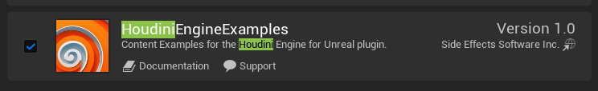

## Houdini Engine install
**HoudiniEngine 폴더를 복사**
Houdini Engine : `C:\Program Files\Side Effects Software\Houdini Engine\Unreal\X.Y.Z`

**언리얼 플러그인 경로에 붙여넣기**
Unreal Plugin : `C:\Program Files\Epic Games\UE_X.Y\Engine\Plugins\Runtime`

>[!note]
>5.7-PCG = 기존의 HDA지원 + PCG 그래프 워크플로우

## HoudiniEngineExamples

1. [HoudiniEngineForUnreal-ContentExamples](https://github.com/sideeffects/HoudiniEngineForUnreal-ContentExamples) zip 다운로드
2. unzip
3. `HoudiniEngineForUnreal-ContentExamples\Plugins\Runtime` HoudiniEngineExample 복사
4. `C:\Program Files\Epic Games\UE_X.Y\Engine\Plugins\Runtime` 또는 개인 프로젝트 `Plugins\Runtime` 에 붙여 넣기
5.`Menu` > `Edit` > `Plugins` > `HoudiniEngineExamples` - 재시작
    
6. `Menu` > `Houdini Engine` > `Browse Contents Examples...`

## Sync
실시간으로 HDA의 수정을 반영 하는 워크플로우
Unreal과 연동된 Houdini 실행
`Menu` > `Houdini Engine` > `Open Houdini Session Sync...`

HDA를 Rebuild 해주면 후디니창에서 해당 HDA를 수정할 수 있고 수정 하면 실시간으로 언리얼에 반영 된다.