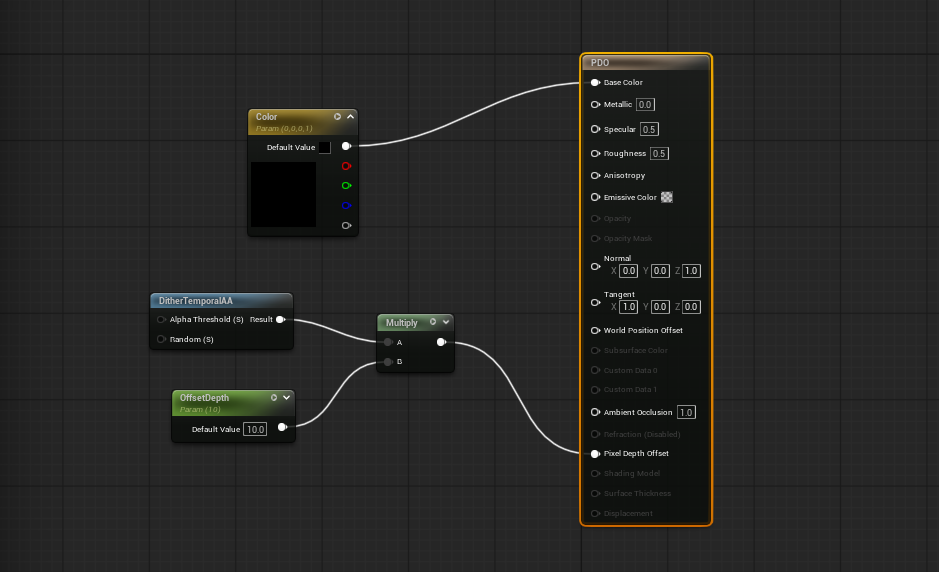

Pixel Depth Offset (PDO) 는 depth buffer 에 적용 되는 픽셀의 Depth 값을 조정하는 속성이다. 쉐이더를 통해서 카메라에 더 가까이 보내거나 더 멀리 보낼 수 있다.

>[!important]
>vertex를 물리적으로 움직이는 WPO 와는 다르게 PDO 는 occlusion과 z-buffer 에 쓰이는 depth data 만 조작한다.

## Use Case

통상적으로 [DitherTemporalAA](../DitherTemporalAA/DitherTemporalAA.md) 노드와 함께 사용하며 겹쳐있는 메쉬를 블렌딩 할때 쓴다.

