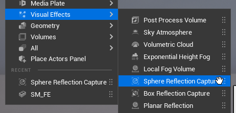
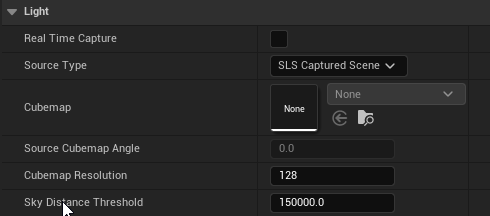

[An In-Depth look at Real-Time Rendering - Reflections](https://dev.epicgames.com/community/learning/courses/EGR/unreal-engine-an-in-depth-look-at-real-time-rendering/rEl/an-in-depth-look-at-real-time-rendering-reflections)

---

## Reflections

- Reflection 은 real-time 으로 렌더링 하기엔 비용이 크다.
- 3가지의 방법이 있으며 장단점이있다.
- 3가지의 방식은 순서차적으로 블렌딩된다.
- Lumen이 켜져 있다면 꺼야 적용 된다.

>[!note]
>PostProcessingVolume, Project Setting 에서 Lumen, SSR, none 을 선택 가능하다. Caputer 기능은 Lumen 환경에선 Lumen 이 오버 라이드 된다.

### Reflection Captures

- 액터 로케이션 기준으로 정적 큐브맵을 캡쳐하여 범위내 오브젝트에 블렌딩 하는 방식
- 여러개 배치 가능
- 매우 빠르다
- 살짝 부정확

```
place actor > Visual Effect > Sphere/Box Reflection Capture
Build > Build Reflections Capture
```

캡쳐 Resolution 설정
```
Project Setting > Reflection Capture Resolution
```

기본적으로 큰 것들을 여러개 배치해 원하는 지역을 덮고 반사성이 높은 객체에 작은 것들을 배치한다.
겹치는 갯수 만큼 블렌딩 연산을 하기 때문에 염두해두고 배치 한다.



### Planar Reflections

- 평면에 캡쳐
- 평면이 아니라면 제한적임
- 무거워질 수 있음
- 비교적 정확함
```
place actor > Visual Effect > planar Reflection Capture
```


### Screen Space Reflections (SSR)
1. 기본 reflection 시스템
2. real-time
3. 정확함
4. 노이즈가 끼고 조금 무겁다.
5. 현재 화면에 렌더링되어있는 것들만 반사한다.


reflection capture는 레벨을 로딩할 때 발생한다. 캡쳐할 것이 많다면 시간이 오래 걸릴 수 있다. - 패키징 하면 문제 해결 된다.


### Skylight

skylight 에도 reflection 캡쳐가 존재한다.

150000 유닛 을 클립 하고 캡쳐 하기때문에 스카이 큐브맵만 캡쳐한다. 오브젝트 주위에 reflection capture 액터가 없다면 skylight의 큐브맵을 reflection으로 사용 하게 된다.