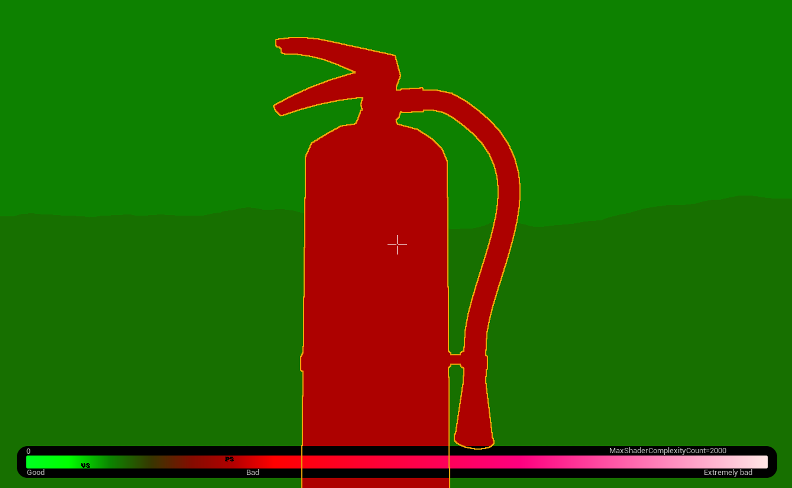
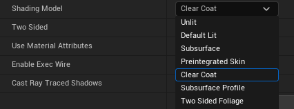
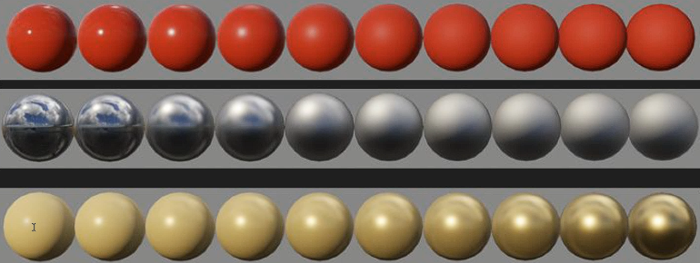
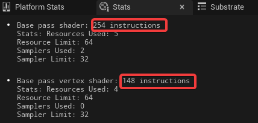

[Shaders and Materials](https://dev.epicgames.com/community/learning/courses/EGR/unreal-engine-an-in-depth-look-at-real-time-rendering/j1v/shaders-and-materials)

---

## Pixel Shaders
- GPU 가 연산
- 픽셀에서 실행 되는 프로그램
- 모든 픽셀에서 연산
- 렌더링의 모든 단계, 모든 부분에 사용됨.
    - material 시스템
    - lighting
    - post process
    - color correction
    - ...
- 쉐이더 언어로 작동됨 - 플랫폼 마다 상이
    - `DirectX` > `HLSL`

Shader Complexity 뷰에서 봤을 때 하단 바를 보면 현재 십자선 을 기준으로 PS(Pixel Shader) VS(Vertex Shader) 의 복잡도를 보여준다.


복잡한 PS는 pixel 단계에서 연산이 되기 때문에 pixel 에 적게 노출 되는, 멀리 있는 오브젝트에 있는 편이 낫다.

### 작동 방식

#### 기존 쉐이더 방식
1. 쉐이더가 작성됨
2. 짜여진 쉐이더 코드에 변수나 텍스쳐가 더 추가됨
3. 모델링에 출력

#### Unreal 에서
1. HLSL 코드가 USF 파일로 저장됨
    - Material Editor의 그래픽 노드 인터페이스 에서 USF 템플릿을 노드로 변한하여 사용함
3. Editor에서 작업된 것들이 컴파일되어 새로운 셰이더로 작성됨
    - 셰이더가 컴파일 되어 Material Instance 를 생성
4. 모델에 적용

Material Editor 에서 작성된 메테리얼 HLSL 확인
```
Window > Shader Code > HLSL Code
```

USF 템플릿 경로 : `C:\Program Files\Epic Games\UE_5.6\Engine\Shaders\Private`

이것들이 전부 제공하는 템플릿이고 사용자가 원하는 쉐이딩 모델 템플릿을 추가 해서 늘릴 수도 있다.


## Materials
머티리얼은 대부분 Physical Based Rendering (PBR) 기반의 통합된 쉐이딩 파이프라인을 가진다.

### 쉐이딩 통합의 이점
1. 단일화로 인한 효율
2. 일관적이고 예측 가능한 파이프 라인 구축 가능.
3. G-buffer 상속에 대한 제약
PBR은 거의 모든 재질이 roughness 와 metalic으로 조절이 가능하다.



stats 창을 보면 shader 가 얼마나 연산하는지 알수 있다 보통 100~300

