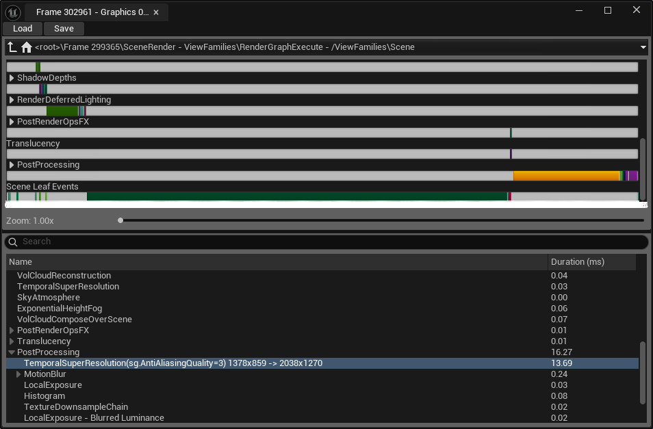

https://dev.epicgames.com/community/learning/courses/EGR/unreal-engine-an-in-depth-look-at-real-time-rendering/JEJ/geometry-rendering-part-1
---

## Draw ?

Draw 는 CPU 가 GPU 에게 특정한 오브젝트를 화면에 렌더 하는것을 명령하고 그리는 것 언리얼은 기본적으로 수많은 렌더 패스를 수행한다. 지오메트리가 아니더라도 하늘, 대기 산란, post-processing, 에디터 UI 등 화면상 렌더되는 것은 전부 포함 된다.


### Draw call ?
CPU가 CPU API 에게 무엇을 어떻게 그릴지 알려주는 것. 각 드로 콜에넌 텍스쳐, 셰이더 및 버퍼 에대 한 정보가 있음. **대부분 draw call 자체 보다는 준비하는 과정에서 리소스가 더 많이 든다.**
또한 드로우콜은 렌더하고 마치면 완료했다고 말하고 다음 명령을 받아야하는 통신 과정이 이루어지기 때문에 단순 크기 보다 그 양이 많을 때 병목 현상이 일어나기 쉽다.
```
1GB 파일 1개
vs
1KB 파일 100만개
```
- 폴리곤 많을 때 : GPU 바쁨
- draw call 많을 때 : CPU bound, GPU 낭비