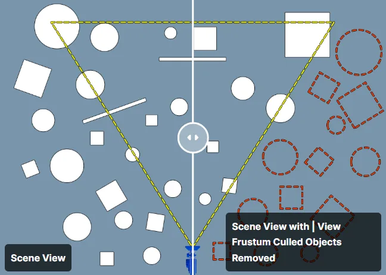
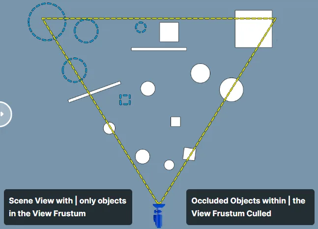
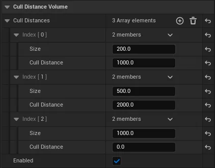
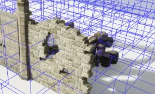

[Unreal Doc - Visibility and Occlusion Culling](https://dev.epicgames.com/documentation/unreal-engine/visibility-and-occlusion-culling-in-unreal-engine#cullingmethods)
[Unreal Doc - Cull Distance](https://dev.epicgames.com/documentation/unreal-engine/cull-distance-volumes-in-unreal-engine)
[Precomputed Visibility Volumes](https://dev.epicgames.com/documentation/unreal-engine/precomputed-visibility-volumes-in-unreal-engine)

---

>[!important]
>Culling은 Rendering 이전에 작동 한다.

보이지 않는 메쉬들을 제외시켜 드로우콜을 낮추는 방법

## Culling Methods

비용이 싼 culling 부터 아래의 순서대로 작동한다.

1. Distance Culling
2. Frustum Culling
3. Precomputed Visibility
4. Nanite Culling
5. Occlusion Culling


## Frunstum, Occlusion

 |  |
--- | --- |
Frustum | Frustum + Occlusion

### 컬링 확인 하는법

```
r.VisualizeOccludedPrimitives 1 
stat initviews
```


## Distance Culling

화면에 1px 정도 차지하는 아주 작은 메쉬라도 엔진은 한번의 드로우 콜을 생성한다. 사실상 육안으로 보이지 않는 부분에서 CPU 비용을 사용 하는 것. Distance Culling 은 이런 것들을 강제적으로 Culling 해주는 기법이다.

### 사용법

```
Volume -> Cull Distance Volume
```

여러 Cull Distance Pair를 만들어 다양한 크기의 오브젝트를 컬링한다.


- 약 200 유닛 오브젝트 + 카메라 거리 1000 유닛 이상 컬링됩니다.
- 약 500 유닛 오브젝트 + 카메라 거리 2000 유닛 이상 컬링됩니다.
- 약 1000 유닛 오브젝트 컬링 X


## Precomputed Visibility Volumes

셀 단위에 가시성 데이터를 저장 하여 플레이어/카메라 의 위치에 따라 셀 안에 있는 오브젝트를 컬링 하는 기법. 매 프레임 계산하는 Occlusion Culling 보다 저렴하다.


가시성 데이터는 **라이팅 빌드**시 저장 된다. 이미 라이팅을 빌드 했다면 따로 빌드 할 수 도 있다.

```
World Settings > Precompute Visibility 체크
Actor > Volume > precompute Visibility volume 배치
build > light

Show > Advanced > Precomputed Visibility 
```

>[!tip]
>r.ShowRelevantPrecomputedVisibilityCells 을 사용하면 카메라 가까이에 있는 셀만 표시된다.
