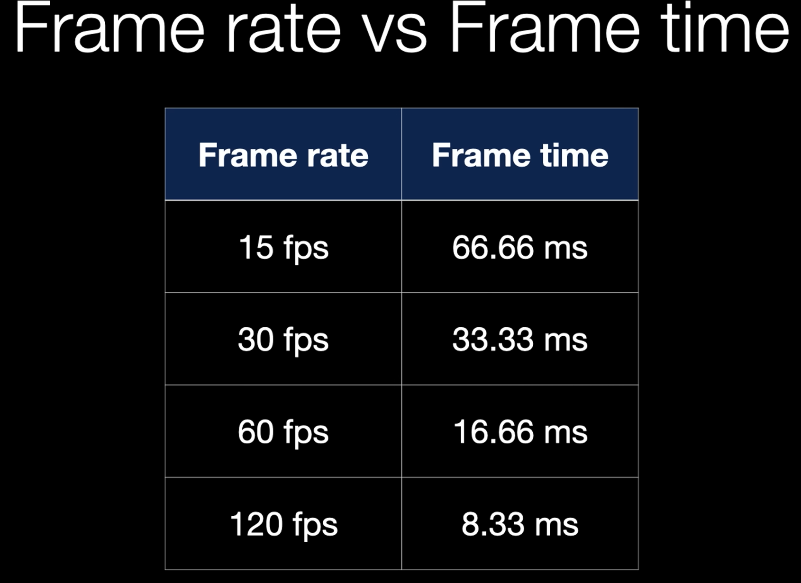
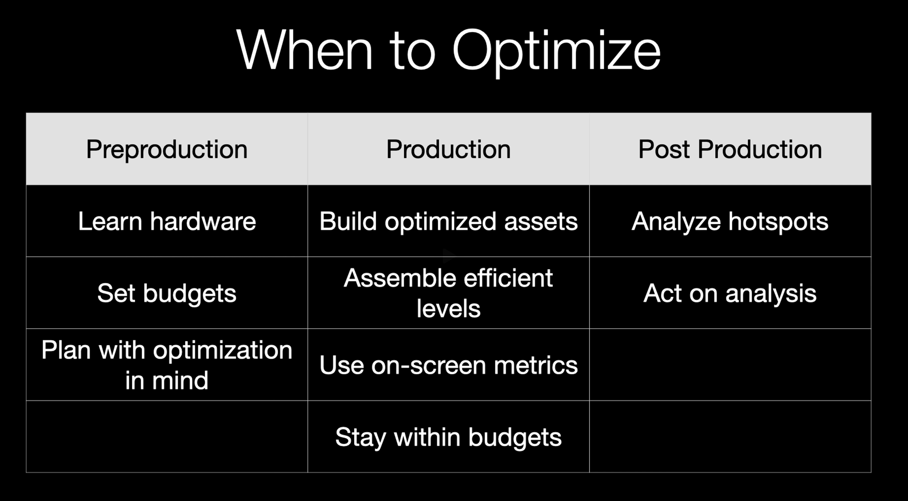

[Game Optimization - Introduction & General Principles - Episode 1](https://www.youtube.com/watch?v=jt8b0cpjUVk&list=PL78XDi0TS4lG4wvgfyGECmB8XiJLCgfFD)

---

최적화는 성능을 측정하는 것에서 부터 시작 한다.

### 최적화에는 크게 두가지가 존재

1. **에셋 단계**에서의 최적화
    - 각 에셋들의 최적화
    - 폴리곤 수, 드로우콜, 텍스쳐 사이즈 등
    - 에셋이 생성 될때
2. **게임, 레벨** 최적화
    - 씬 전체 적인 분석
    - 병목현상 분석
    - 전체적인 성능 향상

최적화는 모든 과정에서 진행 되어야 한다.
