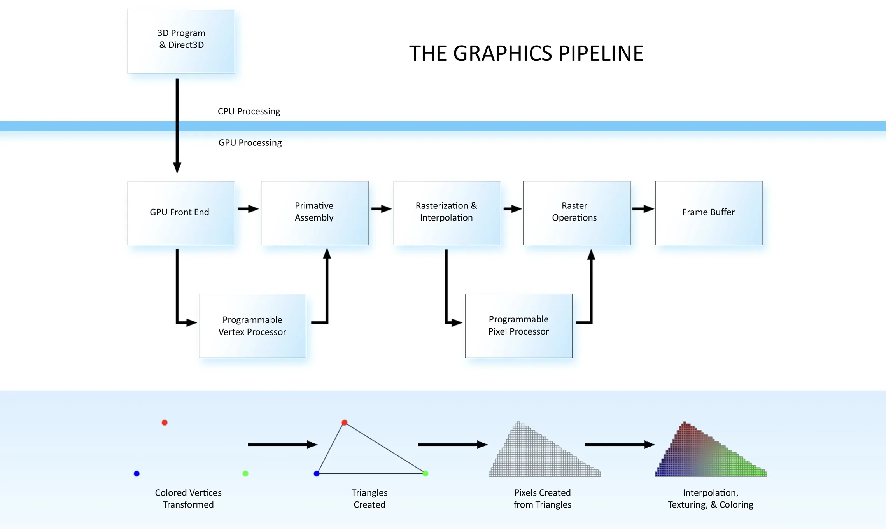
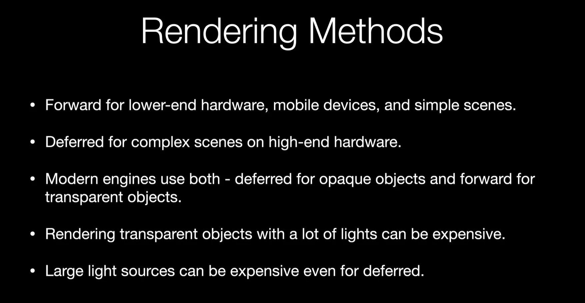
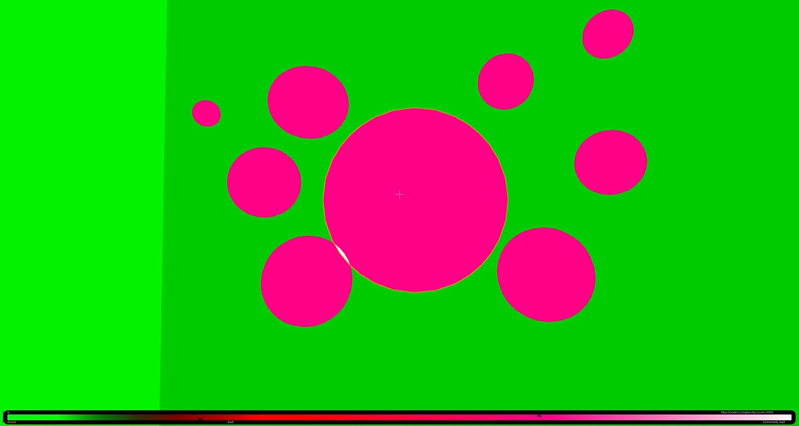

[The Graphics Pipeline and Rendering Types - Game Optimization - Episode 2](https://www.youtube.com/watch?v=27Am6QaH_Hc&list=PL78XDi0TS4lG4wvgfyGECmB8XiJLCgfFD&index=2)

[Forward and Deferred Rendering - Cambridge Computer Science Talks](https://www.youtube.com/watch?v=n5OiqJP2f7w)

[디퍼드 렌더링, 포워드 렌더링이란? 그리고 차이점에 대해서](https://hub1234.tistory.com/50)

[OpenGL - deferred rendering](https://www.youtube.com/watch?v=0ckE-CZpXAo)

---

병목 현상이 일어날 수 있는 단계:

- CPU → GPU
- 많은 vertex → Vertex Shader
- 복잡한 Shader → Pixel Shader

## Rendering Methods

### Forward

- 오브젝트 하나씩 연산
- 오브젝트당 모든 라이트를 연산
- Back to Front rendering - Transparent Surfaces
- 장점
    - 간단한 씬에는 좋음
    - 각 오브젝트당 유니크한 쉐이딩이 가능함 (라이팅을 다 따로 계산 하기 때문에)
    - 텍스처 메모리를 적게씀 (오브젝트는 하나씩 렌더링 되기 때문에)
- 단점
    - 라이트에 대한 비용이 비쌈
    - drawcall = meshes * lights → CPU 에도 부담

불투명 메쉬가 겹치는 방식에 사용되었던 Z-buffer를 더 응용하여 G-buffer를 사용하는 Deferred Rendering 이 나오게됨

### Deferred Rendering

- 모든 오브젝트의 텍스쳐 데이터(normal, worldposition, roughness, metal…)를 한장으로 합친다. - G-buffer
- G-buffer 데이터를 합친 후에 모든 라이트를 한번에 계산한다.
- 장점
    - 라이트가 많아도 렌더링이 빠르다
    - 비주얼적으로 뛰어남
- 단점
    - G-buffer 데이터를 축적해 놔야 하기 때문에 많은 memory 요구
    - No Transparent support
    - 다양한 쉐이더는 문제가 될 수 있다.

엔진에서 Transparent 쉐이더는 라이트 까지 같이 계산 하기 때문에 비교적으로 비싸게 나오지만, 실제론 그렇지 않은 경우가 있다.
