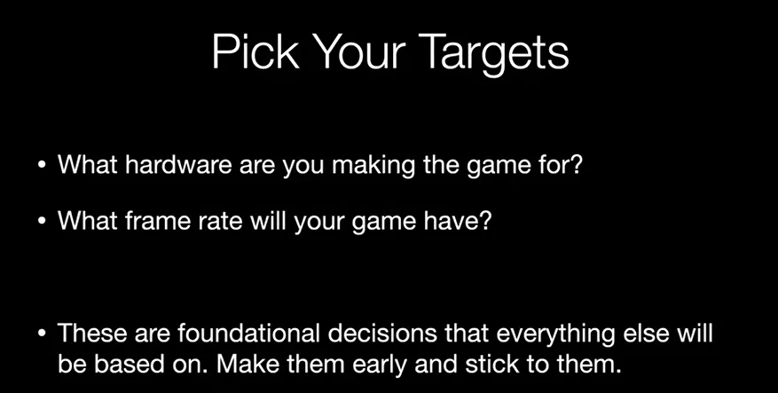
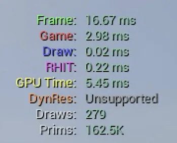

[Preproduction Optimization Steps - Game Optimization - Episode 3](https://www.youtube.com/watch?v=Q05R_UKhRo4&list=PL78XDi0TS4lG4wvgfyGECmB8XiJLCgfFD&index=4)

---



1. 하드웨어의 기준을 정하기
    - 타겟 기기 - 모바일, 콘솔, PC
    - 권장 사양, 최소 사양, 해상도, FPS 등의 기준이 되는 목표를 정하는것
2. 해당 사양의 기기가 어느정도의 퍼포먼스를 내는지 확인
    - Polygon, Drawcall, Memory
3. Budget 내에서 각 파트마다 사용할 수 있는 리소스를 배분
    - UI, 에셋, …
4. 실시간 Budget 추적 하기



## 퍼포먼스 측정

- 에디터 외부에서 측정 하기 (ex. 콘솔)
    - 에디터의 사용량을 제외한 게임 자체의 퍼포먼스를 확인
- 고정된 카메라나 경로를 이용
    - 가장 성능이 저조한 곳에 카메라 설정
    - 측정시 마다 카메라가 조금이라도 흔들린다면, 의도한 값이 왜곡되어 보일 수 있음
- Isolation
    - 환경 에셋을 확인 한다면, FX, PP 전부 off 시킨 상태에서 확인
- 엔진의 프레임률을 고정 하는 설정은 전부 끄기
    - UE - Frame smoothing 끄기
    - Vsync
- Tracking Results
    - 고정된 카메라에서의 초기 퍼포먼스와 실시간 변화율을 추적하기

### Unreal에서
프로젝트 스탯 확인
```
stat Unit graph
```
프로젝트 패키징
```
Platforms -> Window -> Package Project
```
