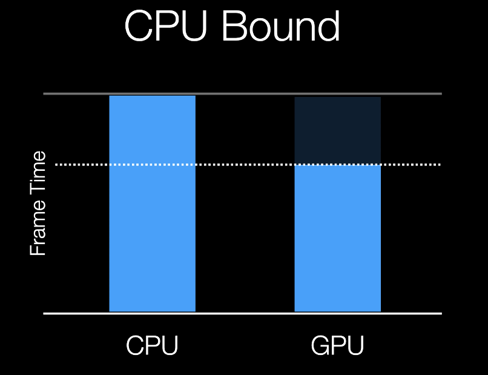
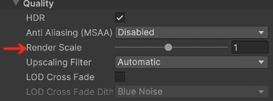
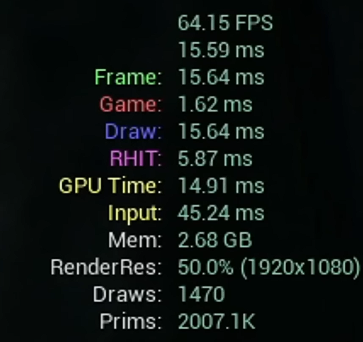
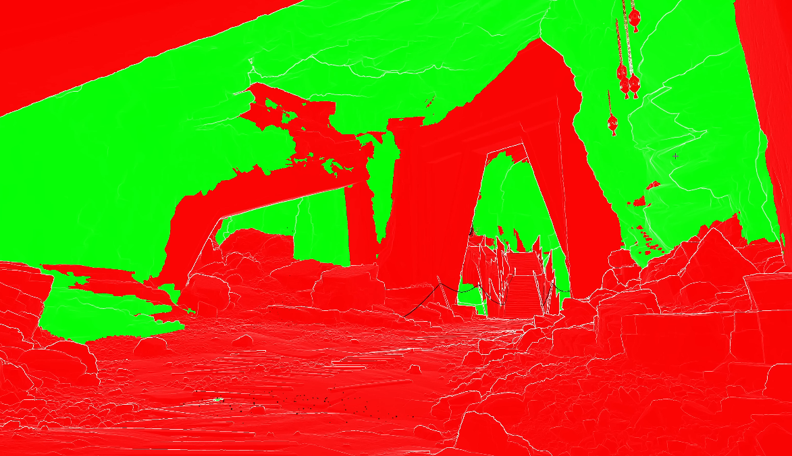
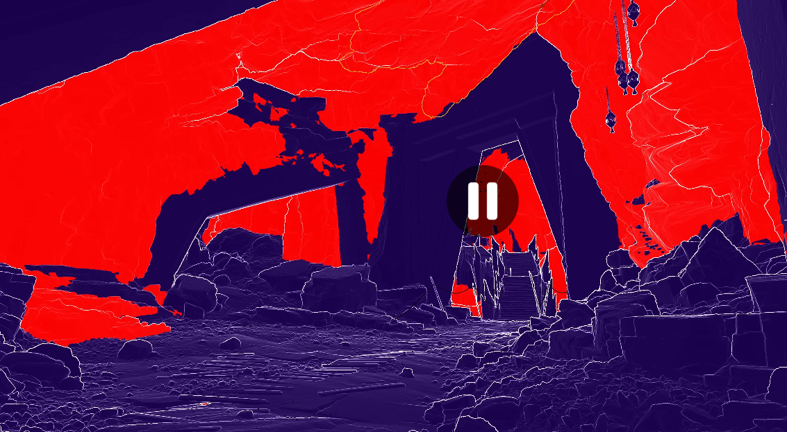
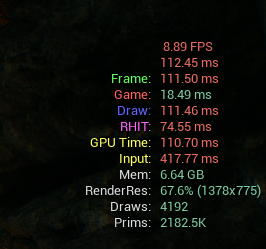
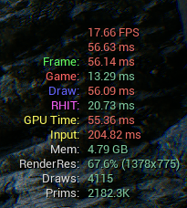
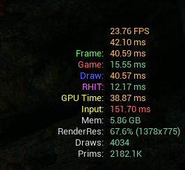

[Game Optimization - Introduction & General Principles - Episode 4](https://www.youtube.com/watch?v=XgaEqRXVmO0)

---

>[!important]
>최적화 이전에 어느 곳에서 문제가 생기는지 파악 하고 분석하는것이 급선무.

**CPU, GPU bound**
- 퍼포먼스의 차이로 한쪽의 프로세서가 다른 한쪽의 진행을 기다리며 나타나는 병목 현상.


GPU bound 확인 법
```
1. editor 밖에서 게임을 실행한다.
2. framerate counter 를 실행
3. 창 해상도를 줄인다.
4. 성능이 향상된다면 GPU bound
```


editor 밖에서 standalone 모드로 실행하는 법
```
툴바에서 Platforms -> Window -> Package Project
```


```
Frame : 전체 프레임 처리 시간.
Game : CPU의 게임 스레드 에서 게임 로직을 처리하는데 걸리는 시간
Draw : CPU 가 GPU로 보낼 Draw call 을 준비하고 처리하는 시간.

GPU Time: GPU 가 실제 화면을 렌더링 하는 시간. 
```

### EvaluateWPO
shader 에서 적용 되는 **World Position Offset**
초록 부분 활성화, 빨간 부분 비활성화
```
View mode -> Nanite Visulization -> EvaluateWPO
```


### pixel programing
빨간 색이 연산 많은 곳
```
View mode -> Nanite Visulization -> Pixel Programmable
```



| ||
--- | WPO 최적화 | PDO off |

쉐이더 단계 에서 최적화를 했는데 Draw 콜이 왜 낮아지나 싶지만,
WPO는 CPU가 Draw를 준비하는 과정에서 프레임마다 변하는 vertex의 위치를 계산하여 최신화 해야하기 때문
PDO 는 [여기로](../Pixel-Depth-Offset-(PDO)/Pixel-Depth-Offset-(PDO).md)
