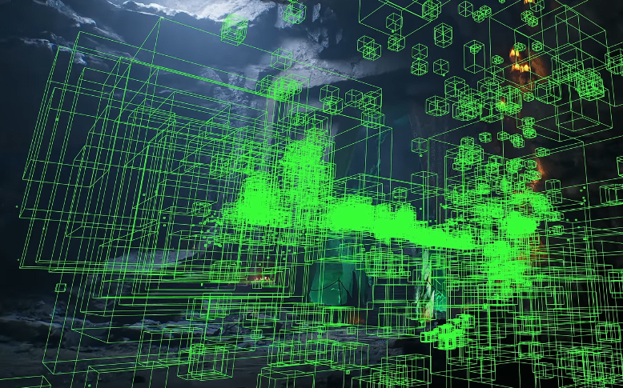
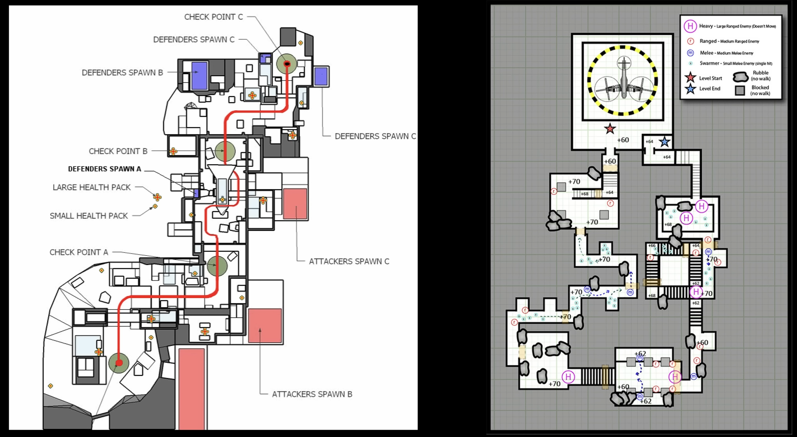

[What to do if you're CPU Bound - Game Optimization - Episode 5](https://www.youtube.com/watch?v=SwWW36mbDhU&list=PL78XDi0TS4lG4wvgfyGECmB8XiJLCgfFD&index=5)
[Visibility and Occlusion Culling](https://dev.epicgames.com/documentation/unreal-engine/visibility-and-occlusion-culling-in-unreal-engine)

---

## High Draw Calls
- Instancing / [Batching](../../ComputerGraphics/Batching/Batching.md)
- Occlusion Culling
- Level Layout
- Early Distance Culling
- HLODS


## Unreal에서 Occlusion Culling 확인하기


```
콘솔 -> r.VisualizeOccludedPrimitives 1 
```


## Level Layout

레벨 단계에서 특정 위치에선 특정 레이아웃만 보이게 계획한다면 컬링 시 큰 도움이 된다. 큰 맵에선 단일 트리거로 한 번에 컬링할 수 있다.


## Early Distance Culling
화면에 비치는 오브젝트가 얼마나 작은지, 또는 카메라와의 거리에 따라 컬링해 주는 기법. 한 화면상의 2픽셀 정도 오브젝트도 1의 드로우콜을 발생시키기 때문에 필터링해 주는 것이다.

```
Volume -> Cull Distance Volume
```
[Distance Culling](../culling/main.md#Distance_Culling)


## Hierarchical Level of Detail (HLODS)

1. 오브젝트를 그룹으로 묶는다.
2. 오브젝트들을 단일 메시로 베이크한다.
3. 거리에 따라 각 그룹의 오브젝트들은 단일 메시로 치환된다.
- 많은 양의 드로우콜을 절약할 수 있다.

## CPU Bound with Low Draw Calls
드로우콜이 낮음에도 CPU 연산 시간이 높다면 확인해야 할 것들이 있다. 오브젝트의 처리보다 보이지 않는 곳에서 연산을 많이 한다.
- Pathfinding
- NPC AI logic
- Complex collision or physics
- Game logic
- Other CPU-intensive task