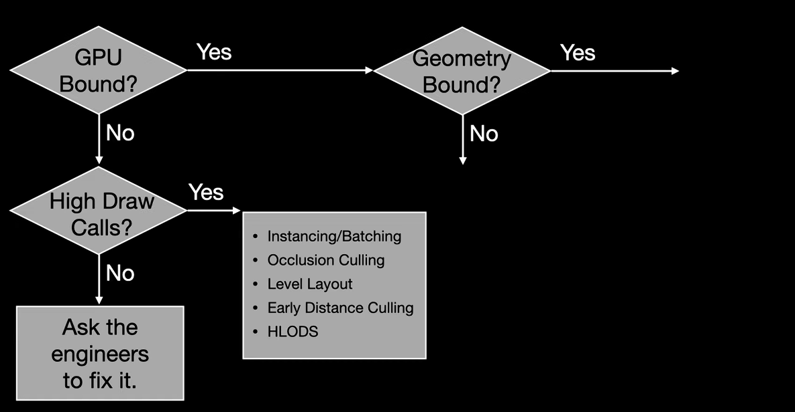

[What to do if you're GPU Bound](https://www.youtube.com/watch?v=hjjodpsZ70Q)
[When Optimisations Work, But for the Wrong Reasons](https://www.youtube.com/watch?v=hf27qsQPRLQ)

---
## GPU Bound
GPU 병목이 발견 될시 지오메트리 또는 쉐이더(포스트 프로세싱) 두가지의 방향을 잡을 수 있다. 먼저 현재 하드웨어가 처리 할 수 있는 폴리곤 카운트를 기준으로 둘중 하나를 확인해 보면 된다.

## GPU Bound with High Polygon Count

### LODs - Level of Detail
- 200 폴리곤이 넘어가는 오브젝트는 LOD가 필요 하다.
- 각 LOD 는 이전 LOD 보다 50% 이하의 폴리곤을 가져야 한다.
- 마지막 LOD 는 100tri 보다 낮은 폴리곤 수를 가져야 한다.
- LOD 들은 카메라의 거리나 화면의 사이즈에 비례해서 스위치 되어야 한다.

### Quad Overdraw
Quad(2*2픽셀) 안에 여러개의 오브젝트가 겹쳐 있어 프로세싱이 중복 되는 경우 LODs 의 진정한 이유는 Quad Overdraw를 피하기 위해서 이다.

>[!note]
>[overshading](../../ComputerGraphics/rasterizingandovershading/main.md#Overshading)참조

### Light Optimization
- 라이트의 수와 크기는 퍼포먼스에 영향을 준다.
- Engine 에서 lighting complexity 를 확인 가능 하다.
- Deferred 렌더 에서는 라이트 비용은 라이트의 크기에 비례한다.
- **라이트를 제거 하거나 라이트의 크기, 감쇠, 콘 앵글을 작게 만드는 것으로 렌더링 비용을 줄일 수 있다.**

### Shadow Optimization
- 필수적인 영역을 제외한 **그림자는 끄는 것이 좋다.**
- 포인트 라이트의 그림자는 특히 조심할것
    - 씬을 육면체의 큐브로 다시 렌더한다.
- 포인트 라이트 대신 스팟 라이트로 바꾸는 것을 고려 해보자
    - 스팟 라이트는 한 방향으로만 다시 렌더 하기 때문

## Pixel Bound
GPU 는 씬을 렌더할떄 추가적인 작업들을 실행 한다.
- Anti-aliasing, SSAO, DOF< Subsurface Scattering, Motion Blur
- 불필요한 포스트 프로세싱 작업들은 비활성화 한다.

### Overdraw Optimization
- Opaque 메쉬는 앞에서 뒤로 렌더 된다.
- Transparent 오브젝트는 뒤에사 앞으로 렌더 된다.
$\rightarrow$ 픽셀 중복 렌더 $\rightarrow$ Overdraw

Pixel 단계의 Overdraw는 스크린을 차지하는 크기를 줄이거나 중첩되는 개수를 줄이는 것이 기본적은 최적화 방향이다.
- Transparent 오브젝트나 빌보드 파티클 레이어들이 많으면 많을 수록 Overdraw 된다.
- 빌보드의 크기를 줄이거나 파티클 개수를 줄이는 것이 좋다.
- 엔진의 Overdraw view 모드로 overdraw 가 몰린 지점을 찾을 수 있다.
- 폴리지 와 같은 경우 Transpereny 대신 alpha clipping opaque를 사용 하는 것이 좋다.(unreal - Masked) 클리핑 된 픽셀은 오버드로우 되지 않는다.

### Dynamic Resolution Scaling - DRS
자체적으로 FPS 를 모니터링 하다 렌더 시간이 오래 걸린다면 렌더 레졸루션을 줄이는 기능이다.
- 해상도를 줄이기 때문에 전체 이미지 품질이 저하 된다.
- 퍼포먼스 결과가 왜곡 될 수 있기 때문에 테스트 때에는 꺼놓는 것이 좋고 모든 최적화가 끝난 후 파이널 빌드에서 사용 하는 것을 권장 한다.

- FPS 가 튀는 현상을 잘 잡아주어 **안정적인 FPS 를 유지하는데에 도움**이 된다.

>[!note]
>자세한 내용은 [여기](../drs/main.md) 참조

### Shader Optimization
- 복잡한 쉐이더는 픽셀에 부하를 줄 수 있다.