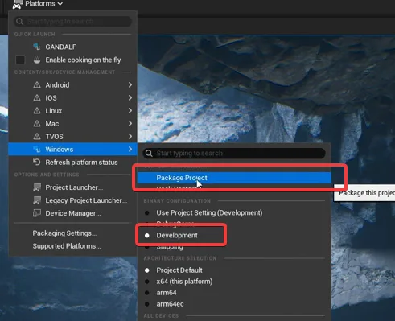
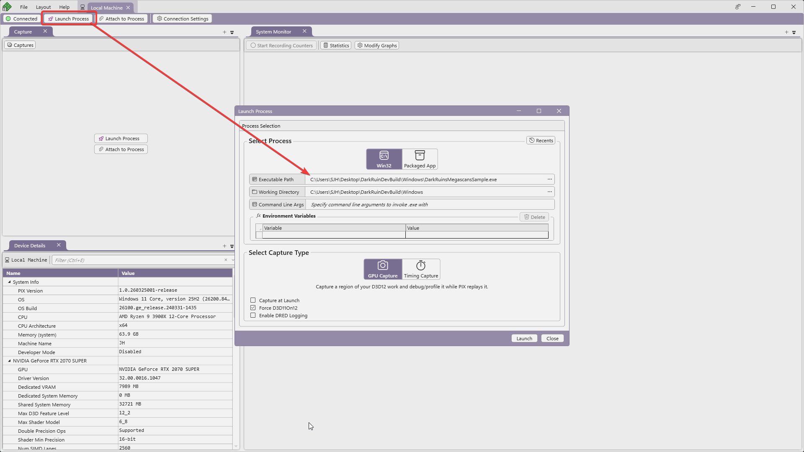
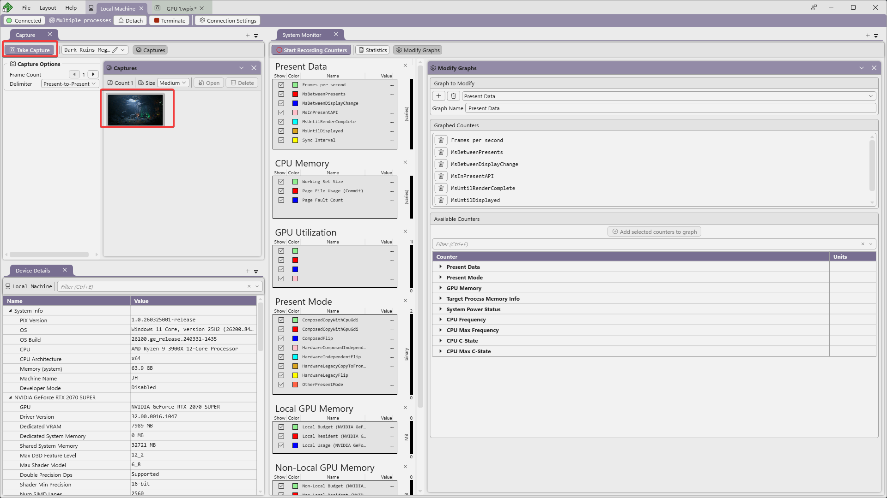
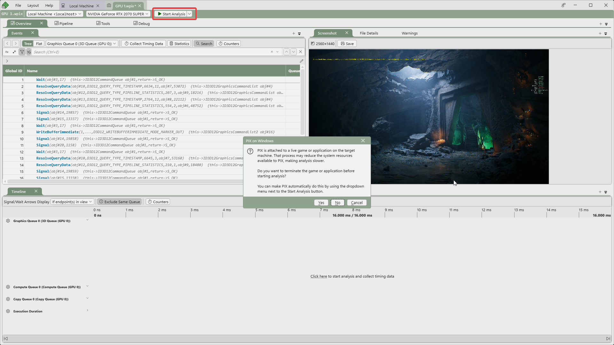

[설치 방법](../profiling/main.md#pix)

>[!important]
>윈도우 개발자 모드가 켜져있어야 한다.

### Dev Build
먼저 Unreal Editor 에서 Development 모드로 빌드를 진행한다.

### 실행 
관리자 권한으로 PIX 실행

Take Capture $\rightarrow$  이미지 더블 클릭

