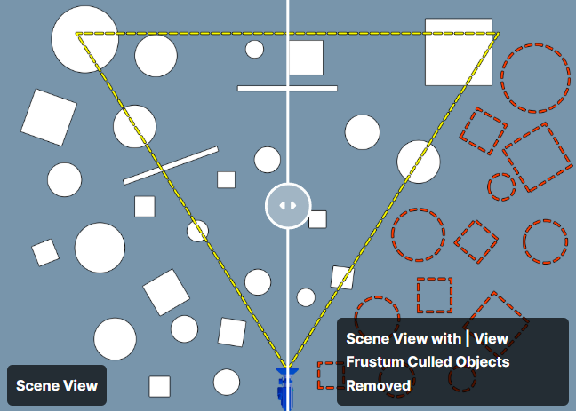
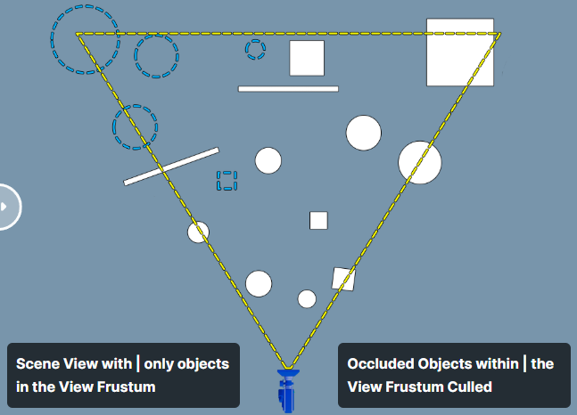

[Visibility and Occlusion Culling](https://dev.epicgames.com/documentation/unreal-engine/visibility-and-occlusion-culling-in-unreal-engine#cullingmethods)

---

보이지 않는 메쉬들을 제외 시켜 드로우콜을 낮추는 방법

## Culling Methods

1. Distance Culling
2. Frustum Culling
3. Precomputed
4. Nanite
5. Occlusion


## Frunstum, Occlusion

 |  |
--- | --- |
Frustum | Frustum + Occlusion

### 컬링 확인 하는법

```
콘솔 -> r.VisualizeOccludedPrimitives 1 
```


## Distance Culling

화면에 1px 정도 차지하는 아주 작은 메쉬라도 엔진은 한번의 드로우 콜을 생성한다. 사실상 육안으로 보이지 않는 부분에서 CPU 비용을 사용 하는 것. Distance Culling 은 이런 것들을 강제적으로 Culling 해주는 기법이다.

### 사용법

```
Volume -> Cull Distance Volume
```

여러 Cull Distance Pair 를 만들어 다양한 크기의 오브 젝트를 컬링한다.


- 약 200 유닛 오브젝트 + 카메라 거리 1000 유닛 이상 컬링됩니다.
- 약 500 유닛 오브젝트 + 카메라 거리 2000 유닛 이상 컬링됩니다.
- 약 1000 유닛 오브젝트 컬링 X

>[!info]
> 더 많은 내용은 [여기](https://dev.epicgames.com/documentation/unreal-engine/cull-distance-volumes-in-unreal-engine)


## Precomputed

[!info]
> 더 많은 내용은 [여기](https://dev.epicgames.com/documentation/unreal-engine/precomputed-visibility-volumes-in-unreal-engine)