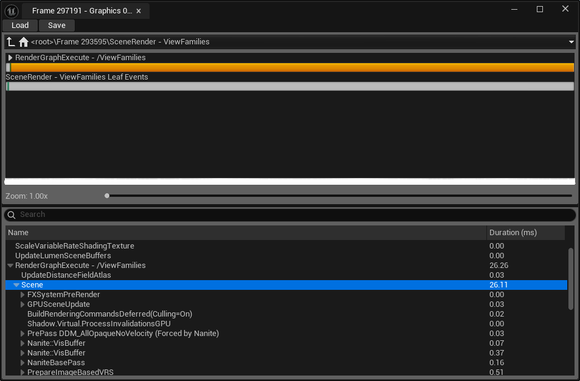
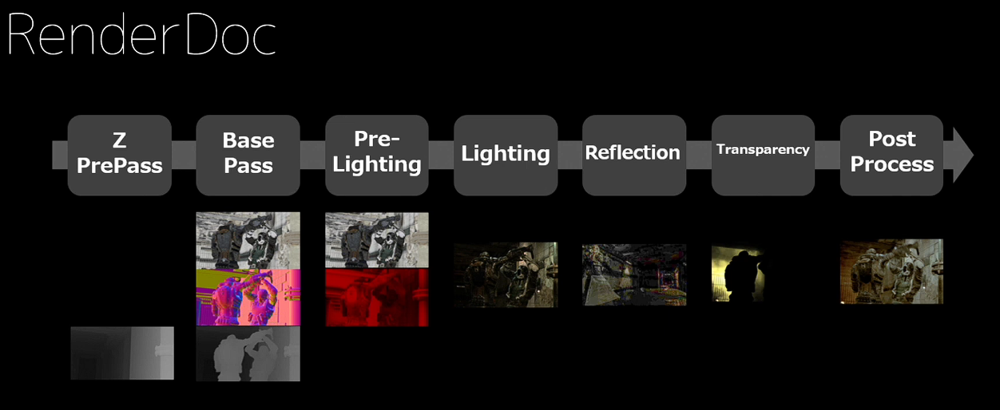

```
stat unit gragh
stat RHI - 드로우 콜
```

## GPU Visiualizer
드로우 시간 중 어떤 것들이 비중을 차지하는지 시각적으로 알려줌

**캡쳐**
`ctrl`+`shift`+`,`

GPU time



## RenderDoc

RenderDoc 은 렌더뷰를 캡쳐해 화면에 그려지기 까지의 그 과정을 볼 수 있는 profiling 툴이다.


렌더링 패스를 크게 나누면 이와 같다.


### 설치

[RenderDoc 설치](https://renderdoc.org/builds)
```
plugin setting - RenderDoc 체크
project setting - RenderDoc - auto attached 체크
```

## PIX

### 설치

[PIX 다운로드](https://devblogs.microsoft.com/pix/download/)