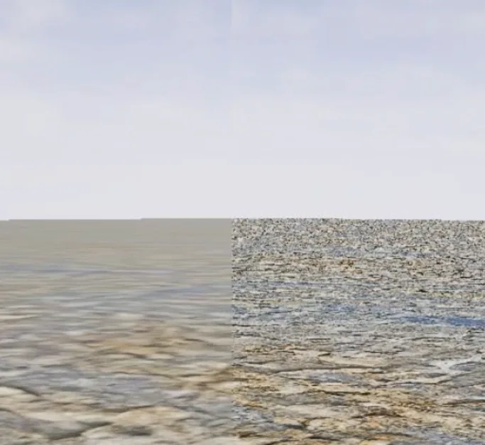
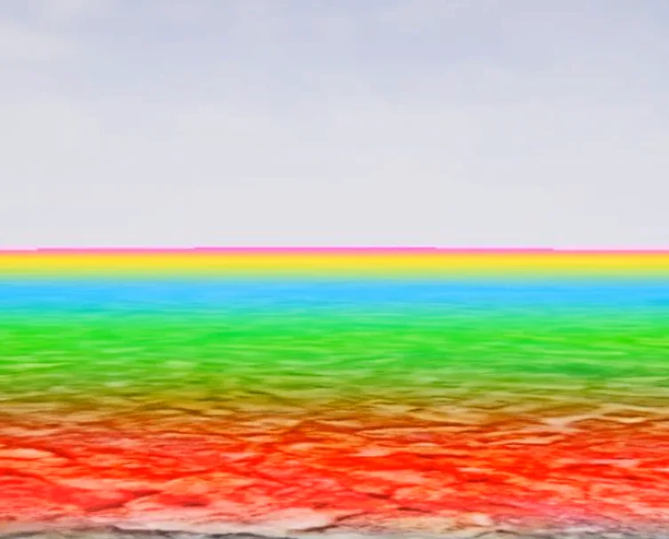

[Rendering and Textures](https://dev.epicgames.com/community/learning/courses/EGR/unreal-engine-an-in-depth-look-at-real-time-rendering/beV/rendering-and-textures)

---

## Texture
- 텍스쳐는 임포트될 때 압축된다. - 메모리와 대역폭 한계가 있기 때문
- 플랫폼마다 압축 방법이 다르며 PC 는 BC(DTXC)를 사용한다.
- UE5에서는 다양한 BC 압축 방법이 존재한다.
- 쉐이더는 조회할 수 있는 텍스쳐 제한이 있다.

### Texture Streaming
어느 시점에 어느 mipmap을 로드할지 결정하는 프로세스. 엔진은  텍스트를 위해 **Streaming Pool** 이라고 하는 VRAM의 일정량을 미리 할당한다.

### Mipmap
- 원본의 1/4 크기의 사본 이미지
- 모든 사본 이미지는 텍스쳐에 저장된다.

밉맵이 없다면 먼 거리의 텍스쳐는 노이즈 처럼 보이는 현상이 일어난다. 폴리곤의 오버쉐이딩 같은 느낌. 밉맵은 블렌딩되어 적용된다.
 |  |
--- | --- |
mipmap 적용, 미적용 | 블렌딩 적용 방식 |

>[!note]
>streaming, mipmap 은 2제곱 크기의 해상도 를 지원한다.
GPU는 메모리를 절약을 위해 4*4 픽셀 블록 단위로 묶어서 압축된다.
>(직사각형)32x16도 지원한다.