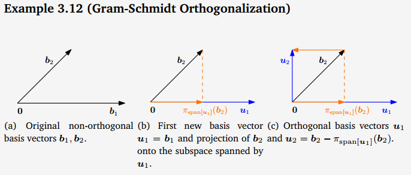

# Gram-Schmidt

주어진 벡터를 이용하여 직교 벡터를 만들어 내는 공식
두벡터의 [정사영](../orthogonal-projection/main.md)만 알고 있다면 너무 쉽게 끝난다.

그림은 참조만

벡터 $\vec{u}, \vec{v}$ 가 있고
$\vec{v}$ 에서 $\vec{u}$ 에 직교하는 수선의 발을 내렸다고 가정할때
$\vec{v}-proj_{u}\vec{v}$ 를 로 계산된 벡터를 정규화 하면
$\vec{u}$ 와 직교하는 기저 벡터가 만들어진다.