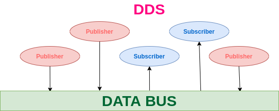

# DDS

## DDS (Data Distribution Service)
여러 대의 컴퓨터가 있을 때 ROS2가 자동으로 서로를 찾아 연결·통신시켜주는 미들웨어 계층이다.

- 발행/구독 통신을 실제로 네트워크 위에서 실어 나르는 역할을 한다 — [Loose Coupling](../loose-coupling/main.md)이 가능한 것도 결국 DDS가 노드 발견(discovery)과 메시지 전달을 대신 처리해주기 때문이다.
- 특정 주기나 IP를 설정해 불필요한 간섭을 막을 수 있다.
- 발행자·구독자마다 통신 품질을 다르게 지정할 수 있는데, 그 설정값이 [QoS](../qos/main.md)다.
- 여러 로봇을 컴퓨터 한 대로 제어하는 것도 이 계층 위에서 가능해진다.

[ROS2와 DDS란?](https://ai-sinq.tistory.com/entry/ROS2%EC%99%80-DDS%EB%9E%80)
