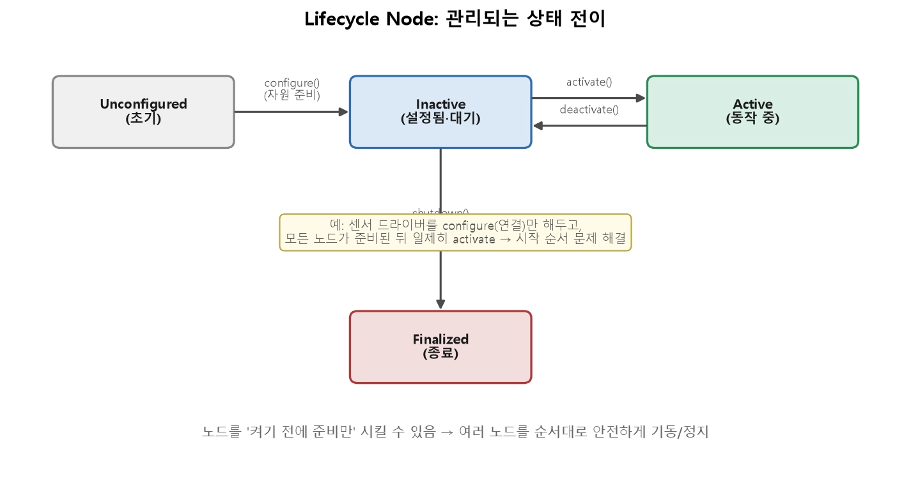

# Lifecycle Node

## ROS 2의 라이프사이클 노드는 미리 정의된 **상태 머신(STM)** 을 갖춘 **관리형 노드**.

> [!NOTE]
> **lifecycle은 하나의 중앙 관리자가 아니다 각 노드가 lifecycle을 상속하면 노드 하나하나가 각자 자기만의 상태 머신 + 콜백 호출 장치를 내장하게 된다.**

로봇 시스템은 준비 단계 가 필요하다. 
- 구동체들이 전부 준비 된 상태에서  active
- 구동체들이 전부 안전한 상태에서 shutdown

  

`Inactive`:  센서,메모리 자원은 준비 됐지만 데이터를 발행,처리 하지 않는 대기 상태
- **시작 순서**:대기 $\rightarrow$ 시작 $\rightarrow$ 대기 $\rightarrow$ 종료
	- `Unconfigured` $\rightarrow$ `Inactive` $\rightarrow$ `Active` $\rightarrow$ `inactive` $\rightarrow$ `Finalized`
	- 먼저 제어가 돌기 시작 하는 사고를 막음
- **안전한 정지, 재시작**: 문제가 생긴 노드를  `deactivate()` 로 대기 시키고 안전 하게 재시작
- **자원 관리**: configure에서 자원을 잡고, 각 상태 전이 콜백(on_configure, on_activate 등)에서 할 일을 명확히 나눔.
- **디버깅 개선**: 라이프사이클 상태는 노드의 동작 상태를 명확히 보여주어 디버깅 및 유지보수를 단순화합니다.

---

- **configure**: 노드를 `Unconfigured` 상태에서 `Inactive` 상태로 전환.
- **activate**: 노드를 `Inactive` 상태에서 `Active` 상태로 전환.
- **deactivate**: 노드를 `Active` 상태에서 `Inactive` 상태로 전환.
- **cleanup**: 노드를 `Inactive` 상태에서 `Unconfigured` 상태로 전환.
- **shutdown**: 노드를 모든 상태에서 `Finalized` 상태로 전환.

1. **Unconfigured**: 노드가 생성되었지만 아직 구성되지 않은 상태.
2. **Inactive**: 노드가 구성되었지만 주요 기능을 수행하지 않는 상태.
3. **Active**: 노드가 완전히 작동 중인 상태.
4. **Finalized**: 노드가 종료되고 리소스가 정리된 상태.

```cpp
from rclpy.lifecycle import LifecycleNode
from rclpy.lifecycle import State
from rclpy.lifecycle import TransitionCallbackReturn
import rclpy

class MyLifecycleNode(LifecycleNode):
    def __init__(self):
        super().__init__('my_lifecycle_node')
        self.get_logger().info("Lifecycle Node created.")

    def on_configure(self, state: State):
        self.get_logger().info("Configuring node...")
        return TransitionCallbackReturn.SUCCESS

    def on_activate(self, state: State):
        self.get_logger().info("Activating node...")
        return TransitionCallbackReturn.SUCCESS

    def on_deactivate(self, state: State):
        self.get_logger().info("Deactivating node...")
        return TransitionCallbackReturn.SUCCESS

    def on_cleanup(self, state: State):
        self.get_logger().info("Cleaning up node...")
        return TransitionCallbackReturn.SUCCESS

    def on_shutdown(self, state: State):
        self.get_logger().info("Shutting down node...")
        return TransitionCallbackReturn.SUCCESS

if __name__ == '__main__':
    rclpy.init()
    node = MyLifecycleNode()
    rclpy.spin(node)
    rclpy.shutdown()
```


---

같은 15강에서 다룬 [Composition](../composition/main.md)과는 다른 축의 설계 판단이다 — Lifecycle Node는 노드가 **언제 활성화될지**(상태 전이)를 다루고, Composition은 노드를 **어느 프로세스에 배치할지**(합성 여부)를 다룬다.

---
[ROS2 LifecycleNode란? — Hoon's Blog](https://yhoons.tistory.com/109#ROS%---%--Lifecycle%-A%--%EB%--%B-%EB%--%-C%--%EA%B-%--%EB%A-%AC%--%EB%B-%-F%--%EC%-B%A-%EB%A-%B-%EC%--%B-%--%ED%--%A-%EC%--%--)