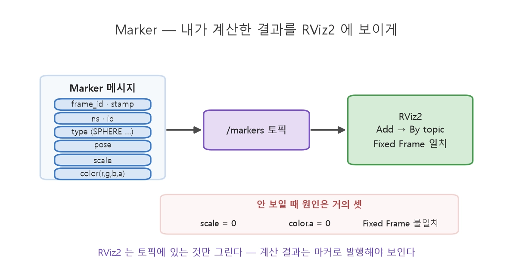

# RViz2

토픽 숫자를 3D 공간의 형상으로 그려주는 시각화 도구다.
- **센서 데이터**(LiDAR 점군·카메라·깊이)
- **TF 좌표계**, **로봇 모델**(URDF)
- **경로·마커**를 한 화면에 겹쳐 볼 수 있다는 게 핵심 

>"LiDAR가 본 장애물"과 "인지가 검출한 장애물"과 "TF상 센서 위치"를 동시에 겹치면 좌표 변환이 틀어졌는지 한눈에 드러난다. TF 디버깅에는 사실상 필수 도구.

```bash
ros2 launch turtlebot3_bringup rviz2.launch.py       # RViz2 띄우기
ros2 launch turtlebot3_gazebo empty_world.launch.py  # Gazebo 빈 월드 시뮬
```

## Marker

RViz2는 **토픽에 있는 것만** 그린다.
사용자가 계산한 결과는 `visualization_msgs/Marker`로 직접 **발행**해야만 화면에 나타난다.
RViz2에서는 `Add → By topic`으로 해당 토픽을 추가하고, 왼쪽 위 [Fixed Frame](#fixed-frame)을 마커의 `frame_id`와 일치시켜야 한다.

> [!NOTE]
> **마커가 안 보이는 3대 원인**
> `scale = 0` · `color.a`(투명도) `= 0` · **Fixed Frame 불일치**

여러 점을 한 번에 그릴 때는 `Marker.SPHERE_LIST`나 `MarkerArray`를 쓴다.

### FIxed Frame
RViz2 가 모든걸 그릴때 기준으로 삼는 좌표계.
Marker는 자신의 `frame_id` 를 기준으로 좌표가 찍힌다. 그 좌표를 기준으로 **프레임 트리**가 만들어지기 때문에 

#### Frame Tree
로봇의 베이스, 조인트 좌표는 모두 하나의 root에서 시작 되어 연결 되어 있다
map $\rightarrow$ odom $\rightarrow$ base_link $\rightarrow$ ...

---
녹화한 데이터를 RViz2로 재현하는 흐름은 [ros2bag](../ros2bag/main.md) 참고.
