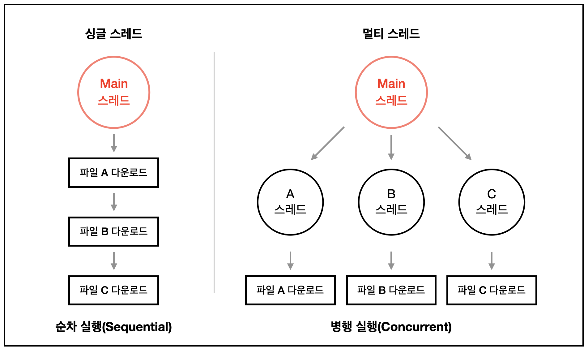

# 단일 스레드, 멀티 스레드

스레드는 프로세스가 할당받은 자원을 이용하는 실행의 단위다.

- **단일 스레드**: 프로세스 안에서 실행 흐름이 하나뿐 — 콜백이든 뭐든 한 번에 하나씩만 처리된다.
- **멀티 스레드**: 같은 프로세스 자원을 공유하는 여러 실행 흐름이 동시에 돈다 — 병렬 처리가 가능해지지만 자원을 공유하는 만큼 경쟁 상태(race condition) 같은 문제가 생길 수 있다.

ROS2에서는 [기본 executor가 단일 스레드](../callback/main.md)라 콜백을 하나씩 순서대로 처리하고, 여러 콜백을 동시에 돌리려면 멀티 스레드 executor(`MultithreadedExecutor`)로 바꿔야 한다 — 이 노트의 단일/멀티 스레드 구분이 그 전제가 된다.

[스레드란?](https://velog.io/@gil0127/%EC%8B%B1%EA%B8%80%EC%8A%A4%EB%A0%88%EB%93%9CSingle-thread-vs-%EB%A9%80%ED%8B%B0%EC%8A%A4%EB%A0%88%EB%93%9C-Multi-thread-t5gv4udj)