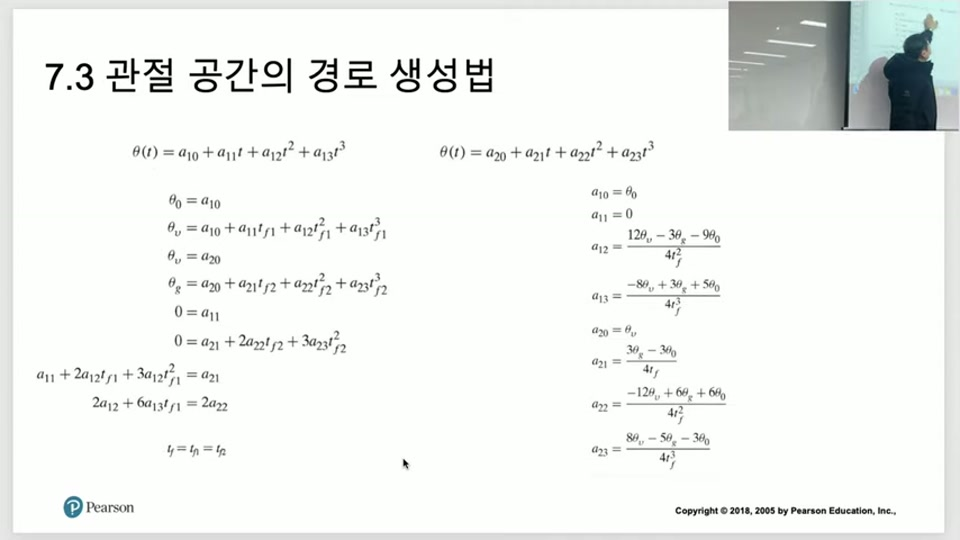
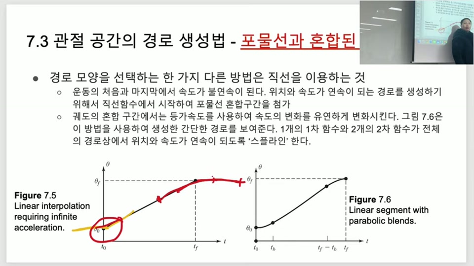
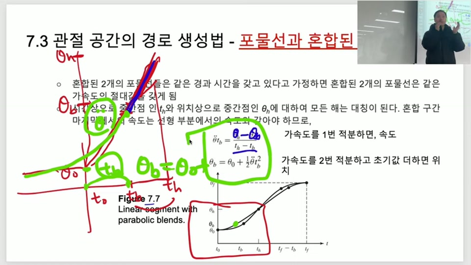
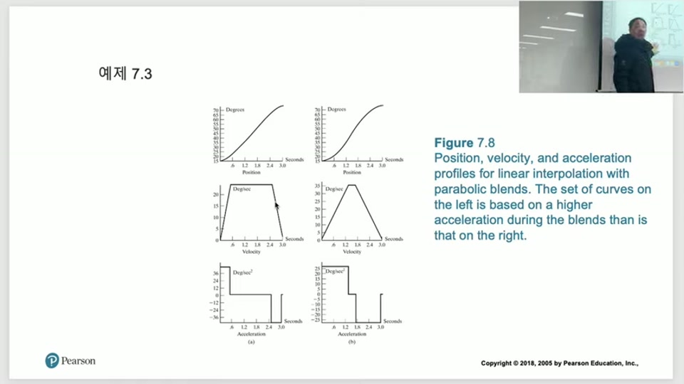
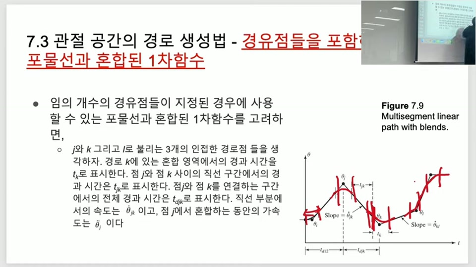
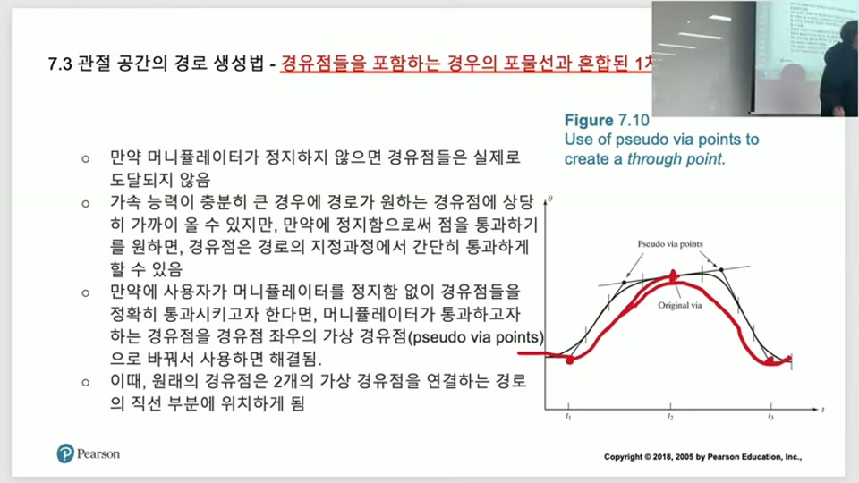

# 궤도 생성 II — 2구간 3차 스플라인과 LSPB (Trajectory Generation II — Cubic Spline & LSPB)

> 출처: 로봇제어공학 — Introduction to Robotics 7장 "궤도 생성(Trajectory Generation) II"
> 영상: https://www.youtube.com/watch?v=GGTM5y9Gvvg&list=PLP4rlEcTzeFIvgNQD8M1T7_PzxO3JNK5Z&index=20
> 대상: [1편](../trajectory-generation-and-cubic-polynomial-path/main.md)에서 3차 다항식과 경유점 속도를 정하는 세 가지 방법(자코비안·휴리스틱·5차 다항식)까지 학습한 상태를 전제로, 경유점에서 **가속도까지** 연속시키는 2구간 스플라인과 완전히 다른 접근인 **LSPB(직선+포물선)** 를 다루는 노트.

---

## 목차
1. [지난 시간 복습과 이번 시간의 문제](#1-지난-시간-복습과-이번-시간의-문제)
2. [경유점에서 가속도까지 연속시키는 2구간 3차 스플라인](#2-경유점에서-가속도까지-연속시키는-2구간-3차-스플라인)
3. [LSPB — 직선과 포물선을 섞는 이유](#3-lspb--직선과-포물선을-섞는-이유)
4. [LSPB 공식 유도 — 블렌드 구간](#4-lspb-공식-유도--블렌드-구간)
5. [가속도 선택과 판별식](#5-가속도-선택과-판별식)
6. [LSPB로 경유점 통과하기 — J, K, L 표기](#6-lspb로-경유점-통과하기--j-k-l-표기)
7. [가상 경유점(pseudo via point)](#7-가상-경유점pseudo-via-point)
8. [표현법 비교표](#8-표현법-비교표)
9. [Python 실습 코드](#9-python-실습-코드)

---

## 1. 지난 시간 복습과 이번 시간의 문제

[1편](../trajectory-generation-and-cubic-polynomial-path/main.md)에서 관절 공간 경로 생성의 큰 그림은: 작업공간의 경유점들을 [역기구학](../inverse-kinematics-algebraic-geometric-pieper/main.md)으로 딱 한 번씩 관절각으로 바꾼 뒤, 관절 하나하나를 시간-각도 함수 θ(t)로 독립적으로 설계하는 것이었다.

경유점의 **위치**는 역기구학으로 확정되지만 **속도**는 사용자가 정해야 했고, 그 방법이

① 자코비안(정확·번거로움)
② 휴리스틱(부호 바뀌면 0, 안 바뀌면 평균)
③ 위치·속도·가속도까지 양 끝에서 지정하는 5차 다항식

이렇게 세 가지였다.


- **(A) 2구간 스플라인**: 3차 다항식을 유지하되 경유점에서 **가속도까지** 연속시킨다.
- **(B) LSPB(Linear Segment with Parabolic Blend)**: 다항식을 버리고 **직선+포물선**으로 만든다.

## 2. 경유점에서 가속도까지 연속시키는 2구간 3차 스플라인

**문제 상황(예제 7.2)**: 시작 $\theta_0$ → 경유점 $\theta_v$ → 종료 $\theta_g$를 지나는 경로를, 경유점에서 **속도뿐 아니라 가속도까지 연속**이 되도록 만들고 싶다. 3차 다항식 하나로는 미지수 4개(조건 4개)라 이미 다 써버렸으니, 구간을 둘로 나눠 3차 다항식을 두 개 쓴다.

$$\theta(t) = a_{10}+a_{11}t+a_{12}t^2+a_{13}t^3 \quad (\text{구간 1: } 0 \sim t_{f1})$$
$$\theta(t) = a_{20}+a_{21}t+a_{22}t^2+a_{23}t^3 \quad (\text{구간 2: } 0 \sim t_{f2},\ \text{자체 지역시간})$$

각 구간이 **자기 지역시간(local time)** 0부터 시작한다는 점이 핵심이다 — 구간 2의 $t$는 전체 시간이 아니라 경유점을 지난 뒤 다시 0부터 잰다.

**경계조건 6개**:

$$\theta_0=a_{10},\qquad \theta_v=a_{10}+a_{11}t_{f1}+a_{12}t_{f1}^2+a_{13}t_{f1}^3,\qquad \theta_v=a_{20}$$
$$\theta_g=a_{20}+a_{21}t_{f2}+a_{22}t_{f2}^2+a_{23}t_{f2}^3,\qquad 0=a_{11},\qquad 0=a_{21}+2a_{22}t_{f2}+3a_{23}t_{f2}^2$$

여기에 **경유점 속도·가속도 연속** 조건 2개가 더해져 총 8개 방정식, 미지수 8개(a₁₀~a₁₃, a₂₀~a₂₃):

$$a_{11}+2a_{12}t_{f1}+3a_{13}t_{f1}^2 = a_{21} \quad(\text{속도 연속}), \qquad 2a_{12}+6a_{13}t_{f1} = 2a_{22} \quad(\text{가속도 연속})$$

계산을 쉽게 하려고 두 구간을 **동일한 시간**($t_{f1}=t_{f2}=t_f/2$)으로 나눈 경우, 풀면 다음 공식이 그대로 나온다.

**이해**: 슬라이드 원문은 "$t_f=t_{f1}=t_{f2}$"라고 적혀 있는데 이는 오타이며, 실제 의미는 $t_{f1}=t_{f2}=\dfrac{t_f}{2}$(전체 시간의 절반씩 균등 분할)이다.

$$a_{10}=\theta_0,\quad a_{11}=0,\quad a_{12}=\frac{12\theta_v-3\theta_g-9\theta_0}{4t_f^2},\quad a_{13}=\frac{-8\theta_v+3\theta_g+5\theta_0}{4t_f^3}$$
$$a_{20}=\theta_v,\quad a_{21}=\frac{3\theta_g-3\theta_0}{4t_f},\quad a_{22}=\frac{-12\theta_v+6\theta_g+6\theta_0}{4t_f^2},\quad a_{23}=\frac{8\theta_v-5\theta_g-3\theta_0}{4t_f^3}$$



**암기 불필요**: 이 8개 공식 자체는 외울 필요 없다 — 대입만 하면 되는 결과식이다. **반드시 기억**할 것은 "조건의 개수 = 미지수의 개수"라는 원칙과, 구간을 나눌 때마다 지역시간이 다시 0에서 시작한다는 점이다.

**실전 취급**: 처음 위치·경유점 각도·최종 위치, 전체 시간 $t_f$만 알면 위 공식에 바로 대입해 두 다항식의 계수가 나온다.

## 3. LSPB — 직선과 포물선을 섞는 이유

3차·5차 다항식은 부드럽지만, 그림으로 그려보면 목표점 근처에서 곡선이 **불필요하게 휘어 도는 경향**이 있다.

그러면 차라리 중간 구간은 그냥 **직선**으로 가는 게 낫지 않을까? 문제는 순수 직선 보간(Figure 7.5)은 시작·끝에서 속도가 즉시 0→일정값으로 튀어 **무한 가속도**가 필요하다는 점이다.



**해결책**: 시작·끝 구간만 **2차 포물선(등가속도)** 으로 완충하고, 중간은 그대로 직선으로 두자 — 이것이 **LSPB(Linear Segment with Parabolic Blend)**, 직선 구간과 포물선 블렌드를 섞은 방법이다.

$$\theta(t) = \begin{cases}\theta_0+\frac12\ddot\theta t^2 & 0\le t\le t_b \ \text{(가속 블렌드)}\\ \text{직선} & t_b\le t\le t_f-t_b\\ \theta_f-\frac12\ddot\theta(t_f-t)^2 & t_f-t_b\le t\le t_f \ \text{(감속 블렌드)}\end{cases}$$

**이해**: 다항식은 "무조건 그 경유점을 지나가는" 조건을 걸어서 곡선이 되고, LSPB는 "직선으로 빠르게 가되 양 끝만 봐준다"는 발상이다. 직선·2차 포물선은 이미 중·고등학교 수학이라 계산이 훨씬 쉽다.

블렌드(포물선) 구간이 짧으면 직선 구간이 길어져 급가속-급감속이 되고, 블렌드가 길면 직선 구간이 짧아져 완만한 가감속이 된다. 실제로 이 길이를 무엇으로 정하는지는 [5절](#5-가속도-선택과-판별식)에서 다룬다.

## 4. LSPB 공식 유도 — 블렌드 구간

가속·감속 블렌드는 대칭(원점 기준 점대칭)이므로 가속 구간 하나만 유도하면 감속 구간은 그대로 뒤집으면 된다.



블렌드가 끝나는 시각을 $t_b$, 그때의 각도를 $\theta_b$라 하자. 전체 궤적이 점대칭이므로 중간점은 정확히 $t_h=t_f/2$, $\theta_h=(\theta_0+\theta_f)/2$이다.

**조건 1 — 속도 매칭**: 블렌드 구간 끝에서의 속도($\ddot\theta \cdot t_b$, 등가속도 적분값)가 직선 구간의 기울기와 같아야 한다.

$$\ddot\theta\, t_b = \dot\theta_h = \frac{\theta_h-\theta_b}{t_h-t_b}$$

**조건 2 — 위치 매칭**: 가속도를 두 번 적분(한 번은 속도, 한 번 더는 위치)하고 초기값을 더하면 $\theta_b$가 나온다.

$$\theta_b = \theta_0+\frac12\ddot\theta t_b^2$$

두 식에서 $\theta_h=(\theta_0+\theta_f)/2$, $t_h=t_f/2$를 대입해 정리하면:

$$\ddot\theta\, t_b^2 - \ddot\theta\, t_f\, t_b + (\theta_f-\theta_0) = 0$$

$t_b$에 대한 **2차 방정식**이므로 근의 공식을 바로 쓸 수 있다.

$$t_b = \frac{t_f}{2}-\frac{\sqrt{\ddot\theta^2 t_f^2-4\ddot\theta(\theta_f-\theta_0)}}{2\ddot\theta}$$

**이해**: 위 유도는 "속도가 맞아야 한다", "위치가 맞아야 한다"는 상식 두 줄에 대칭성만 더한 것으로, 고차원 수학이 아니다.

**암기 불필요**: 유도 과정을 통째로 외울 필요는 없고, 최종 $t_b$ 공식만 대입해 쓰면 된다.

## 5. 가속도 선택과 판별식

LSPB를 쓰려면 사용자가 **가속도 $\ddot\theta$의 절댓값**을 먼저 정해야 한다(로봇이 낼 수 있는 적당한 가속도). 가속도를 정하면 위 공식으로 **블렌드 시간 $t_b$가 자동으로 결정**된다. 스포츠카처럼 가속도가 크면 살짝만 밟아도 금방 목표 속도에 도달하니 블렌드 시간이 짧고, 버스처럼 가속도가 작으면 오래 밟아야 하니 블렌드 시간이 길어지는 것과 같은 이치다.

**판별식의 물리적 의미**: 근의 공식 안의 판별식 $\ddot\theta^2t_f^2-4\ddot\theta(\theta_f-\theta_0)$이 음수면 **허근**이 나온다. 수학적으로는 존재하지만 물리적으로는 불가능하다는 뜻이다 — 아무리 밟아도 40km/h까지밖에 못 내는 경운기에게 "정해진 시간 안에 50km/h를 내라"고 요구하는 상황과 같다. 목표 각도 변화를 그 시간 안에, 그 가속도로는 도저히 달성할 수 없다는 의미다.

정리하면 실현 가능 조건(**반드시 기억**)은:

$$|\ddot\theta| \ge \frac{4|\theta_f-\theta_0|}{t_f^2}$$

**실전 취급**: 정해진 시간 $t_f$ 안에 목표 각도 변화 $\theta_f-\theta_0$를 달성하려면, 관절이 낼 수 있는 최대 가속도가 이 하한값 이상이어야 한다 — 못 미치면 $t_f$를 늘리거나 가속도 스펙이 더 좋은 액추에이터가 필요하다는 뜻.

가속도 크기에 따른 실제 곡선 비교(예제 7.3, 15°→70°):



- 가속도를 크게(약 40°/s²) 잡으면 블렌드 구간이 짧고 직선(정속) 구간이 길다 — 속도 그래프가 사다리꼴에 가깝다.
- 가속도를 작게(약 26°/s²) 잡으면 블렌드 구간이 길어지고 직선 구간이 짧아진다 — 더 낮추면 아예 도달 전에 감속을 시작해야 해서 목표 시간 안에 도달이 불가능해진다(판별식 음수).

## 6. LSPB로 경유점 통과하기 — J, K, L 표기

여러 경유점을 지나는 LSPB는 3차 다항식보다 표기가 복잡하지만 아이디어는 같다: 인접한 세 경로점을 $J,K,L$이라 부른다.



| 기호 | 의미 |
|---|---|
| $\theta_J,\theta_K,\theta_L$ | J, K, L점을 지날 때의 각도 |
| $\dot\theta_{JK}$ | J–K 사이 **직선 구간**의 기울기(속도) |
| $\ddot\theta_K$ | K점에서 블렌드하는 동안의 가속도 |
| $t_{JK}$ | J–K 사이 직선 구간의 경과 시간 |
| $t_K$ | K점 블렌드 구간의 경과 시간 |
| $t_{dJK}$ | J점에서 K점까지의 **전체** 경과 시간($t_{JK}$ + 양쪽 블렌드 절반) |

$$t_{dJK} = t_{JK} + \tfrac12 t_J + \tfrac12 t_K$$

풀어야 할 4개 공식(중간 경유점 K에 대해):

$$\dot\theta_{JK}=\frac{\theta_K-\theta_J}{t_{dJK}},\qquad \ddot\theta_K = \mathrm{SGN}(\dot\theta_{KL}-\dot\theta_{JK})\,|\ddot\theta_K|$$
$$t_K = \frac{\dot\theta_{KL}-\dot\theta_{JK}}{\ddot\theta_K},\qquad t_{JK}=t_{dJK}-\tfrac12 t_J-\tfrac12 t_K$$

**이해**: 두 번째 식의 $\mathrm{SGN}$은 크기가 아니라 **부호만** 정하는 항이다 — 앞뒤 기울기가 같은 방향으로 커지면(가속) 양수, 방향이 바뀌면 음수가 되도록 만들 뿐, 가속도의 크기 $|\ddot\theta_K|$는 사용자가 이미 정한 값이다.

**시작점·끝점은 이웃이 하나뿐**이라 공식이 살짝 바뀐다(경유점이 아니라 시작/끝이므로 SGN 안의 기준이 인접한 한쪽 기울기뿐):

$$\ddot\theta_1=\mathrm{SGN}(\theta_2-\theta_1)|\ddot\theta_1|,\quad t_1=t_{d12}-\sqrt{t_{d12}^2-\frac{2(\theta_2-\theta_1)}{\ddot\theta_1}}$$
$$\dot\theta_{12}=\frac{\theta_2-\theta_1}{t_{d12}-\frac12 t_1},\qquad t_{12}=t_{d12}-t_1-\frac12 t_2$$

$$\ddot\theta_n=\mathrm{SGN}(\theta_{n-1}-\theta_n)|\ddot\theta_n|,\quad t_n=t_{d(n-1)n}-\sqrt{t_{d(n-1)n}^2+\frac{2(\theta_n-\theta_{n-1})}{\ddot\theta_n}}$$
$$\dot\theta_{(n-1)n}=\frac{\theta_n-\theta_{n-1}}{t_{d(n-1)n}-\frac12 t_n},\qquad t_{(n-1)n}=t_{d(n-1)n}-t_n-\frac12 t_{n-1}$$

**암기 불필요**: 이 8개 식 전부 외울 필요 없음 — 공식 형태를 갖고 있다가 대입만 하면 된다. **반드시 기억**: 중간 경유점용 4식과 시작/끝점용 4식이 서로 다르다는 것(이웃이 하나뿐이라 제곱근 안 부호가 다르다).

## 7. 가상 경유점(pseudo via point)

LSPB의 치명적인 단점: 중간 경유점을 **정확히 지나가지 않는다**. 블렌드 구간이 그 점을 감싸고 지나가버려 근처만 스칠 뿐이다.

다항식 방법은 경유점 통과를 조건으로 걸었기 때문에 반드시 지나가지만, 그 대신 구불거림이 생겼다. LSPB는 반대로 움직임은 깔끔하지만 **꼭 가야 하는 점을 놓친다**는 트레이드오프다.



**해결 트릭**: LSPB의 직선 구간은 반드시 그 구간의 두 끝점을 지난다는 성질을 역이용한다.

1. 진짜 지나가야 하는 경유점의 **양옆에 가상의 경유점 두 개**를 찍는다.
2. 가상 점들 사이의 **직선 구간이 원래 경유점을 지나가도록** 배치한다.
3. [6절](#6-lspb로-경유점-통과하기--j-k-l-표기)의 경유점 공식을 그대로 적용하면 원래 경유점을 100% 통과한다.

**이해**: "pseudo(수도)"는 "가짜의"라는 뜻 — pseudo code(수도 코드)가 진짜 코드는 아니지만 해석되는 것처럼, pseudo via point도 실제로 로봇이 멈추는 진짜 목표점은 아니고 LSPB 공식에 넣기 위한 보조 좌표다.

**대가**: 경유점 하나당 가상 점 2개가 추가되므로 계산량이 약 3배로 늘어난다.

**실전 취급**: 경유점이 많은 실제 궤적에서 "이 점만은 반드시 통과해야 한다"는 요구가 있을 때만 가상 경유점을 추가하고, 그 외에는 원래 LSPB 그대로 근사 통과시키는 것이 더 가볍다.

## 8. 표현법 비교표

| 기호 | 의미 | 비고 |
|---|---|---|
| $t_{f1},t_{f2}$ | 2구간 스플라인의 각 구간 지역시간 | 2절, 균등분할 시 $t_{f1}=t_{f2}=t_f/2$ |
| $t_b$ | LSPB 블렌드(가속/감속) 구간 시간 | 4절, 2차 방정식으로 풀림 |
| $\ddot\theta$ | LSPB 블렌드 구간의 등가속도(사용자 지정) | 5절, $\lvert\ddot\theta\rvert\ge 4\lvert\theta_f-\theta_0\rvert/t_f^2$ 필요 |
| $J,K,L$ | LSPB에서 인접한 세 경로점 표기 | 6절 |
| $t_{dJK}$ | J–K 전체 경과시간(직선+양쪽 블렌드 절반) | $t_{dJK}=t_{JK}+\tfrac12t_J+\tfrac12t_K$ |
| $\mathrm{SGN}(\cdot)$ | 부호만 결정하는 항 | 가속도 크기는 이미 지정, 방향만 결정 |
| pseudo via point (수도 비아 포인트) | LSPB가 경유점을 100% 지나가게 만드는 가상의 보조 점 | 7절 |

## 9. Python 실습 코드

```python
import numpy as np

def cubic_via_spline(theta0, theta_v, theta_g, tf):
    """예제 7.2: 경유점에서 속도·가속도까지 연속인 2구간 3차 스플라인.
    두 구간을 tf/2씩 균등분할했다고 가정."""
    a10 = theta0
    a11 = 0.0
    a12 = (12*theta_v - 3*theta_g - 9*theta0) / (4*tf**2)
    a13 = (-8*theta_v + 3*theta_g + 5*theta0) / (4*tf**3)
    a20 = theta_v
    a21 = (3*theta_g - 3*theta0) / (4*tf)
    a22 = (-12*theta_v + 6*theta_g + 6*theta0) / (4*tf**2)
    a23 = (8*theta_v - 5*theta_g - 3*theta0) / (4*tf**3)
    return (a10, a11, a12, a13), (a20, a21, a22, a23)

def eval_cubic(coeffs, t):
    a0, a1, a2, a3 = coeffs
    return a0 + a1*t + a2*t**2 + a3*t**3


def lspb_blend_time(theta0, thetaf, tf, acc_mag):
    """LSPB 블렌드 시간 tb와 부호 있는 가속도를 구한다 (판별식 음수면 ValueError)."""
    delta = thetaf - theta0
    acc = np.sign(delta) * abs(acc_mag)
    disc = acc**2 * tf**2 - 4*acc*delta
    if disc < 0:
        raise ValueError("가속도가 부족합니다 — tf 안에 도달 불가 (판별식 음수)")
    tb = tf/2 - np.sqrt(disc) / (2*acc)
    return tb, acc

def lspb_eval(t, theta0, thetaf, tf, acc_mag):
    tb, acc = lspb_blend_time(theta0, thetaf, tf, acc_mag)
    if t <= tb:
        return theta0 + 0.5*acc*t**2
    elif t <= tf - tb:
        theta_b = theta0 + 0.5*acc*tb**2
        v = acc*tb
        return theta_b + v*(t - tb)
    else:
        return thetaf - 0.5*acc*(tf - t)**2


if __name__ == "__main__":
    # 예제 7.2 검증: 15deg -> 40deg(경유점) -> 75deg, tf=4s
    seg1, seg2 = cubic_via_spline(15, 40, 75, 4.0)
    print("구간1 계수:", seg1)
    print("구간2 계수:", seg2)

    # LSPB: 15deg -> 70deg, tf=3s, 가속도 40deg/s^2
    tb, acc = lspb_blend_time(15, 70, 3.0, 40.0)
    print(f"tb={tb:.3f}s, acc={acc:.1f}deg/s^2")
    for t in [0, tb, 1.5, 3-tb, 3]:
        print(f"t={t:.2f} -> theta={lspb_eval(t, 15, 70, 3.0, 40.0):.2f}deg")
```

**연습문제(TODO)**:

```python
# TODO 1: 2구간 스플라인의 속도·가속도 연속성 검증
#   cubic_via_spline(15, 40, 75, 4.0)의 두 다항식에 대해,
#   구간1의 t=tf/2 시점 속도·가속도와 구간2의 t=0 시점 속도·가속도가
#   각각 일치하는지 수치로 확인하라.
#   힌트: 미분 계수는 [a1, 2*a2, 6*a3] 형태로 직접 계산하거나 np.polyder 사용.

# TODO 2: 가속도 하한 검증
#   theta0=10, thetaf=70, tf=2.0 일 때 4*abs(thetaf-theta0)/tf**2 을 계산하고,
#   그보다 작은 가속도를 lspb_blend_time에 넣으면 실제로 ValueError가
#   발생하는지 확인하라.

# TODO 3: LSPB 경유점(J,K,L) 공식 구현
#   theta_J, theta_K, theta_L, t_dJK, t_dKL, acc_K(크기)가 주어졌을 때
#   6절의 4개 공식으로 t_JK, dtheta_JK, dtheta_KL, t_K을 구하는
#   함수 lspb_via_point(...)를 작성하라.
#   검증: 구해진 t_K, dtheta_JK로 만든 블렌드 구간 끝점 속도가
#   직선 구간 기울기 dtheta_JK와 실제로 같은지 확인.
```

**실전 연결**:
- 경유점 속도·가속도 경계조건이 있는 3차 구간은 [`scipy.interpolate.CubicHermiteSpline`](https://docs.scipy.org/doc/scipy/reference/generated/scipy.interpolate.CubicHermiteSpline.html)로 그대로 대체 가능 — 직접 계수를 풀 필요 없이 위치·속도 배열만 넘기면 된다.
- LSPB(사다리꼴 속도 프로파일)는 `roboticstoolbox-python`의 `trapezoidal()` 함수가 동일한 개념을 구현해 제공한다.
- ROS2에서는 `joint_trajectory_controller`가 각 관절에 대해 이런 시간-각도(및 속도) 프로파일을 받아 실행하고, MoveIt의 시간 파라미터화 단계(TOPP-RA, Ruckig 등)가 실제로는 여기서 배운 것보다 일반화된 형태로 같은 문제(위치·속도·가속도 연속성, 가속도 한계)를 푼다.

## 핵심 요약 카드

| 구분 | 핵심 내용 |
|---|---|
| 2구간 3차 스플라인 | 경유점에서 위치·속도·가속도까지 연속시키려고 3차 다항식 2개(지역시간 각자 0부터) 사용. 균등분할 시 계수 공식 8개가 바로 나옴 |
| LSPB 아이디어 | 시작·끝만 등가속도 포물선으로 완충하고 중간은 직선 — 다항식보다 계산이 쉽고 불필요한 곡선을 줄임 |
| LSPB 블렌드 공식 | 속도 매칭 $\ddot\theta t_b=\dot\theta_h$ + 위치 매칭 $\theta_b=\theta_0+\frac12\ddot\theta t_b^2$ + 대칭성 → $\ddot\theta t_b^2-\ddot\theta t_f t_b+(\theta_f-\theta_0)=0$의 근 |
| 실현 가능 조건 | $\lvert\ddot\theta\rvert \ge 4\lvert\theta_f-\theta_0\rvert/t_f^2$ — 판별식이 음수면 그 시간 안에 도달 불가(허근) |
| LSPB 경유점(J,K,L) | 중간 경유점용 4식 + 시작점용 4식 + 끝점용 4식, 총 12식. SGN은 부호만 결정 |
| pseudo via point | LSPB가 경유점을 스치기만 하는 문제를, 진짜 점 양옆에 가상 점 2개를 찍어 직선 구간이 그 점을 지나가게 하는 우회 — 계산량 약 3배 |
| 다항식 vs LSPB | 다항식: 경유점 100% 통과·계산 복잡. LSPB: 계산 간단·직선 위주 움직임이지만 경유점은 근처만 통과(가상 경유점으로 보완 가능) |
