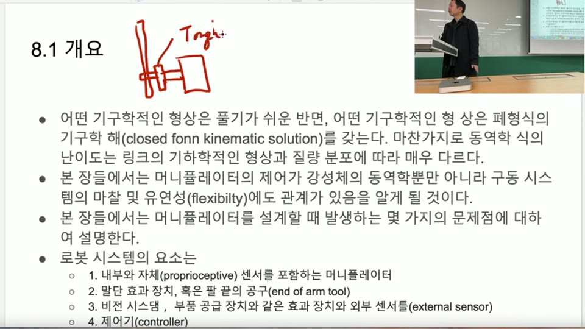
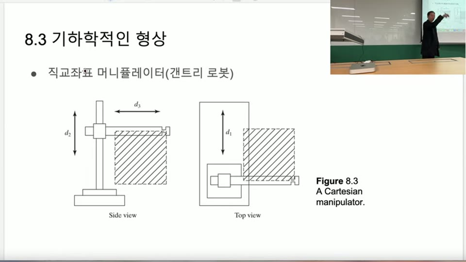
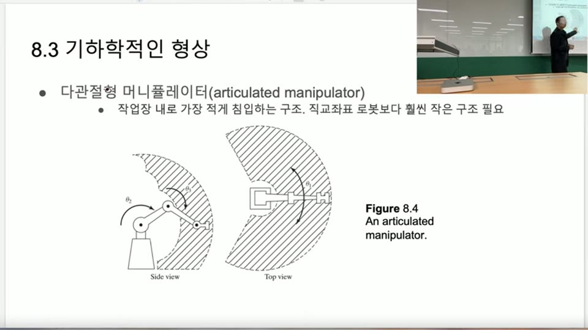
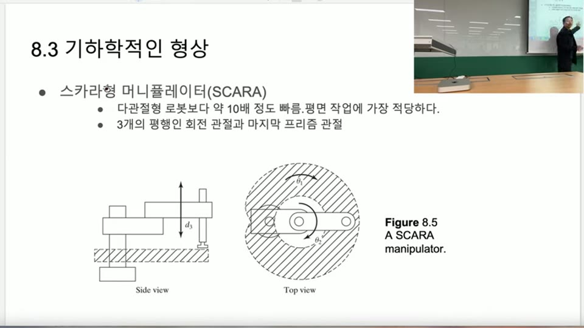
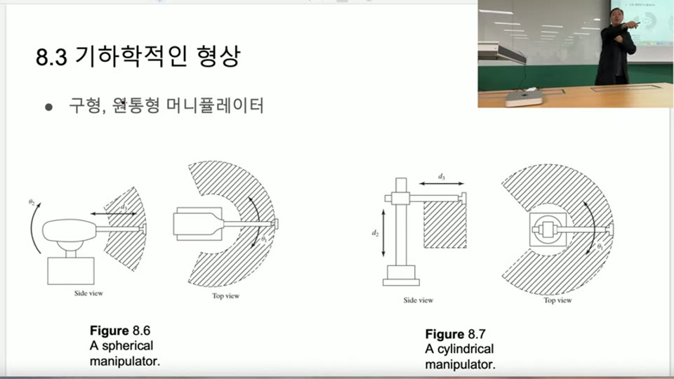
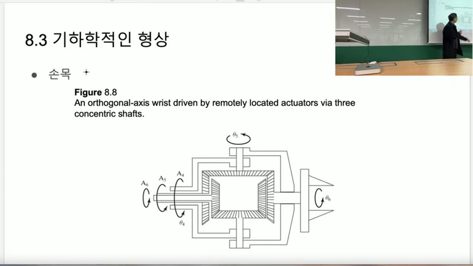
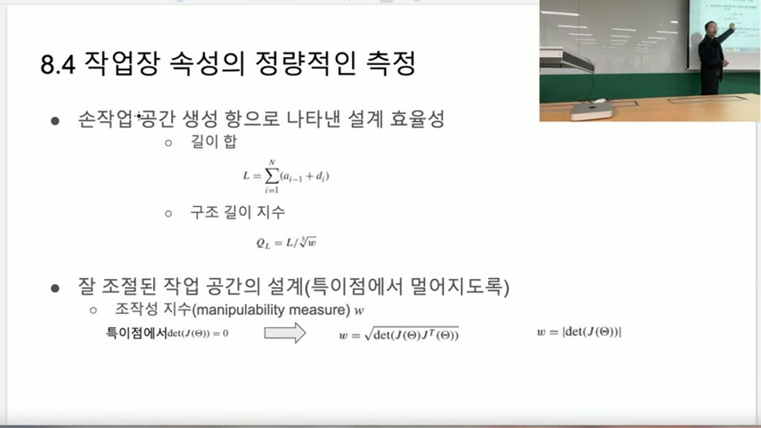
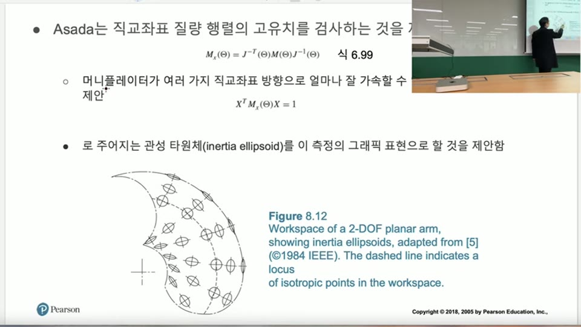
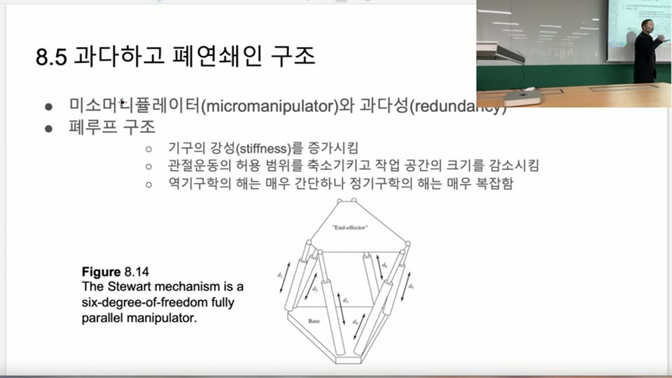

# 매니퓰레이터 기구 설계 — 센서·자유도·로봇 유형과 설계 지표 (Manipulator Mechanical Design)

> 출처: 로봇제어공학 — Introduction to Robotics 8장 "매니퓰레이터 기구 설계(Manipulator Mechanical Design)"
> 영상: https://www.youtube.com/watch?v=1ZAGpiTyfEU&list=PLP4rlEcTzeFIvgNQD8M1T7_PzxO3JNK5Z&index=21
> 대상: [7장](../cartesian-space-trajectory-generation/main.md)까지 기구학·동역학·궤적 생성을 배운 상태에서, "그럼 실제로 로봇 팔을 어떻게 설계하는가"를 다루는 개론 성격의 장.

> [!NOTE]
> **이 장의 성격**
> 강의에서 이 장을 정독보다 가볍게 훑도록 안내했다.
> > 8장은 교양처럼 들으라고 했죠. 8장은 매니퓰레이터 기구 설계예요.
> 수식보다 개념·용어·설계 시 고려사항이 중심이며, 이후 9~10장(제어) 진입 전 배경지식에 해당한다.

---

## 목차
1. [로봇 시스템을 이루는 4가지 요소](#1-로봇-시스템을-이루는-4가지-요소)
2. [센서 — 엔코더·토크 센서·전류 센서](#2-센서--엔코더·토크-센서·전류-센서)
3. [말단 효과 장치(End Effector)](#3-말단-효과-장치end-effector)
4. [자유도(DOF) 결정 — 작업에 맞춰 줄이거나 늘리기](#4-자유도dof-결정--작업에-맞춰-줄이거나-늘리기)
5. [설계 시 고려 요소 — 작업 공간·하중·속도·반복성·정밀성](#5-설계-시-고려-요소--작업-공간·하중·속도·반복성·정밀성)
6. [산업용 로봇의 기하학적 유형](#6-산업용-로봇의-기하학적-유형)
7. [손목(wrist) 설계 — 4·5·6축을 한 점에 모으기](#7-손목wrist-설계--4·5·6축을-한-점에-모으기)
8. [설계 평가 지표 — 구조 길이 지수와 조작성 지수](#8-설계-평가-지표--구조-길이-지수와-조작성-지수)
9. [과다 자유도와 폐루프(닫힌 사슬) 구조 — 스튜어트 플랫폼](#9-과다-자유도와-폐루프닫힌-사슬-구조--스튜어트-플랫폼)
10. [액추에이터 종류](#10-액추에이터-종류)
11. [표현법 비교표](#11-표현법-비교표)
12. [Python 실습 코드](#12-python-실습-코드)

---

## 1. 로봇 시스템을 이루는 4가지 요소

로봇 팔을 만들려면 링크·관절·DH 파라미터만으로는 부족하다. 교재는 로봇 시스템의 구성 요소를 4가지로 정리한다.

1. **내부·자체(proprioceptive) 센서를 포함한 머니퓰레이터** — 관절 각도·속도·가속도, 토크를 측정
2. **말단 효과 장치(end effector)** — 팔 끝의 공구(그리퍼, 드라이버 등)
3. **비전 시스템, 부품 공급 장치 같은 외부 센서(external sensor)**
4. **제어기(controller)**

> 여러분 로봇을 만들려고 하면 뭐뭐가 필요해요? 당연히 센서가 들어있어야 돼요.

**이해**: 그동안 강의에서는 링크 길이·A·D 같은 DH 파라미터만 다뤘지만, 실제 로봇은 여기에 센서·엔드 이펙터·제어기가 더해져야 완성된다는 걸 짚고 넘어가는 절이다.

**"proprioceptive"라는 용어에 대해**:
> 프로프리오셉티브 센서다 이렇게 불렀는데, 이건 나도 처음 듣는 단어고, 안 쓰는 단어고.
실제로는 로봇 자체의 내부 상태(관절 각도 등)를 측정하는 센서를 가리키는 표준 용어이며, 외부 환경을 보는 외부(exteroceptive) 센서와 대비된다 — 강의에서는 생소하다고 했지만 로보틱스 문헌에서는 일반적으로 쓰인다.

## 2. 센서 — 엔코더·토크 센서·전류 센서

**엔코더(encoder)**: 가장 널리 쓰이는 내부 센서. 원래는 **위치만** 측정하지만, 위치를 미분하면 속도, 한 번 더 미분하면 가속도가 나온다.

> 원래 엔코더는 위치만 아는 건데, 위치를 미분하면 속도가 나오고, 한번 더 미분하면 가속도니까. 그래서 유추해내는 거고.

**토크 센서(torque sensor)**: 모터 축과 링크 사이에 끼워, 축이 비틀리는 정도(strain)로 전달 토크를 직접 측정한다.



모터축 — 토크 센서 — 링크 순으로 이어지며, 모터가 돌면서 토크 센서에 미세한 비틀림이 생기고 그 비틀림 양으로 토크를 역산한다.

> 저 토크 센서가 겁나 비싸요. 모터보다 더 비싸, 정확한 토크 센서는.

**전류 기반 토크 추정(실전에서 더 많이 쓰는 대안)**: 정밀 토크 센서가 비싸므로, 대신 모터에 흐르는 전류를 측정해 토크를 간접 추정하는 방법을 많이 쓴다.

$$I = \frac{V}{R} \quad(\text{저항 } R \text{은 고정}) \qquad \tau \propto I$$

전압(PWM 제어값)을 바꾸면 저항이 일정하므로 전류가 바뀌고, 모터 특성상 **토크는 전류에 비례**한다. 그래서 전압·전류를 측정해 토크를 유추한다.

> 정확한 건 이거고(토크 센서), 이거 너무 비싸고, 이게 싸니까, 추가해야 할 게 별로 없으니까 이걸 많이 써요.

**실전 취급**: 정밀도가 꼭 필요한 협동로봇 손목 등에는 토크 센서를 쓰지만, 대부분의 관절에는 엔코더 + 전류 기반 토크 추정 조합이 비용 대비 실용적인 선택이다.

## 3. 말단 효과 장치(End Effector)

로봇의 손끝에 달려 작업을 실제로 수행하는 부분. 픽앤플레이스면 그리퍼, 드라이빙 작업이면 드라이버 형태 등 작업에 맞춰 다양하게 설계된다.

**사람 손과의 대비**: 사람은 엔드 이펙터가 손 하나뿐이라 대신 다양한 도구(드라이버, 드릴, 핀셋 등)를 갈아 끼우며 쓴다. 로봇은 도구를 쓸 필요 없이 작업 전용 엔드 이펙터를 바로 만들면 된다.

**사람 손을 그대로 흉내 낸 다관절 로봇 손이 실용적이지 않은 이유**: 손가락 관절 수가 팔 관절 수보다 훨씬 많아 만들기가 극도로 어렵고 비싸다.

> 저 시판되고 있는, 진짜 팔고 있는 손 중에 최고가는 1억이 넘어요. 손만. 팔은 뭐 몇천인데, 손이 1억이에요.

**실전 취급**: 범용성이 필요 없는 산업 현장에서는 작업 전용 그리퍼/공구를 쓰는 게 훨씬 경제적이다. 범용 다지 그리퍼(사람 손 모사)는 연구용·특수 목적에 주로 쓰인다.

## 4. 자유도(DOF) 결정 — 작업에 맞춰 줄이거나 늘리기

사람 팔은 6자유도이고, 손끝 위치·방위를 완전히 표현하려면 $X, Y, Z, R, P, Y$ 6개 변수가 필요하므로 **6관절이면 이론적으로 정확히 맞는다.**

하지만 항상 6관절이 필요한 건 아니다.

**예: 픽앤플레이스 → 4자유도로 충분**
위치는 $X, Y, Z$ 3개가 필요하지만, 잡은 물건을 손끝 각도까지 바꿔가며 옮길 필요는 없다 — 그냥 잡고 옮기기만 하면 되므로 회전은 1개(예: 위아래로 놓는 방향)면 충분하다.

**예: 용접 → 특정 각도 자유도를 없앨 수 있다**
항상 같은 방향으로 용접선을 따라가는 작업이라면, 그 방향을 결정하는 자유도 하나는 로봇이 아니라 **작업물(지그) 쪽을 회전시켜서** 대신할 수 있다.

> 그 용접하는 작업물을 이쪽으로 옮기면 되는 거 아니야. 후지 로봇이 거기 가서 각도를 틀어서 할 필요가 뭐 있어? 아까운 거지.

**예: 드라이버 작업 → 엔드 이펙터에 이미 회전 자유도가 내장**
드라이버는 그 자체로 계속 회전하는 도구이므로, Z축 회전 자유도가 엔드 이펙터에 이미 들어 있는 셈이다 — 로봇 팔에 별도로 그 회전 자유도를 추가할 필요가 없다.

**7자유도 이상 — 여유 자유도(redundant DOF)**
필요한 변수(6개)보다 관절이 많으면 남는 관절을 **여유 자유도**라 부른다.

$$\text{관절 수} > 6 \ \Rightarrow\ \text{여유 자유도} = \text{관절 수} - 6$$

여유 자유도는 사람이 하지 못하는 동작(예: 좁은 틈으로 팔꿈치를 굽혀 접근)을 가능하게 하지만, 관절 하나마다 모터·토크 센서·제어기·기구가 추가되어 **비용이 계속 올라간다.**

**저자유도 설계 — 팔은 단순하게, 작업물을 움직인다**
자유도를 높이는 건 설계·역기구학 난이도·비용이 모두 크게 늘어나는 일이다. 그래서 팔은 낮은 자유도(예: 4자유도)로 단순하게 만들고, 대신 **작업대(작업물)를 움직이는 축을 따로 추가**하는 설계도 흔하다.

> 여러분이 혼자 일할 거를 옆에 있는 친구한테 도와달라고 하는 거야. 야 옆으로 좀 움직여봐. 그러면 친구가 이렇게 돌려주면 나는 이것만 계속하면 되고.

예: 팔 4자유도 + 작업대 회전축 → 손끝은 가만히 있고 작업물이 돌면서 원 궤적을 만들어낼 수 있다(로봇이 굳이 원을 그릴 필요 없이).

**실전 취급**: 자유도는 "사람처럼 6개"가 기본값이 아니라 **작업이 실제로 요구하는 최소 자유도**를 먼저 분석하고 결정한다. 여유 자유도는 특수한 회피/접근 동작이 필요할 때만 비용을 감수하고 추가한다.

## 5. 설계 시 고려 요소 — 작업 공간·하중·속도·반복성·정밀성

| 요소 | 의미 | 비고 |
|---|---|---|
| **작업 공간(workspace)** | 팔 길이에 따라 결정되는 도달 가능 범위 | 팔이 짧으면 필요한 곳에 손이 안 닿는다(강의 예: UR3는 6축이지만 팔이 짧아 엘리베이터 버튼을 못 누름) |
| **하중(payload)** | 들 수 있는 최대 물체 무게 | UR3(3kg)·UR5(5kg)·UR10(10kg)처럼 제품명에 하중 스펙이 직접 붙기도 함 |
| **속도(speed)** | 관절이 움직일 수 있는 최대 속도 | 빠를수록, 하중이 클수록 가격 상승 |
| **반복성(repeatability)** | 같은 목표점을 반복해서 갈 때 도달 위치가 얼마나 일정한가 | 탄착군이 몰려 있음(정확도는 낮아도 됨) |
| **정밀성(accuracy)** | 지시한 목표점과 실제 도달점이 얼마나 가까운가 | 탄착군이 목표(10점)에 가까움 |

> 탄착군이 몰려있으면 반복성이 뛰어난 거야. 근데 그게 가운데 명중한 거에서 멀리 있어. 그래도 탄착군이 계속 거기에 잘 모여있으면 반복성은 뛰어난 거야. 정밀성은 떨어져.

**이해**: 반복성과 정밀성은 독립적인 지표다 — 반복성이 뛰어나도(항상 같은 곳에 도달) 정밀성은 나쁠 수 있다(그 위치가 목표와 떨어져 있음). 둘 다 좋은 로봇이 이상적이지만, 반복성만 좋아도 캘리브레이션으로 정밀성을 어느 정도 보정할 수 있다.

**DH 파라미터 설계 원칙(복습)**: [3-1](../denavit-hartenberg-parameters/main.md)에서 다룬 대로, $A, D$ 값을 가능하면 0 또는 90°로 단순하게 설계하면 정기구학·역기구학·자코비안이 모두 간단해진다.

**산업용 로봇의 전형적인 축 배치**: 밑에서부터 1~3축은 $X, Y, Z$ 위치를 담당하고, 손목 쪽 4~6축은 방위(orientation)를 담당하도록 설계하는 경우가 많다([PUMA 560](../forward-kinematics/main.md)도 이 구조).

## 6. 산업용 로봇의 기하학적 유형

### 6.1 갠트리(직교좌표) 로봇 — Cartesian/Gantry manipulator



세 관절이 모두 **직선(프리즘) 관절**로 X, Y, Z를 각각 담당한다.

- **장점**: 제어가 매우 간단하다 — 목표 XYZ가 정해지면 해당 축 담당 모터에 바로 명령을 보내면 되고, 역기구학·기구학을 풀 필요가 없다.
- **단점**: 작업 공간이 딱 직육면체 박스 모양으로 제한되고, 로봇 구조물 자체가 작업 대상보다 커야 한다.

> 로봇이 작업물보다 더 커야 돼. 이만해야 돼. 작업물은 그 안에 들어와 있어야 돼.

### 6.2 다관절형 로봇 — Articulated manipulator



우리가 지금까지 강의에서 다룬 것도 대부분 이 형태다. 회전 관절 위주라 작업장을 가장 적게 침입하는 구조(직교좌표 로봇보다 훨씬 작은 설치 공간으로 큰 작업 공간을 커버).

작업 공간 모양은 어깨 관절의 회전 범위 등 **DH 파라미터(링크 길이)에 따라 달라지는 부채꼴/초승달 모양**이며, 사람 팔처럼 안쪽 일부는 도달하지 못하는 빈 영역이 생긴다(예: 어깨가 뒤로 완전히 젖혀지지 않으므로). 가장 많이 쓰이지만, 그만큼 제어(역기구학·특이점 등)가 갠트리형보다 어렵다.

### 6.3 스카라(SCARA) 로봇



Selective Compliance Assembly Robot Arm의 약자. 평행한 두 회전 관절($\theta_1, \theta_2$)로 XY 평면을 커버하고, 세 번째 프리즘 관절($d_3$)이 위아래(Z)를 담당하며, 마지막에 손끝 회전 관절 하나가 붙는다 — **3개의 평행 회전 관절 + 프리즘 관절** 구성.

> 다관절형 로봇보다 약 10배 정도 빠름. 평면 작업에 가장 적당하다.

픽앤플레이스처럼 손끝 각도가 중요하지 않고 XYZ + 회전 1개만 있으면 되는 작업에 최적화되어 있다 — [4절](#4-자유도dof-결정--작업에-맞춰-줄이거나-늘리기)에서 다룬 "4자유도로 충분한 작업"의 대표 사례.

> 이거는 너무 파퓰러해서 이게 진짜 제일 파퓰러하고 많이 쓰이는 로봇이에요.

### 6.4 구형(spherical)·원통형(cylindrical) 로봇



- **구형(spherical) 매니퓰레이터**: 회전 2개 + 프리즘 1개(뻗는 축)로 대포(포신)처럼 움직인다. 데이터센터 등에서 보이는 형태.
- **원통형(cylindrical) 매니퓰레이터**: 회전 1개 + 프리즘 2개(위아래 + 뻗는 축)로 원통 좌표계를 그대로 따른다.

두 형태 모두 잘 쓰이지는 않지만, 좌표계 이름 그대로의 기하학적 직관을 준다는 점에서 개념적으로 이해해 둘 가치가 있다.

## 7. 손목(wrist) 설계 — 4·5·6축을 한 점에 모으기



4·5·6번 축을 **한 점에서 만나도록(orthogonal-axis, 나란히 한 축의 모임)** 설계하면 손목 부분의 기구학이 훨씬 단순해진다(축이 한 점에서 교차하면 [Pieper의 해](../inverse-kinematics-algebraic-geometric-pieper/main.md)가 적용 가능해져 역기구학이 폐형식으로 풀린다).

이를 기계적으로 구현하는 대표적인 방법이 **원격 위치 액추에이터 + 3중 동심축(concentric shaft)** 구조다 — 모터 3개($A_4, A_5, A_6$)를 손목에서 떨어진 곳에 두고, 속이 빈 동심 축 3개를 통해 회전을 전달해 $\theta_4, \theta_5, \theta_6$을 만든다. 이렇게 하면 무거운 모터를 손목 끝이 아니라 팔 안쪽(무게 중심에 가까운 곳)에 배치할 수 있어, 손목 관성을 줄이고 팔 끝을 가볍게 만들 수 있다.

**실전 취급**: 이 동심축 구조는 협동로봇·산업로봇 손목의 실제 설계에서 흔히 쓰이는 패턴이며, "손목 자유도는 모터를 손목에 직접 달 필요가 없다"는 설계 아이디어의 핵심 사례다.

## 8. 설계 평가 지표 — 구조 길이 지수와 조작성 지수



**구조 길이 지수(structural length index) $Q_L$** — 설계 효율성 지표: 팔을 얼마나 짧게 만들면서 작업 공간을 얼마나 크게 확보했는지 측정한다.

$$L = \sum_{i=1}^{N}(a_{i-1}+d_i) \qquad Q_L = \frac{L}{\sqrt[3]{w}}$$

$L$은 모든 관절의 DH 파라미터 $a, d$(길이 성분)를 합한 값이다. $w$(작업 공간 부피)는 길이의 세제곱 차원이므로, $L$과 차원을 맞추기 위해 세제곱근을 취한다.

> 팔을 짧게 만들었는데 작업 공간이 이렇게 많이 나와요, 좋은 거 아니야?

**낮은 $Q_L$일수록** 같은 팔 길이로 더 넓은 작업 공간을 확보했다는 뜻이므로 설계가 더 효율적이다.

**조작성 지수(manipulability measure) $w$** — 특이점에서 얼마나 멀리 떨어져 있는지를 측정하는 지표:

$$w = \sqrt{\det\big(J(\Theta)\,J^T(\Theta)\big)}$$

관절 수와 작업 공간 자유도가 같은 정방(square) 자코비안의 경우 다음처럼 단순화된다:

$$w = |\det(J(\Theta))|$$

특이점은 $\det(J(\Theta))=0$인 지점이므로, **$w$가 클수록 특이점에서 멀리 떨어진 좋은 자세**라는 뜻이 된다.

**이해**: 여유 자유도가 있어 자코비안이 정방행렬이 아닌 경우엔 $J J^T$ 형태의 일반식을 쓰고, 정방행렬인 일반적인 경우엔 $|\det(J)|$로 바로 계산할 수 있다 — $\sqrt{\det(J)\det(J^T)} = \sqrt{\det(J)^2} = |\det(J)|$이기 때문이다.

**아사다(Asada)의 조작성 지표 — 관성 타원체(inertia ellipsoid)**:



$$M_x(\Theta) = J^{-T}(\Theta)\,M(\Theta)\,J^{-1}(\Theta) \qquad X^T M_x(\Theta) X = 1$$

$M_x$는 [작업공간 질량행렬](../configuration-space-b-c-split-lagrangian-and-task-space-dynamics/main.md)이며, 이 식이 그리는 타원체가 그 위치에서 **작업 공간 방향별로 얼마나 잘 가속할 수 있는지**를 시각화한다. 타원체가 길쭉한 방향일수록 그 방향으로는 가속이 자유롭고, 짧은 방향일수록 가속이 제한된다 — 그림에서 팔 끝(작업 공간 경계)에 가까워질수록 타원체가 한쪽으로 눌리는 걸 볼 수 있다(더 멀리 뻗지 못하므로).

**실전 취급**: 조작성 지수·관성 타원체는 로봇 두 설계안을 비교하거나, 궤적이 특이점 근처를 지나는지 정량적으로 판단할 때 쓰는 지표다. 값을 외울 필요는 없고, "크면 좋은 것"이라는 방향성과 자코비안 행렬식과의 관계만 기억하면 된다.

## 9. 과다 자유도와 폐루프(닫힌 사슬) 구조 — 스튜어트 플랫폼

지금까지 다룬 로봇은 모두 **열린 사슬(open-loop/open-chain)** 구조 — 베이스에서 손끝까지 링크가 한 줄로 이어진다. 이와 대비되는 **폐루프(closed-loop/closed-chain)** 구조의 대표 예가 스튜어트 플랫폼(Stewart platform)이다.



베이스와 엔드 이펙터(윗판) 사이를 프리즘 액추에이터 6개($d_1$~$d_6$)가 병렬로 직접 연결하는 **6자유도 완전 병렬 머니퓰레이터(fully parallel manipulator)**다. 비행 시뮬레이터, 놀이공원 체험 기구 등에 쓰인다.

**폐루프 구조의 특징**:

| 항목 | 내용 |
|---|---|
| 강성(stiffness) | 증가함 — 여러 액추에이터가 하중을 나눠 받쳐 뻣뻣함 |
| 관절 운동 범위·작업 공간 | 축소됨 — 서로 묶여 있어 움직일 수 있는 범위가 좁음 |
| 역기구학 | 매우 간단함 |
| 정기구학 | 매우 복잡함 |

> 이 정도밖에 못 움직이고... 작업 범위가 되게 좁아. 좌우 공간이 되게 조그맣고 각도도 많이 안 변하거든요. 그럼 저걸 왜 써?

**왜 쓰는가 — 고하중(high payload)**: 엔드 이펙터를 액추에이터 6개가 동시에 떠받치므로, 무게가 6분의 1씩 나눠 실린다. 열린 사슬 로봇 팔은 끝에 무거운 물체를 달면 처지지만, 스튜어트 플랫폼은 훨씬 큰 하중을 버틸 수 있다.

**이해**: 역기구학이 간단한 이유는, 엔드 이펙터 자세가 정해지면 각 액추에이터의 길이가 기하학적으로 바로 계산되기 때문이다. 반대로 정기구학(6개 액추에이터 길이 → 엔드 이펙터 자세)은 6개의 비선형 연립방정식을 풀어야 해서 훨씬 어렵다 — 열린 사슬 로봇의 역기구학이 어려웠던 것과 정반대 구도다.

**여유 자유도·미소머니퓰레이터(micromanipulator)**: 과다 자유도(redundancy)와 함께, 큰 팔 끝에 작은 정밀 조작 장치(micromanipulator)를 추가로 다는 설계도 이 절에서 함께 언급된다 — 큰 팔이 대략적인 위치까지 이동하고, 손끝의 작은 장치가 정밀 보정을 담당하는 역할 분담이다.

## 10. 액추에이터 종류

| 종류 | 장점 | 단점 |
|---|---|---|
| **모터(전기)** | 제어가 쉽고 정밀함 — 로보틱스에서 기본 선택 | 회전 속도가 너무 빨라 감속(기어)이 필요, 백래시·마찰 발생 |
| **유압(hydraulic)** | 작은 에너지로 큰 힘을 낼 수 있음(예: 자동차 브레이크, 포크레인) | 제어가 어려움(유체 특성) |
| **공압(pneumatic)** | 구조 단순, 저렴 | 정밀 제어가 어려움 |

> 유압이 좋은 장점이 뭐예요? 아주 작은 에너지로 큰 힘을 다룰 수 있어요. 근데 뭐가 문제예요? 유압은 제어가 잘 안 돼요.

**모터 세부 종류**:

| 종류 | 특징 |
|---|---|
| **브러시(brush) DC 모터** | 전극을 기계적으로 바꿔주는 브러시 존재 — 마모되어 수명이 짧음 |
| **BLDC(Brushless DC) 모터** | 브러시 없음 — 마찰이 적어 더 오래, 더 고속으로 회전 가능. 현재 가장 많이 쓰임 |
| **AC 모터** | 힘은 좋지만 덩치가 크고 제어가 어려워 엘리베이터 등 제한적 용도에만 사용 |

**감속 필요성**: 모터는 회전 속도가 사람 관절 움직임보다 훨씬 빠르므로 기어로 감속해야 하고, 기어를 추가하면 백래시(backlash, 기어 간 유격에 의한 미세 오차)와 마찰이 함께 생긴다.

**강성(compliance)**: 모든 기계 부품은 어느 정도 휜다 — 아무리 튼튼하게 설계해도 무거운 물체를 잡으면 팔이 처지므로, 설계 단계에서 이를 감안해야 한다.

## 11. 표현법 비교표

| 기호/용어 | 의미 | 비고 |
|---|---|---|
| proprioceptive 센서 | 로봇 내부 상태(관절각·속도 등)를 측정하는 센서 | 엔코더가 대표적 |
| $\tau \propto I$ | 모터 토크는 전류에 비례 | 전압→전류→토크 순으로 간접 추정, 토크 센서 대체용 |
| 여유 자유도(redundant DOF) | 필요 변수(보통 6개)보다 많은 관절 수 | 특수 회피 동작 가능, 비용 증가 |
| 반복성 vs 정밀성 | 같은 곳에 도달하는 일관성 vs 목표와의 근접성 | 서로 독립적인 지표 |
| $Q_L = L/\sqrt[3]{w}$ | 구조 길이 지수 — 팔 길이 대비 작업 공간 효율 | 낮을수록 효율적 설계 |
| $w=\sqrt{\det(JJ^T)}=\lvert\det(J)\rvert$ | 조작성 지수 — 특이점과의 거리 | 클수록 특이점에서 멀다(좋음) |
| $M_x(\Theta)=J^{-T}MJ^{-1}$ | 아사다 관성 타원체(작업공간 질량행렬) | 방향별 가속 능력을 타원체로 시각화 |
| 열린 사슬 vs 폐루프 | 링크가 일렬 vs 액추에이터가 병렬로 엔드 이펙터를 지지 | 폐루프: 역기구학 쉬움·정기구학 어려움·강성 높음·작업 공간 좁음 |
| BLDC | 브러시리스 DC 모터 | 현재 로봇 관절에 가장 널리 쓰이는 액추에이터 |

## 12. Python 실습 코드

```python
import numpy as np

def torque_from_current(current, kt):
    """전류 -> 토크 추정 (토크 상수 kt 사용, tau = kt * I)."""
    return kt * current


def structural_length_index(a_list, d_list, workspace_volume):
    """구조 길이 지수 Q_L = L / w^(1/3)."""
    L = sum(a + d for a, d in zip(a_list, d_list))
    return L / (workspace_volume ** (1 / 3))


def manipulability(J):
    """조작성 지수 w = sqrt(det(J J^T)); 정방행렬이면 |det(J)|와 같다."""
    JJt = J @ J.T
    return np.sqrt(max(np.linalg.det(JJt), 0.0))


if __name__ == "__main__":
    # 전류 기반 토크 추정 예시
    print("추정 토크:", torque_from_current(current=2.0, kt=0.15), "N*m")

    # 2-링크 평면 로봇 자코비안 예시 (5-2절 정의 재사용)
    theta1, theta2 = np.radians(30), np.radians(45)
    l1, l2 = 0.3, 0.25
    J = np.array([
        [-l1*np.sin(theta1) - l2*np.sin(theta1+theta2), -l2*np.sin(theta1+theta2)],
        [ l1*np.cos(theta1) + l2*np.cos(theta1+theta2),  l2*np.cos(theta1+theta2)],
    ])
    print("조작성 지수 w:", manipulability(J))
    print("정방행렬이므로 |det(J)| =", abs(np.linalg.det(J)))
```

**연습문제(TODO)**:

```python
# TODO 1: 구조 길이 지수 비교
#   설계안 A: a_list=[0.3,0.3,0.1], d_list=[0.1,0,0.1], workspace_volume=0.5
#   설계안 B: a_list=[0.4,0.4,0.15], d_list=[0.1,0,0.1], workspace_volume=0.55
#   structural_length_index로 둘을 계산해 어느 쪽이 더 효율적인 설계인지 판단하라.

# TODO 2: 특이점 근접도 스캔
#   theta1을 0~180도로 스캔하며(theta2=45도 고정) manipulability(J) 값을 계산하고,
#   w가 0에 가까워지는(특이점에 가까운) theta1 구간을 찾아라.
#   힌트: 완전히 뻗은 자세(theta2=0 또는 180)에서 특이점이 발생하는지 확인.

# TODO 3: 반복성 vs 정밀성 시뮬레이션
#   목표점 (1.0, 1.0) 주변에 노이즈를 준 도달점 샘플 100개를 두 세트 생성하라:
#   세트 A(반복성 좋음, 정밀성 나쁨): 평균이 (1.1, 1.1)이고 표준편차가 작은 분포
#   세트 B(반복성 나쁨, 정밀성 좋음): 평균이 (1.0, 1.0)이고 표준편차가 큰 분포
#   각 세트의 평균(정밀성 지표)과 표준편차(반복성 지표)를 계산해 비교하라.
```

**실전 연결**:
- ROS2 `ros2_control`의 하드웨어 인터페이스는 관절마다 `position`, `velocity`, `effort`(토크) 상태를 노출하는데, `effort`가 바로 이 장에서 다룬 토크 센서/전류 추정값이 흘러 들어오는 자리다.
- URDF의 `<joint>` 태그에서 `type="prismatic"`은 갠트리/스카라형 축, `type="revolute"`는 다관절형 회전 축을 표현한다 — 이 장에서 본 로봇 유형이 그대로 URDF 관절 타입 선택으로 이어진다.
- 조작성 지수·특이점 근접도는 MoveIt의 IK 솔버가 다중해 중 하나를 고를 때 내부적으로 참고하는 개념과 같은 뿌리다.

## 핵심 요약 카드

| 구분 | 핵심 내용 |
|---|---|
| 로봇 시스템 4요소 | 내부 센서 포함 머니퓰레이터, 엔드 이펙터, 외부 센서(비전 등), 제어기 |
| 센서 | 엔코더(위치→미분으로 속도·가속도), 토크 센서(비싸서 실전은 전류 기반 추정 선호) |
| 자유도 | 사람=6, 하지만 작업(픽앤플레이스=4, 용접=작업물 회전으로 대체 등)에 맞춰 조정. 초과분은 여유 자유도 |
| 설계 고려 요소 | 작업 공간(팔 길이), 하중, 속도, 반복성(일관성) vs 정밀성(정확도) |
| 로봇 유형 | 갠트리(제어 쉬움·공간 큼), 다관절형(작업장 침입 적음·제어 어려움), SCARA(평면 작업 특화·10배 빠름), 구형/원통형(대포형, 잘 안 씀) |
| 손목 설계 | 4·5·6축을 한 점에서 교차 + 동심축으로 모터를 원격 배치 → 손목 관성 감소, Pieper 해 적용 가능 |
| 설계 지표 | $Q_L=L/\sqrt[3]{w}$(짧은 팔로 넓은 작업공간=효율적), $w=\lvert\det J\rvert$(특이점과의 거리), Asada 관성 타원체(방향별 가속 능력) |
| 폐루프 구조 | 스튜어트 플랫폼 = 6축 완전 병렬. 역기구학 쉬움·정기구학 어려움, 고강성·고하중, 작업 공간은 좁음 |
| 액추에이터 | 모터(제어 쉬움, 기본 선택) > 유압(힘은 크지만 제어 어려움) > 공압. 모터 중 BLDC가 현재 표준 |
