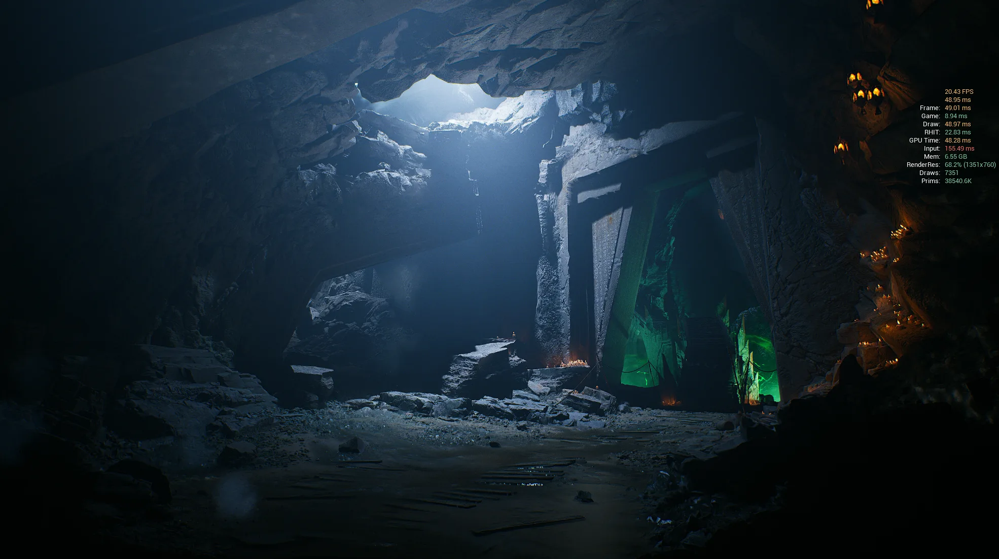
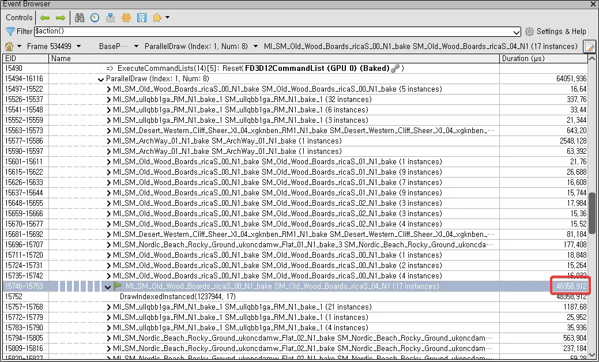
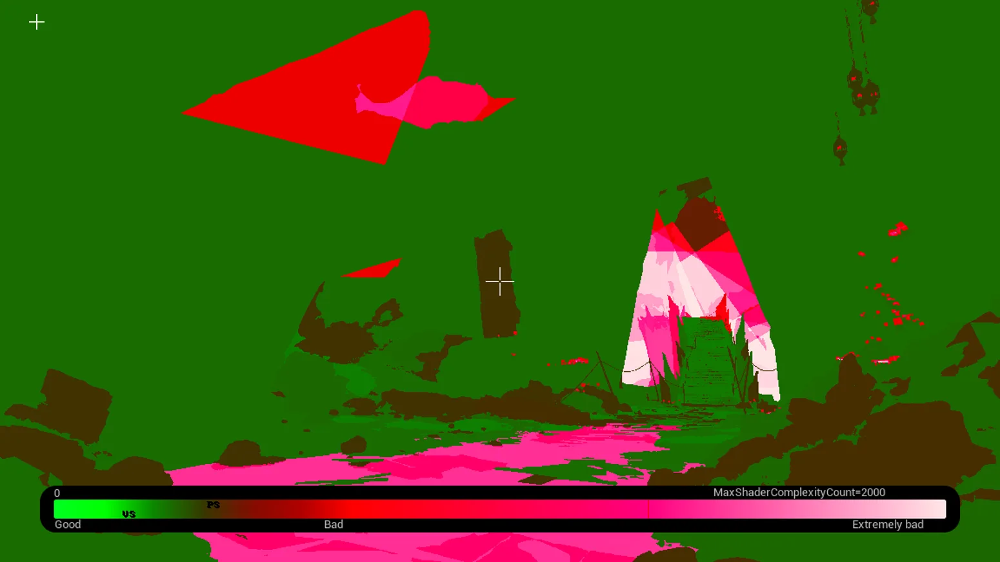
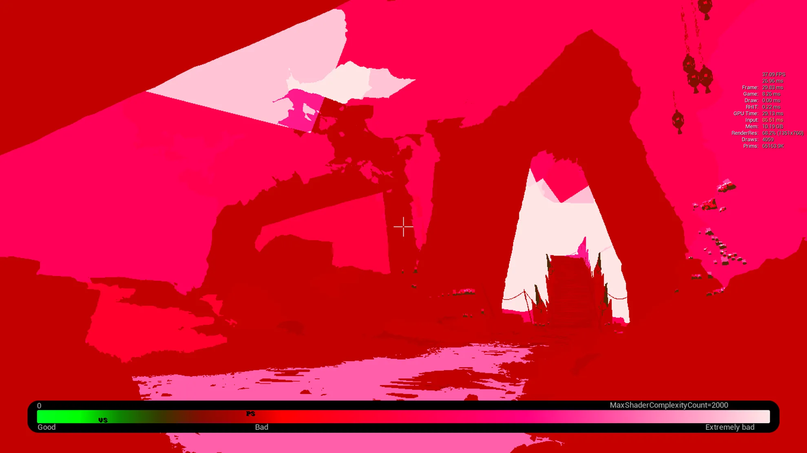
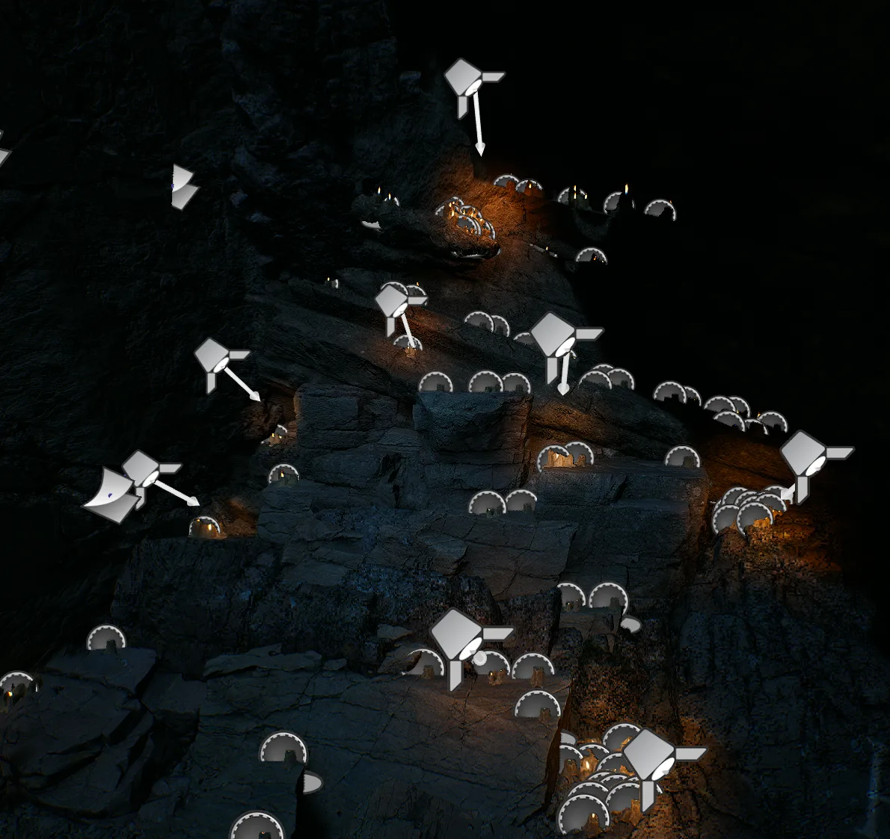
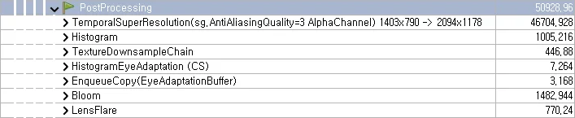
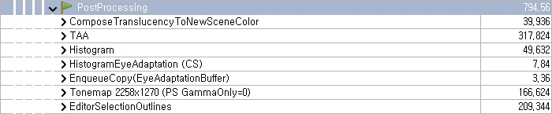
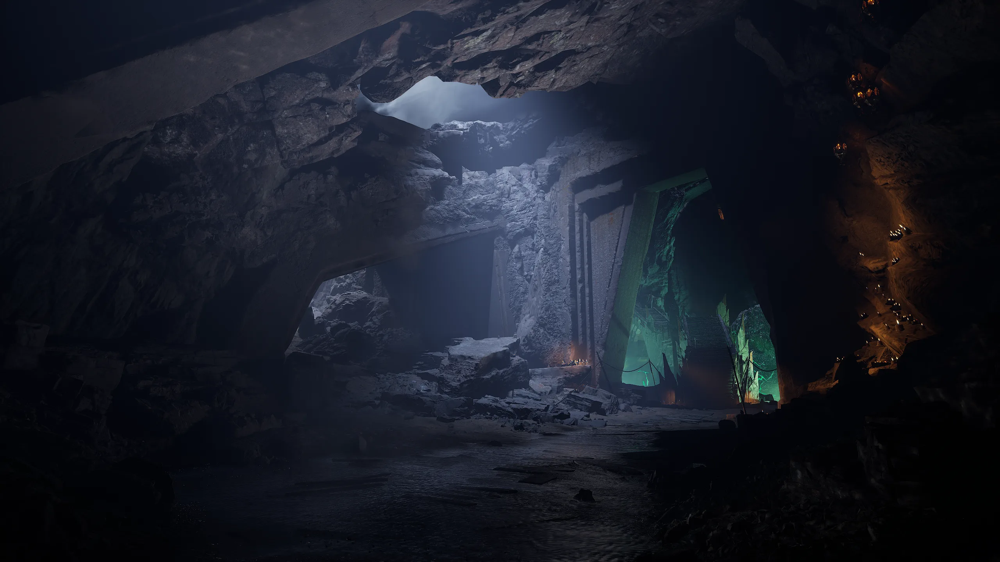
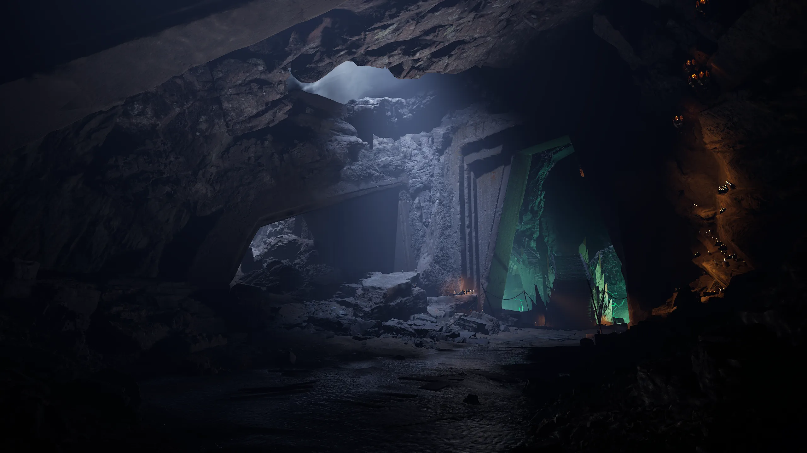
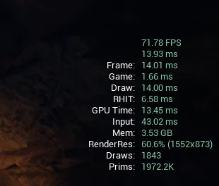

---
## Overview
Unreal 라이브러리에서 얻을 수 있는 DarkRuin 씬을 최적화해 보았다.


**하드웨어**
GPU | RTX 2070 SUPER |
--- | --- |
CPU | Ryzen9 3900X | 
RAM | 64GB |

**목표**
60fps


## Workflow

### Drawcall
#### 메쉬 정리

레벨 배치가 모두 완료된 씬이니 계단 같은 작은 메쉬들이 뭉쳐 있는 것들을 병합해 주었다.
RenderDoc에서 튀는 메쉬들 HDA로 데시메이션, LOD 정리 및 최적화 진행.
Opaque 머티리얼 동일 Master로 단일화 



#### 머티리얼 최적화
Opaque 머티리얼은 직접 제작한 [Bakerst](../../../works/bakerst/main.md) 플러그인을 사용하여 텍스처 기반 단순 머티리얼로 변환.
일괄적으로 최대 2K로 사용하게 리밋을 잡아 주었다. 디테일이 떨어지는 부분은 추후에 재조정.

```compare

 
```

### Light
- 무드용 라이트 `shadow cast` off
- static, stationary 로 변경
- 라이트 반경 조절
- 불필요한 라이트 제거
- 촛불 라이트  -> spot 라이트 교체
씬의 무드를 위한 라이트는 shadow를 전부 꺼 주었다. 작은 촛불 하나씩 있던 라이트를 전부 지우고 스포트 라이트로 표현해 주었다.

 ||
--- | --- |

### PostProcessing

포스트 프로세싱 중 연산 효율이 좋지 않고 변화가 거의 없는 것들은 수정을 해 주었다.



```
r.BloomQuality 0
r.AntiAliasingMethod 2
sg.AntiAliasingQuality 2
r.LensFlareQuality 0
```



```compare


```

## Result
빌드 후 프레임


