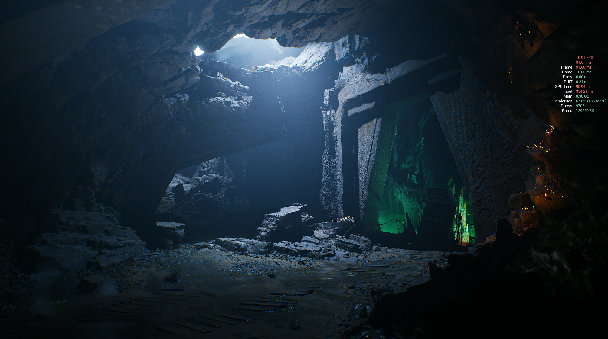
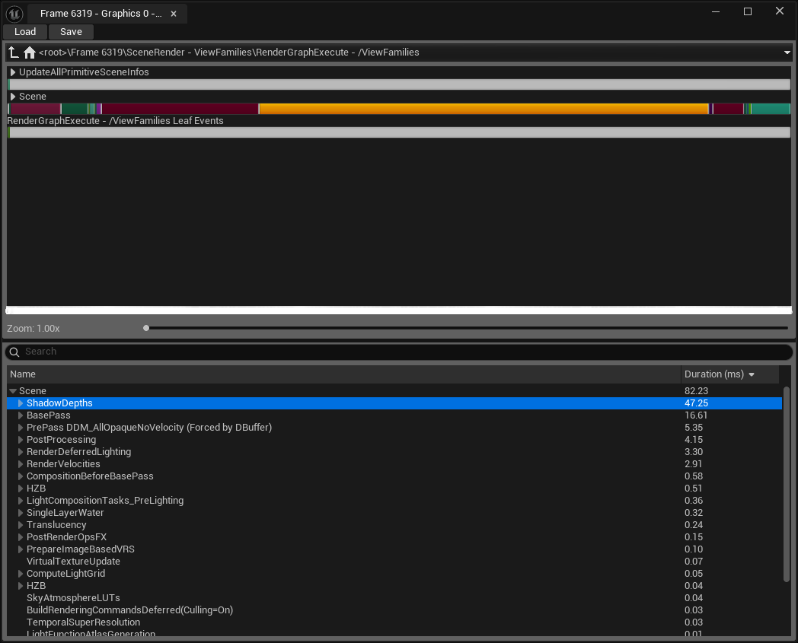
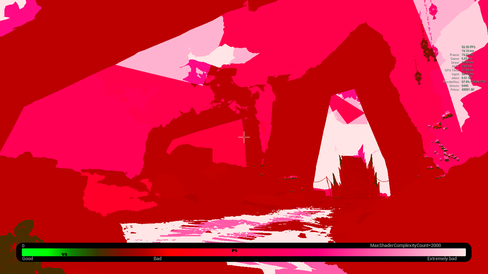

---
## Overview
Unreal 라이브러리에서 얻을 수 있는 DarkRuin 씬을 최적화해 보았다. QAcamera를 기준으로 최대한 룩을 보존하는 선에서 작업을 진행했다.
이 프로젝트에서는 Nanite, Lumen, Megalight 는 꺼주었다.

**하드웨어**
GPU | RTX 2070 SUPER |
--- | --- |
CPU | Ryzen9 3900X | 
RAM | 64GB |
scalability | Epic |

**목표**
90fps

## Workflow
### Analyze

전체 적으로 손봐야 할곳이 많지만 GPU 병목을 먼저 해결하기로 했다. profileGPU로 ShadowDepths 가 아주 많은 양을 차지 하고 있는 것을 확인했다.

### Drawcall
#### Actor Merge

레벨 배치가 모두 완료된 씬이니 계단 같은 작은 메쉬 들이 뭉쳐 있는 것들을 병합해 주었다.

### Shader

기둥에도 4K를 쓰는 모습

일괄적으로 최대 2K로 사용하게 리밋을 잡아 주었다. 디테일이 떨어지는 부분은 추후에 재조정. 또한 메테리얼에서 커스텀 노이즈와 

### Light

- 무드용 라이트 `shadow cast` off
- 불 필요한 라이트 제거
- 촛불 라이트 
씬의 무드를 위한 라이트는 shadow를 전부 꺼주었다. 작은 촛불 하나씩 있던 라이트를 전부 지우고 포인트 라이트로 표현해 주었다. 또한 기존에 있던 포인트 라이트는 반경을 줄여 겹치는 부분을 최소화 해주었다.

 |  |
--- | --- |

