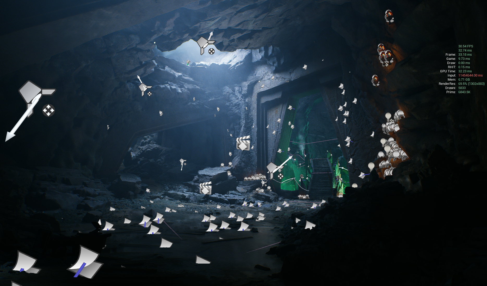
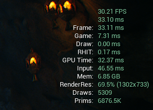
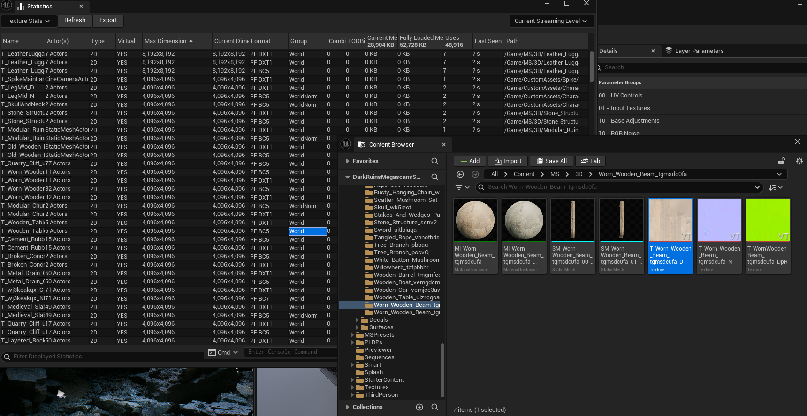

**하드 웨어**

GPU | RTX 2070 SUPER |
--- | --- |
CPU | Ryzen9 3900X | 
RAM | 64GB |
scalability | Epic |

---

Unreal 라이브러리 에서 얻을 수 있는 DarkRuin 씬을 최적화 해보는 작업.

## Goal
90fps

## Workflow
기둥에도 4K를 쓰는 모습

일괄적으로 최대 2K 로 사용 하게 리밋을 잡아 주었다. 디테일이 떨어 지는 부분은 추후에 재조정.