## Overview
환경 제작을 목적으로 Unreal의 기본 기능들을 익히며 작업했다. 대부분 Megascan Asset을 사용했으며 필요한 에셋들은 Houdini에서 직접 제작했다.

## Workflow

### Giant Tree HDA
앙코르와트 사원을 감싸는 나무를 레퍼런스로 제작한 HDA. 기본적으로 curve를 인풋으로 받아 나무가 생성된다.

#### Stage Parameter
HDA 내에서 **Stage** 를 오가며 파라미터를 조작할 수 있다. 각 단계별로 조작이 가능하고 불필요한 연산을 피할 수 있다.

#### Collision + VDB Vector field
콜리전을 이용하여 나무가 오브젝트를 감싸는 표현을 구현했다. 뿌리의 형태는 VDB Vector field로 커브를 생성했다. Curve를 직접 조작하는 것보다 유기적이고 자연스러운 모습을 만들 수 있다.

레퍼런스 나무는 뿌리와 몸통이 부드럽게 이어지는 모습이기 때문에 VDB로 합친 후 하이 폴리 단계에서 노이즈를 주어 디테일을 넣어주었다.

#### lowpoly
제작된 하이 폴리는 폴리곤 수와 디테일이 많아 로우 폴리 로 변환하는 과정에서 노드 연산 비용이 컸다. 자잘한 노이즈는 생략하고 큰 실루엣을 유지하는 중간 단계의 지오메트리를 거쳐 진행했다. 그 결과 예상보다 연산이 빠르고 실루엣을 잃지 않는 선에서 만족스러운 로우 폴리 를 만들 수 있었다.
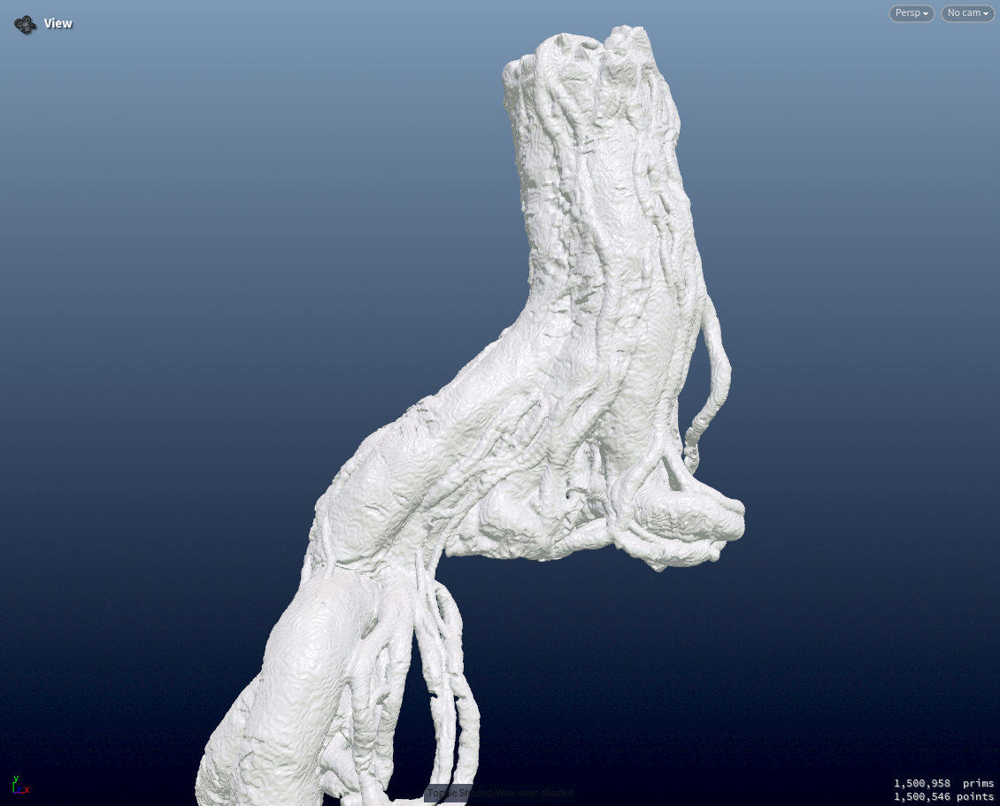||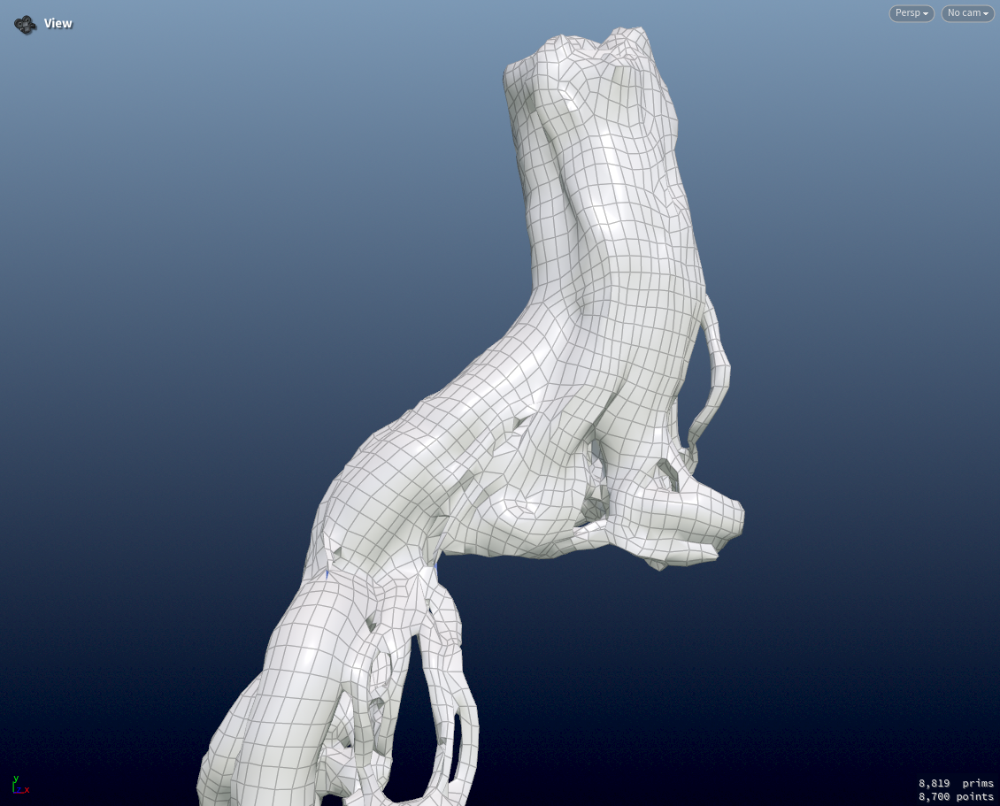|
--- | --- | -- |
`high` `1.5m` | `medium` `237k` |`low` `8k` |

원하는 모양이 픽스되면 `refresh` 버튼으로 생성된다. 라이브 업데이트는 연산 시간이 불필요하게 길어지기 때문에 원하는 결과가 나왔을 때 마지막 단계로 생성하는 것이 효율적이다.
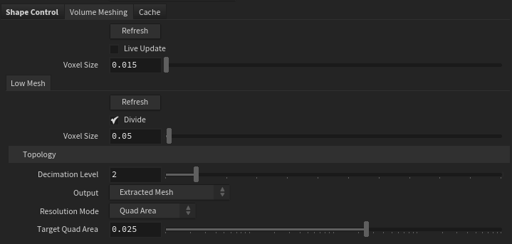

#### Texture
텍스쳐는 Substance Painter에서 만들어 주었다. 이 단계에서는 이끼의 분포와 껍질의 디테일을 집중적으로 작업했다. 
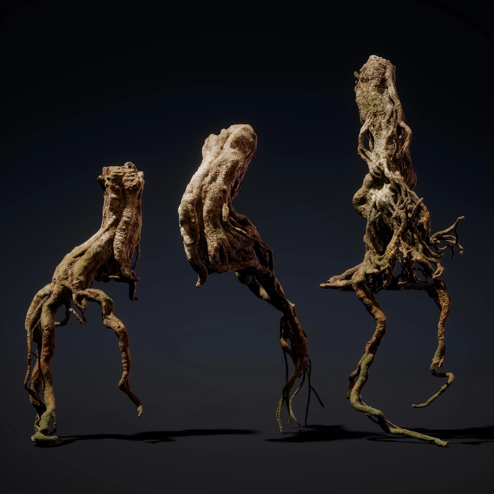

### Block

반복 배치되는 블럭의 경우 Houdini의 PDG를 통해 절차적으로 생성되게 디자인했다.

#### Shape
SDF 로 블럭의 부식 노이즈를 만들고 텍스쳐링에 쓰일 마스크도 만들어 주었다.
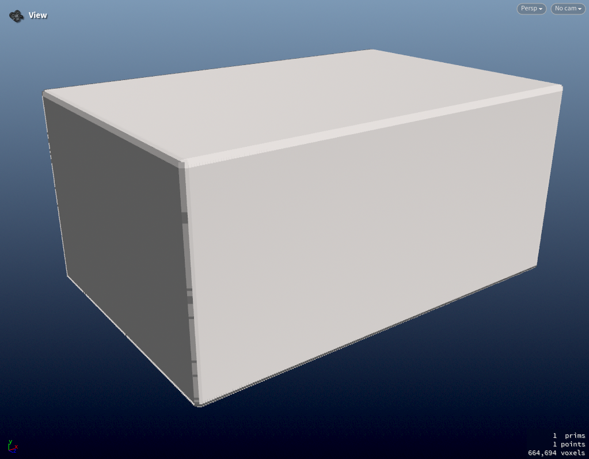 |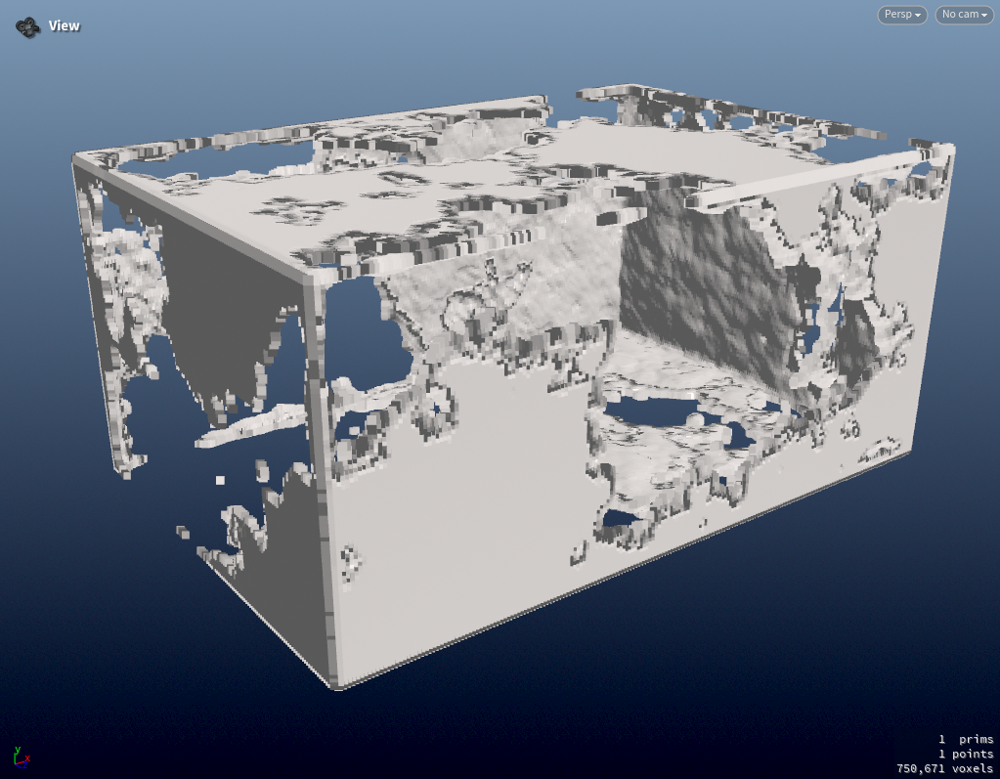 | 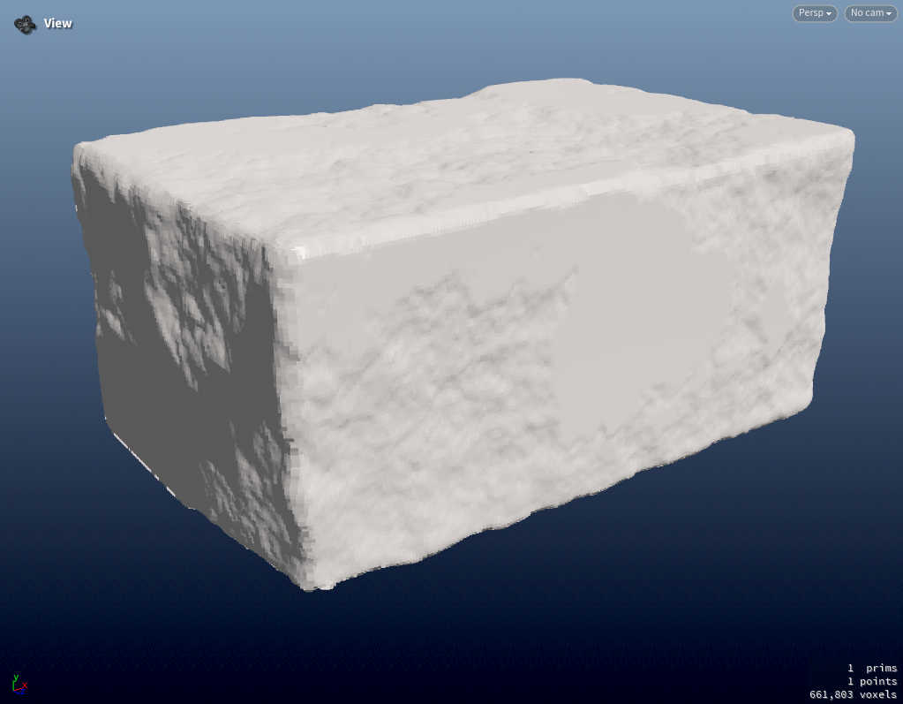 | 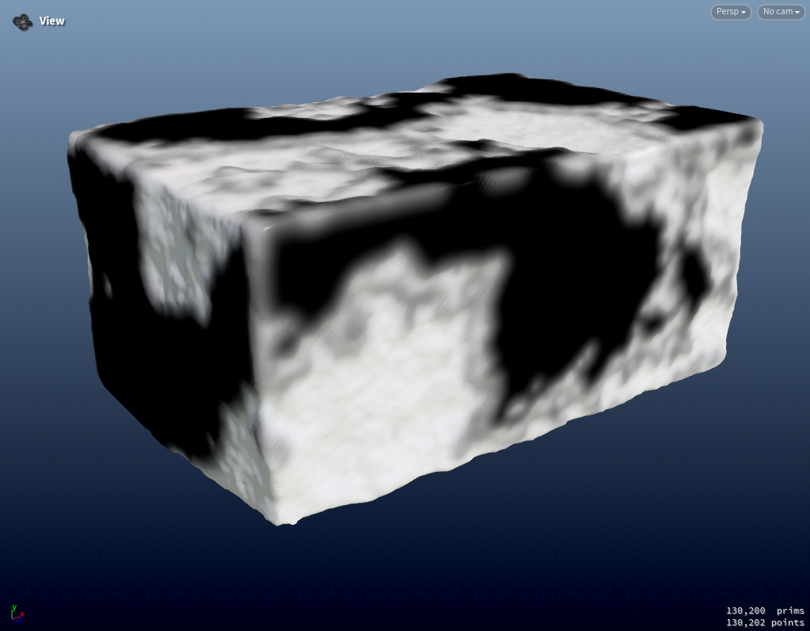 |
--- | --- | --- | --- |

#### Texture
##### UV Box mapping
블럭 형태의 UV는 Box mapping 으로 제작 했다. 하지만 Houdini 에는 Box mapping 하는 노드가 없기 때문에 따로 만들어 주었다.

Bake와 Texture 제작은 COPs에서 진행했다. 텍스처 리소스를 블렌딩하여 활용했다.
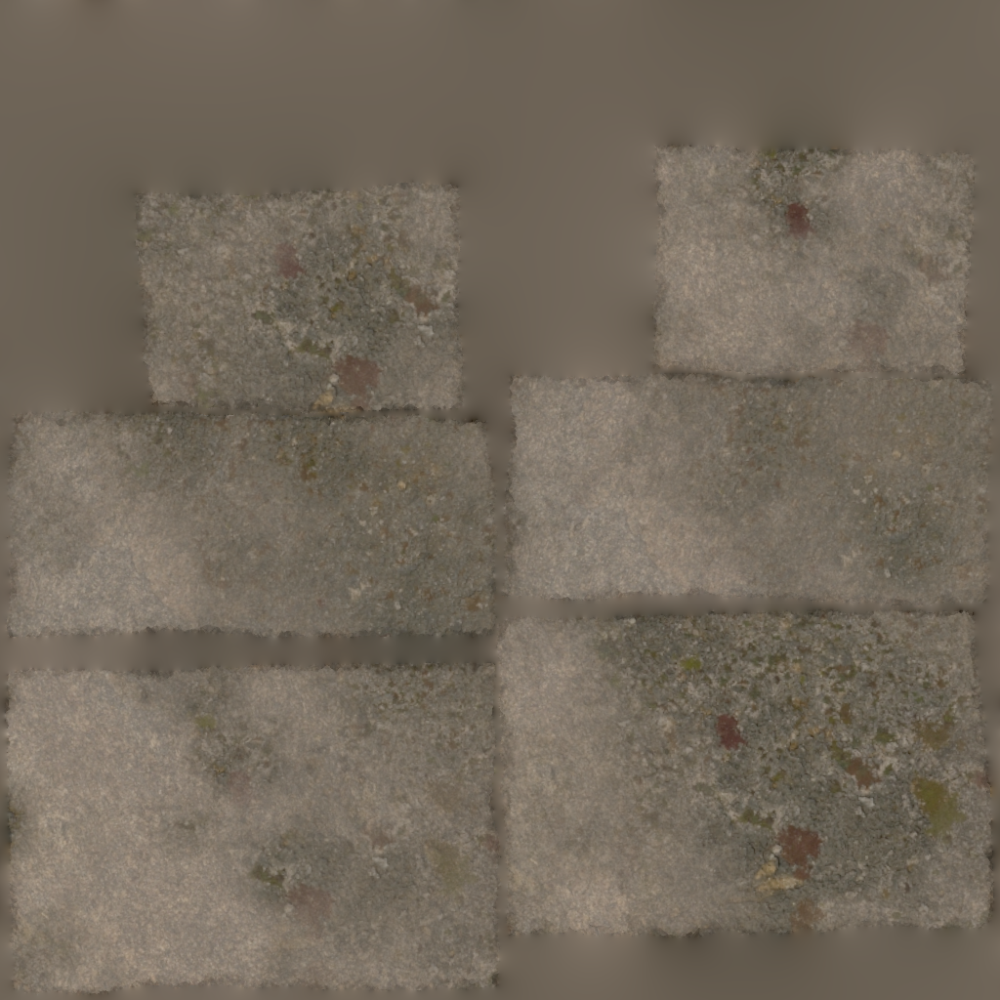 |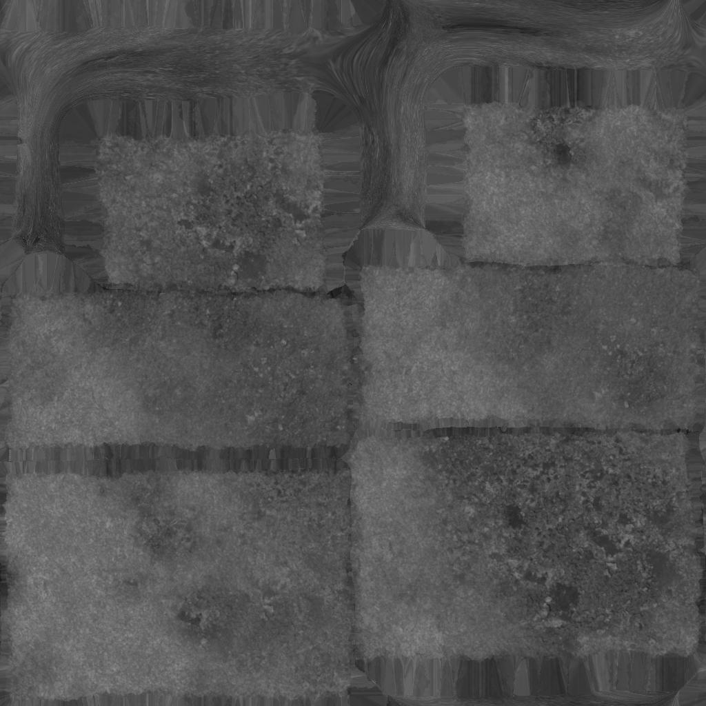| 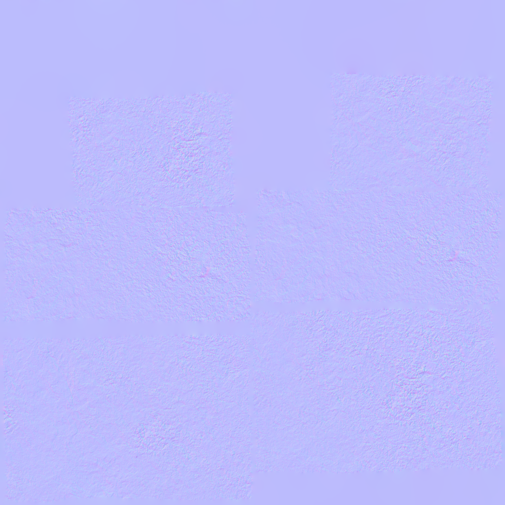|
--- | --- | --- |
Base Color | Roughness | Normal |

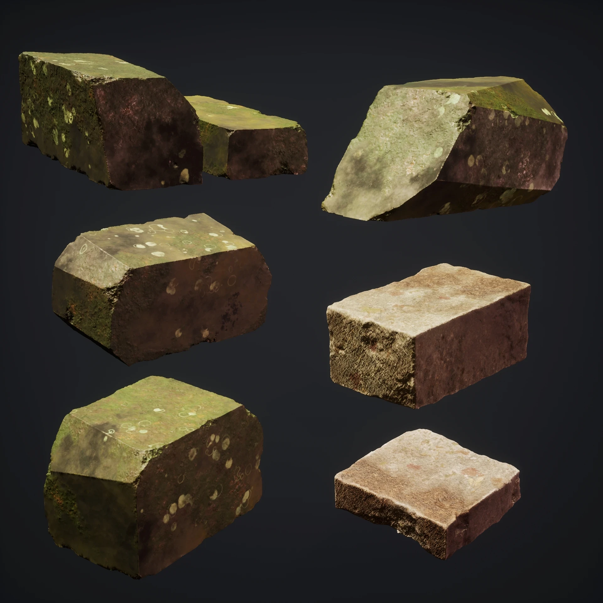

## Result

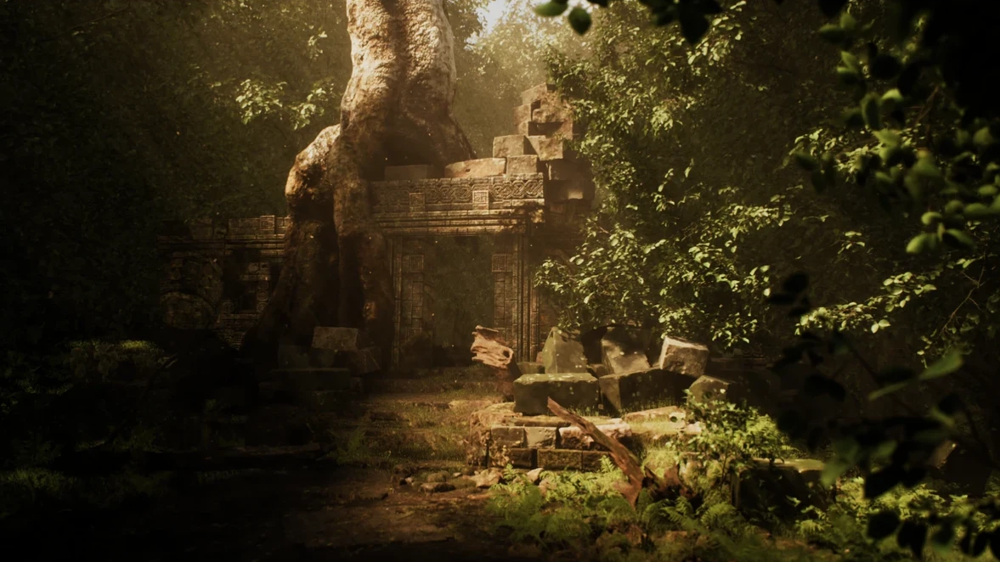

