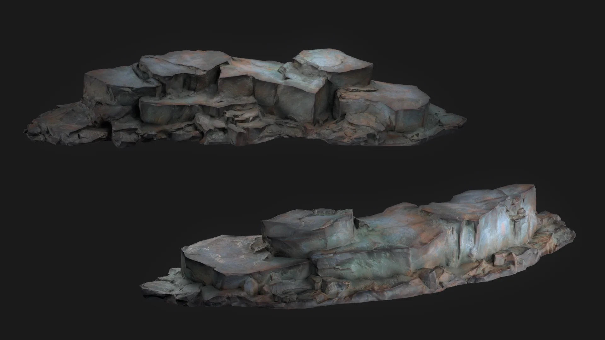
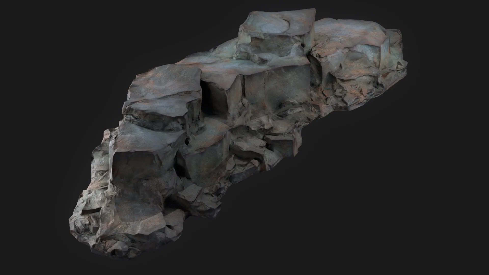
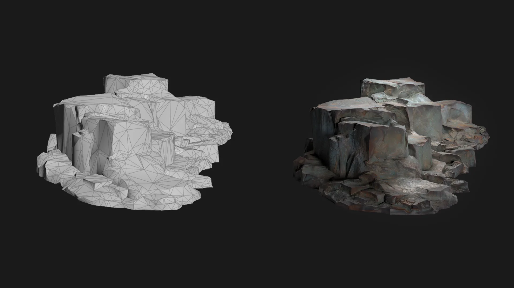

## Overview
[HDA](../RockCliffGen/main.md)로 더미 데이터를 생성하여 Zbrush로 제작한 에셋 텍스쳐는 Substance Painter에서 진행했다.

## Workflow
### Decimation
지브러시로 스컬프팅한 메쉬를 후디니로 불러와 최적화를 진행했다. Zbrush에서도 기능이 있지만 훨씬 빠른 연산으로 Houdini 에서 작업했다. 베이크용으로 제작한 로우 메쉬를 이용해 텍스쳐를 제작하고 한번 더 폴리곤을 정리해 주었다. 베이크용 로우 메쉬가 폴리곤이 너무 적으면 베이크에 문제가 생기는데 이 절차로 그런 에러를 확실히 줄일 수 있었다.

스컬프팅 이후에 메쉬가 꼬여 있는 흔적을 종종 볼 수 있는데 이대로 리메쉬를 진행하면 꼬인 면이 그대로 노출 되기 때문에 `measure`노드로 필터링 하여 면을 정리 했다.

