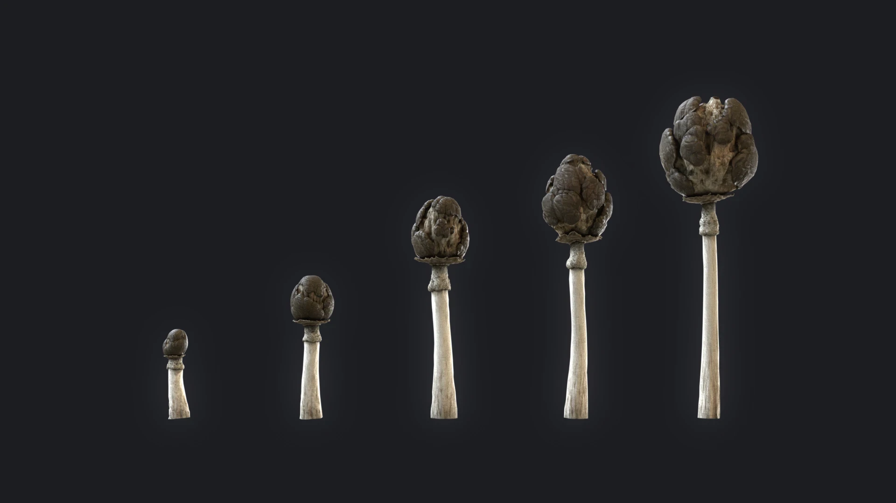
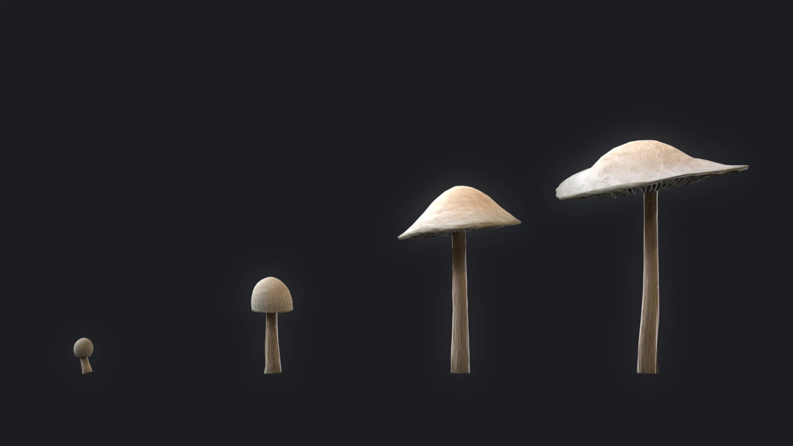
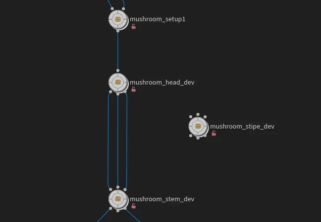
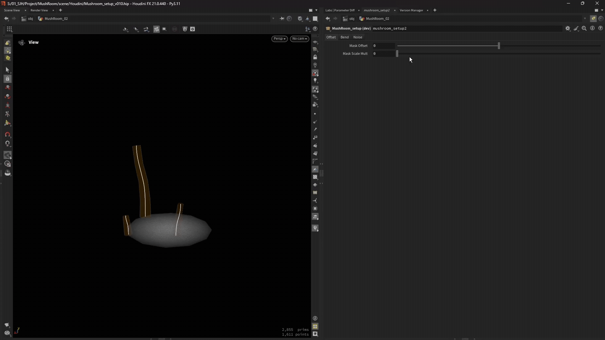
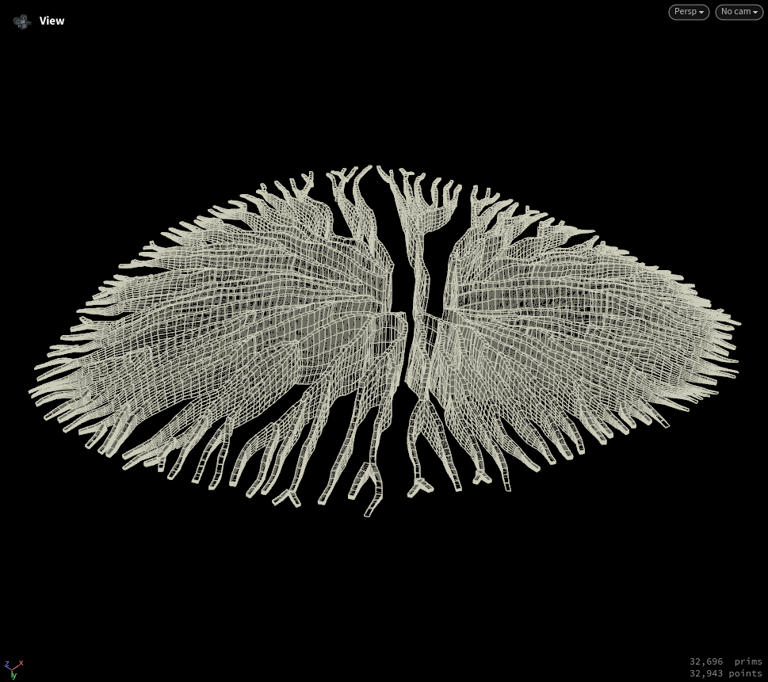
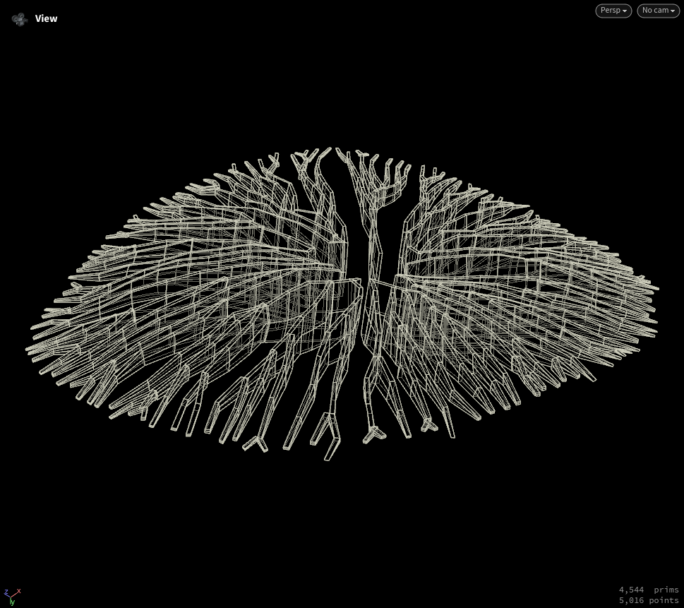
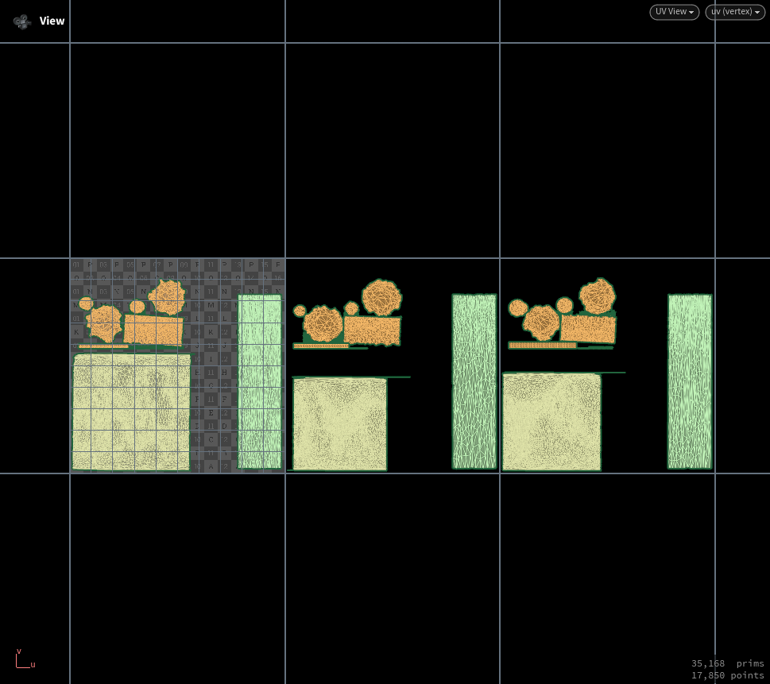
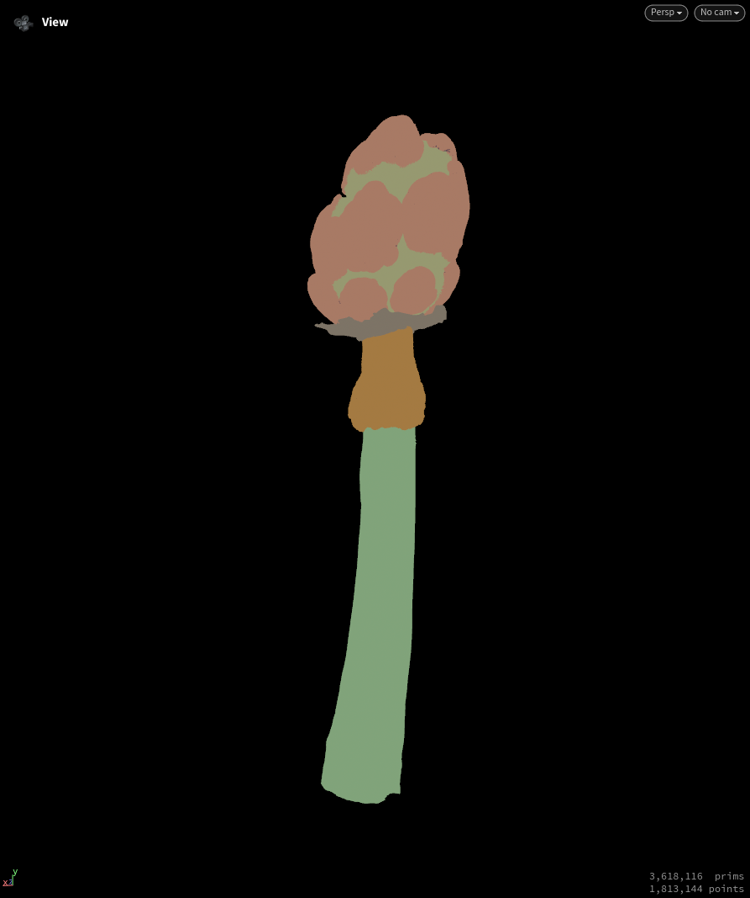
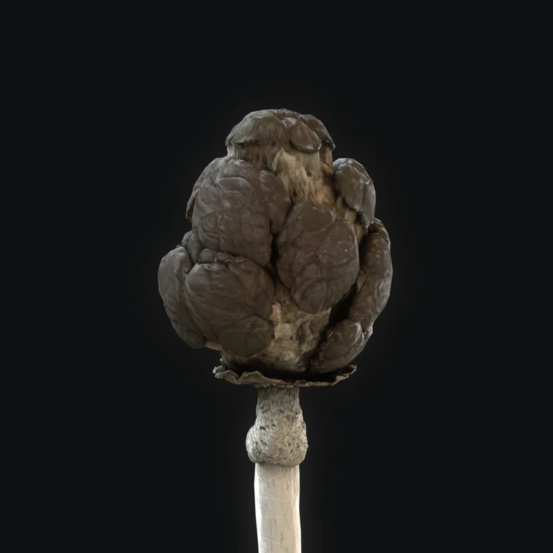
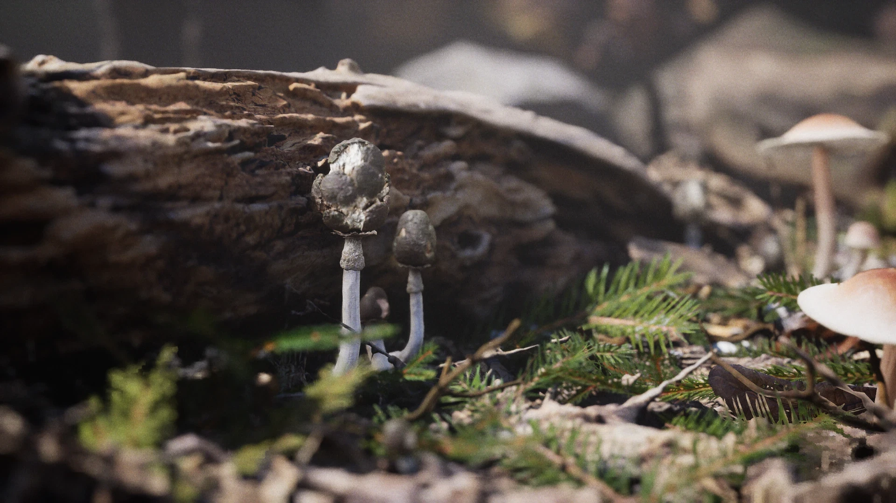

## Overview
하나의 컨셉을 가진 버섯 에셋을 만들어 보았다. 다양한 버섯을 위한 범용적인 셋업은 아니지만 파라미터 조절로 **개연성 있는 성장 단계**를 구현해보고 싶었다. 
버섯의 전체적인 크기를 기준으로 단계가 정해진다.

## Workflow
Module 형식으로 제작한 이유는 사용자가 노드 중간에서 지오메트리를 조작할 수 있도록 하기 위해서다. 또한 하이 메쉬로 제작되기 때문에 순차적으로 빌드하는 것이 효율이 좋을 거라고 생각했다.

버섯의 분포는 지정된 파라미터로 쉽게 조작할 수 있게 구성했다.

### Pattern
대부분의 패턴은 VOP 안에서의 attribute와 noise를 조합하여 제작되었다.

### Lowpoly
highpoly와 lowpoly가 병렬적으로 생성되는 워크플로우를 채택했다. 각 노드의 연산 비용이 증가하지만 UV 보존을 용이하게 하고 내가 원하는 디테일을 의도적으로 보존할 수 있다는 확실한 장점이 있다.
 |  |
--- | --- |

### Texture
Houdini 내에서 lowpoly, highpoly, IDmap(VertexColor), UDIM 등의 Substance Painter 에서 사용할 요소들이 만들어진다. 때문에 master material을 하나 만들어 놓고 일괄적으로 적용 가능하게 구성하였다.
 |  |
--- | --- |

> [!NOTE]
> 지금 워크플로우는 한 번에 여러 오브젝트를 만들지만, 하나씩 생성 후에 Unreal 내부에서 레벨로 만들어 사용하거나 인스턴싱하는 방식도 괜찮을 것 같다.

## Result

