## Overview
Stylized 아트 표현을 목표로 제작된 모듈 에셋 생성기. VDB와 하이폴리 사용을 배제하여 폴리곤 수와 베이크 시간을 아끼는 방향으로 제작되었다.
https://www.youtube.com/watch?v=kQhtnKJwX6Q

### 우선 순위
1. Stylized 디테일 구현해 보기
2. 사용 가능한 실루엣
3. VDB·하이폴리 조작 배제

## Workflow

### Vertex Color
Unreal에서의 사용을 염두에 두고 인풋을 버텍스 컬러로 선정했다. 높낮이를 2D로 저장할 수 있는 지형적 특성을 활용하여, 버텍스 컬러는 높이 값으로 변환되어 에셋으로 생성된다.
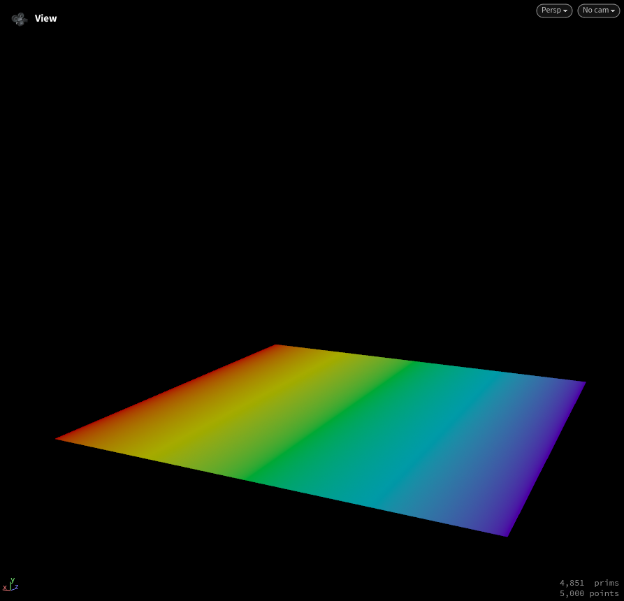 | 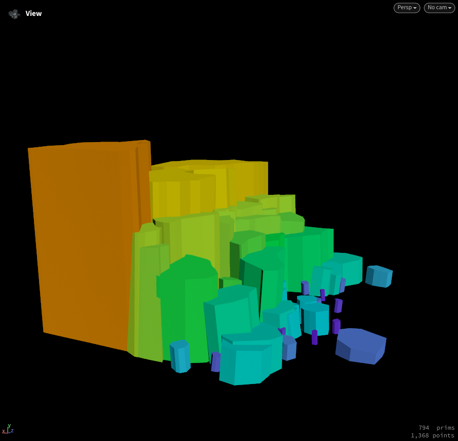 |
--- | --- |
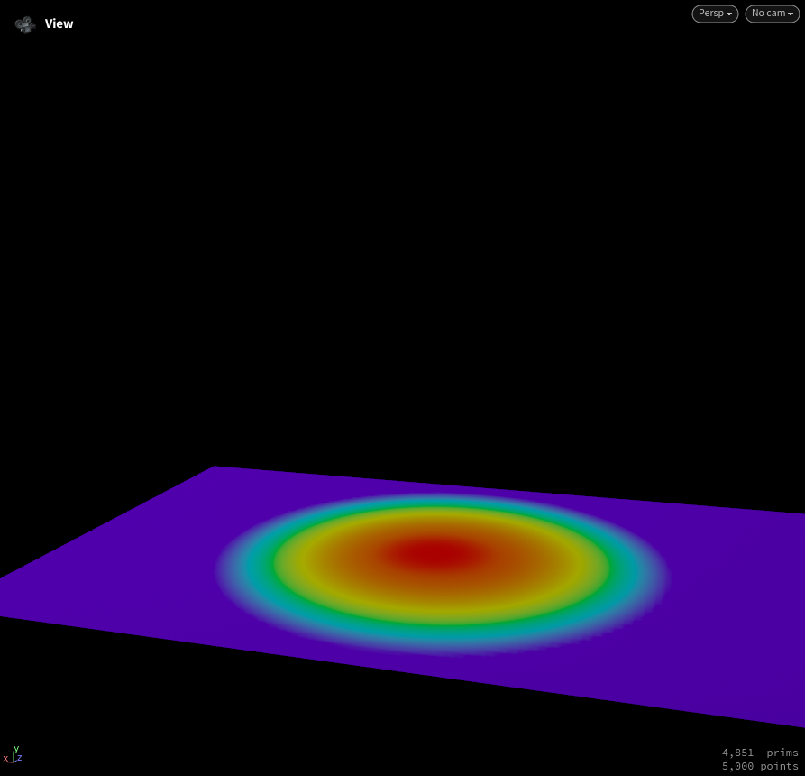 | 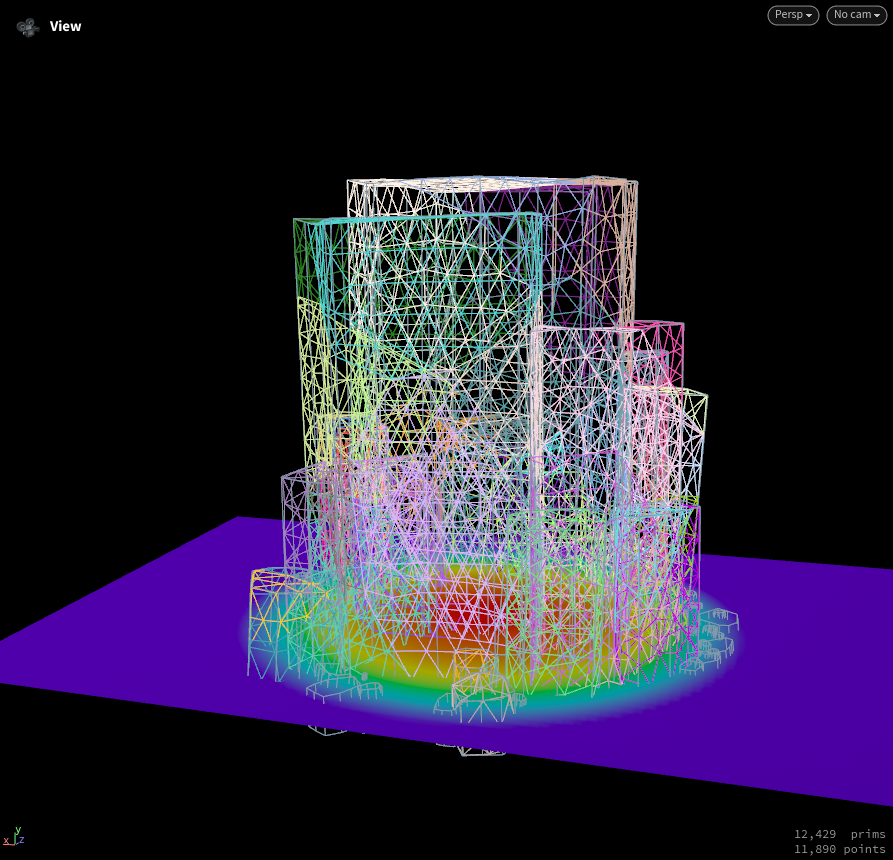 | 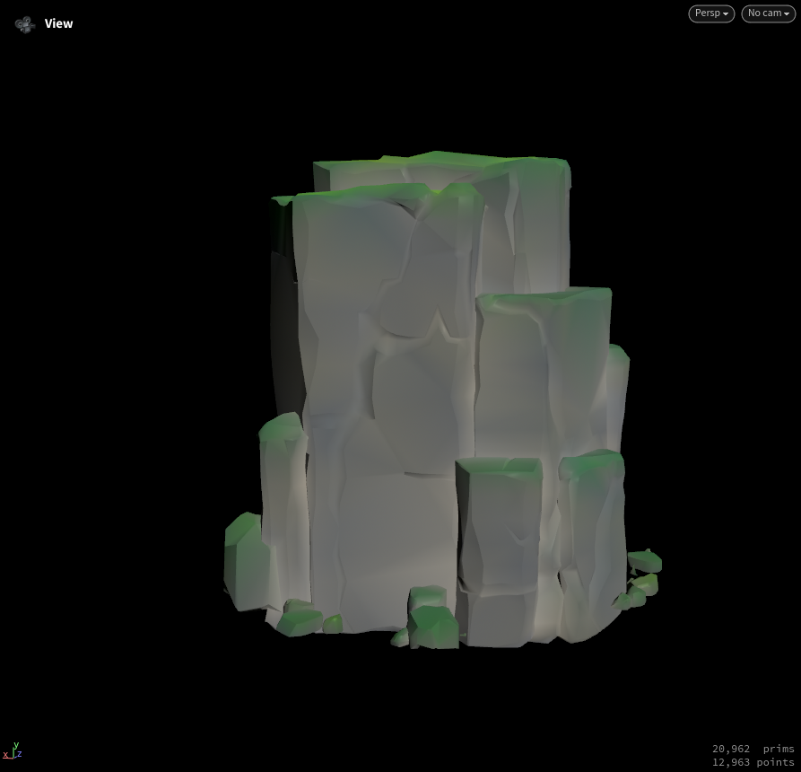 |

### Clustering
얻은 버텍스 컬러로 마스킹과 클러스터링을 진행했다.

바위의 덩어리감을 잡는 방법으로는 `voronoifracture`를 먼저 떠올렸다. 하지만 스캐터된 포인트만으로 형태감을 유도하는 것은 쉽지 않았다. 겹치는 부분이 제한적이고 조각의 모양 또한 인위적이어서 추가 공정이 필요했다. `cluster`와 `shrink` 노드로 덩어리감을 살리고, 클러스터 밀도도 조작할 수 있게 만들었다.
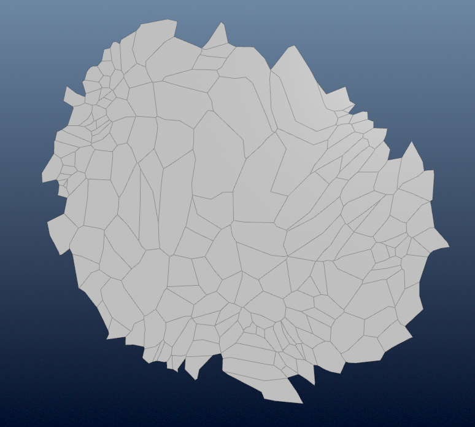 | 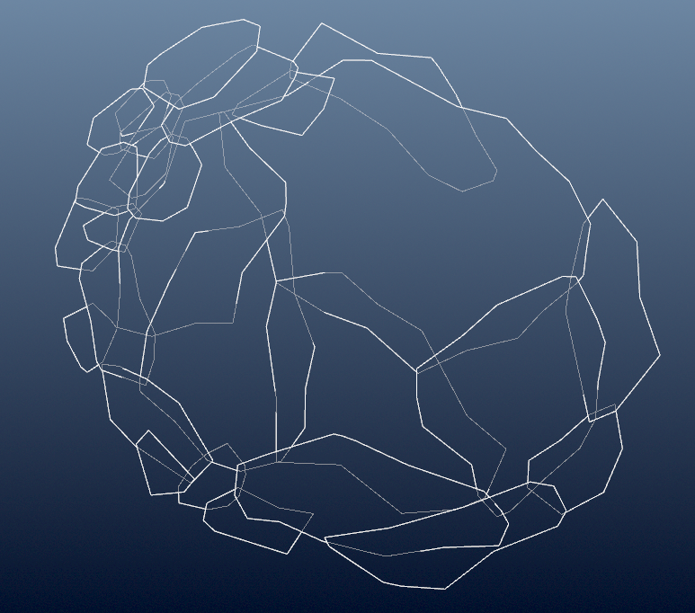 |
--- | --- |

### Bevel, Crack
Stylized 작업에서 자주 쓰이는 스컬핑 방식을 참고하여, 바위의 모서리와 크랙 형태를 `polyextrude`와 `polybevel` 노드로 적용했다. 크랙은 `edgefracture` 노드를 활용해 유기적인 패턴을 만들었다.
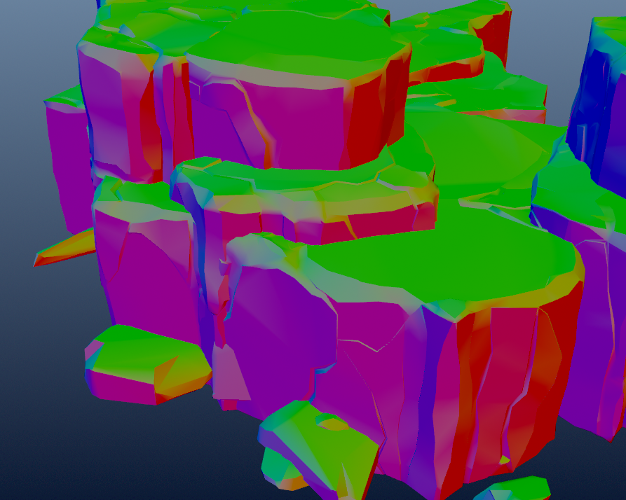 
#### Geometry control
`polybevel` 노드는 강력하지만, 프로시쥬얼로 예민한 파라미터를 가지고 있다. 그래서 중간중간 보정이 필요한데, 어느 정도 튀는 포인트는 `blur`나 `smooth`로 조절할 수 있다. 다만 격하게 튀는 포인트들은 반복문을 쓰거나 값을 높여도 비용만 늘고 결과가 아쉬울 때가 있다. 이 경우에는 안정화 작업 전에 한 번 필터링해 주는 편이 효율적이다.
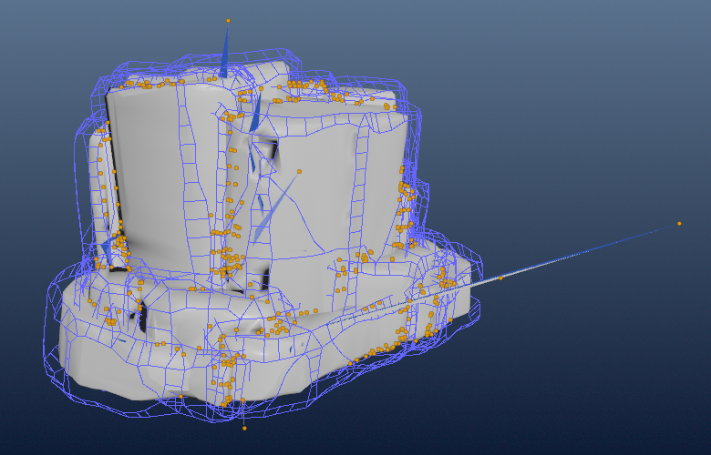 | 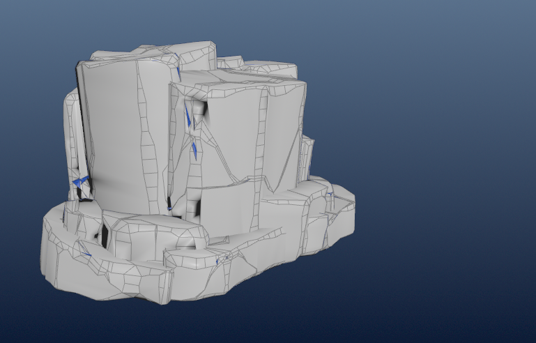 |
--- | --- |

### UV, Collision, LOD
UV 는 커스텀 Box 매핑 노드를 사용했다.
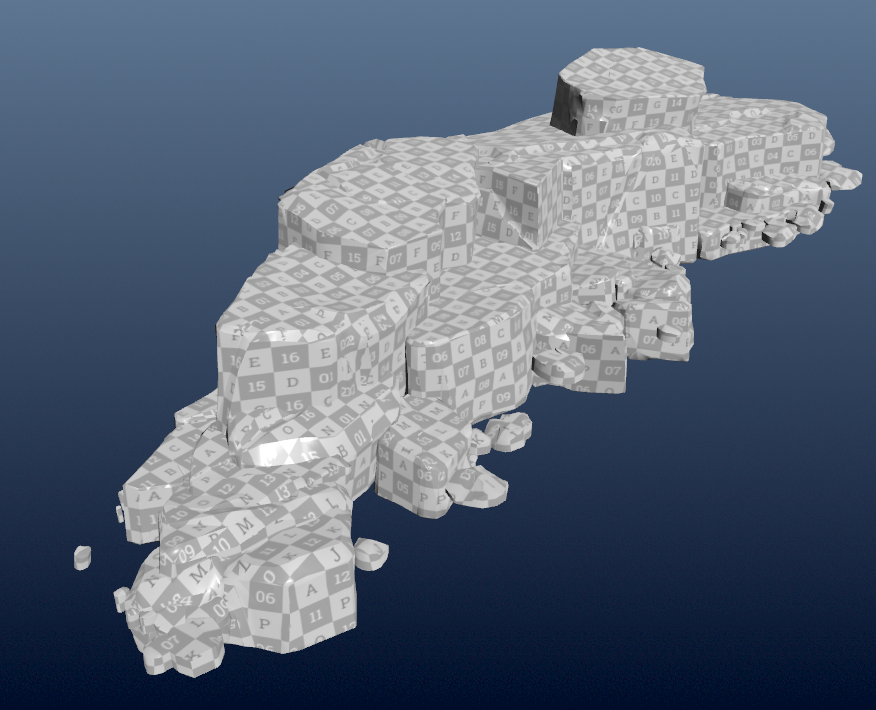
후디니는 언리얼과 호환되는 어트리뷰트, 그룹핑 파이프라인을 가지고 있다.[Unreal](https://www.sidefx.com/docs/houdini/unreal/attributes.html)
어트리뷰트와 그룹 네임을 이용해서 Bake 경로, 이름, Collision, LOD 설정을 해주었다.
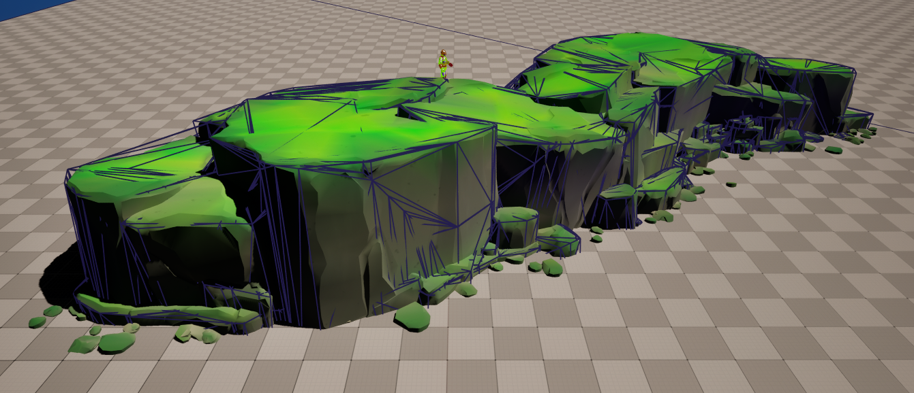

## Optimizing
생각보다 생성에 시간이 오래 걸려, 전체적인 최적화를 한번 진행하기로 했다.

- 불필요한 반복 구조 제거
- 불필요 공정 제거
- 메커니즘 교체

### Optimizing Node
HDA에서 가장 불안정한 부분은 크랙과 베벨이 적용되는 단계였다. 지오메트리가 과도하게 찢어지는 현상을 방지하기 위해 안정화 작업을 진행했는데, 이 단계의 연산 시간이 상대적으로 오래 걸려 최적화를 함께 진행했다.
- 노드 교체: blur > smooth
- 필터링 방식 수정

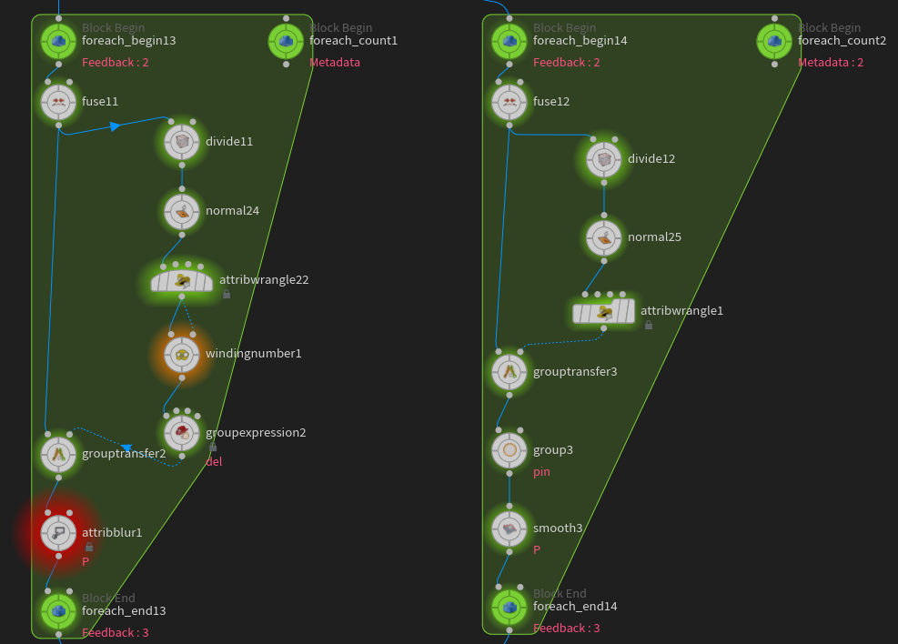
좌) 수정 전 우) 수정 후

### Result
최적화 + 지오메트리 정리 추가
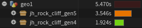
지오메트리 시드가 조금씩 바뀐 점을 감안하면, 이전과 같은 아웃풋이 나오는 것을 확인할 수 있다.
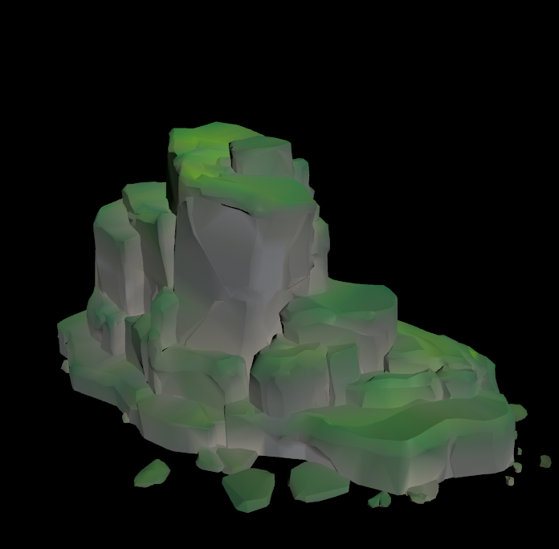 | 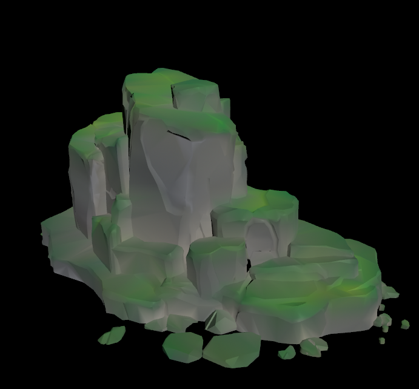 |
--- | --- |
최적화 전 | 최적화 후 |

## Unreal
Vertex Painting을 통해 버텍스 컬러를 입히고 그걸을 베이스로 에셋이 생성 된다. 불필요한 연산은 피하기 위해 파라미터 조작시 collision, lod, polyreduce 등의 포스트 프로세스 파라미터를 분리 시켜 놓았다.
https://www.youtube.com/watch?v=eH-oy7hPmHQ&feature=youtu.be
