## Overview
Houdini COPs에서 지오메트리 데이터를 활용해 Procedural 러그 텍스처를 제작했다. 그리드 지오메트리를 인풋으로 받아 영역, 코너, 테두리 정보를 마스크로 분리해 각 구역에 서로 다른 패턴을 자동으로 배치한다.
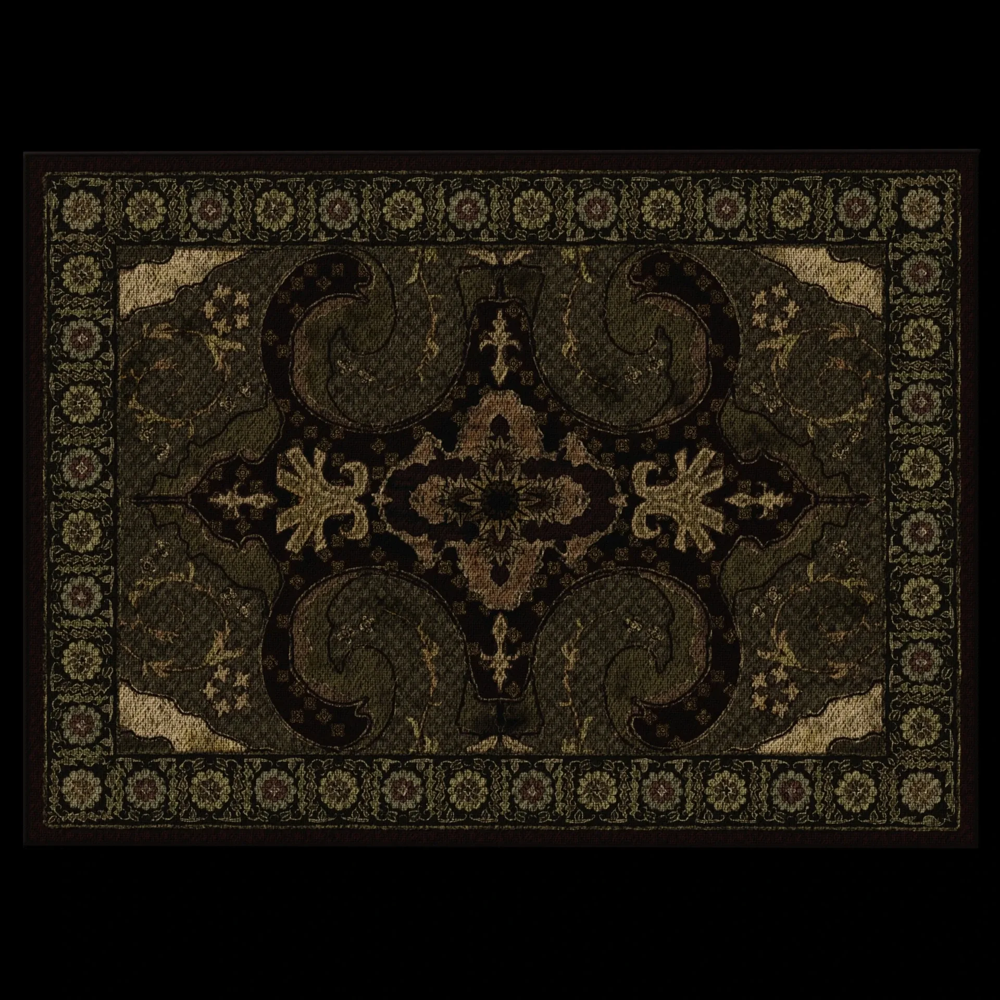

## Workflow

### Patterns
`SDFshape`와 `curve3d`를 적극 사용해서 문양을 제작했다.
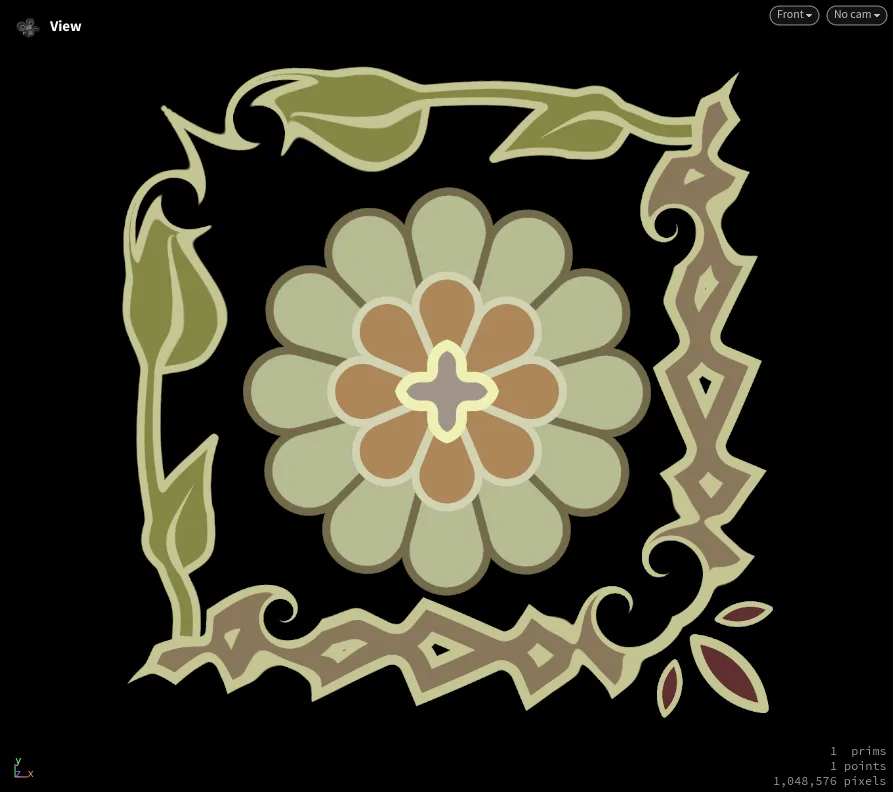 | 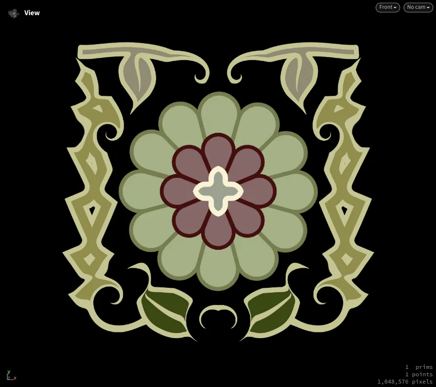 |
--- | --- |

### Geometry Data

러그는 중앙, 코너, 테두리 세 영역에 각각 다른 패턴이 들어가야 하기 때문에, 그리드를 인풋으로 크게 3가지 섹션으로 나눠 COPs 안에서 마스킹으로 사용하였다.
 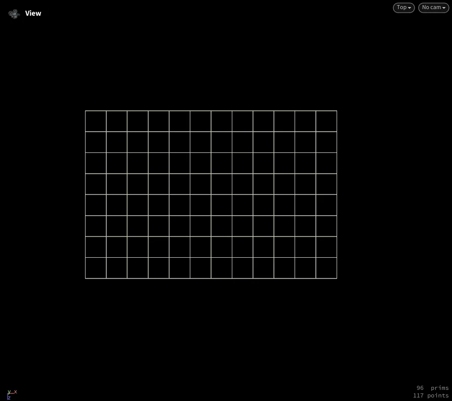 |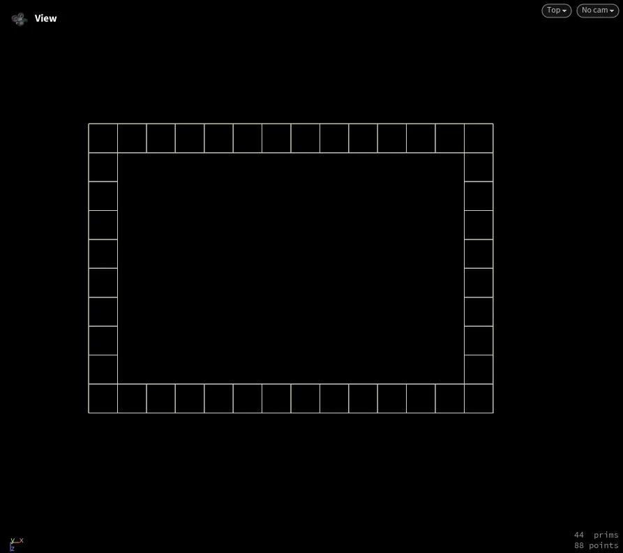 |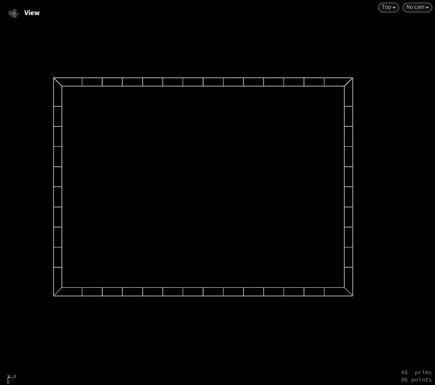 |
--- | --- | --- |

테두리 부분의 point 데이터를 이용해서 패턴을 인스턴싱하였다. point의 @N으로 패턴의 방향을 설정했다.
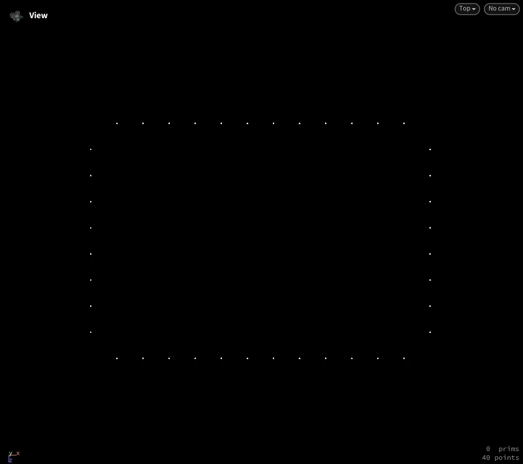 | 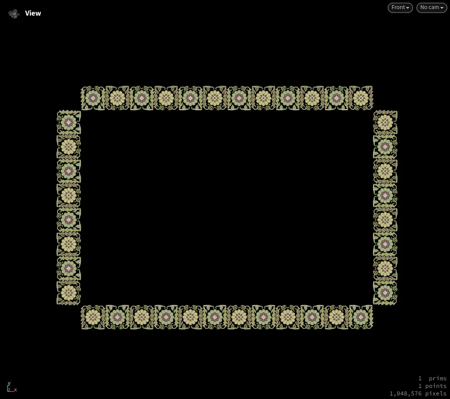 |
--- | -- |
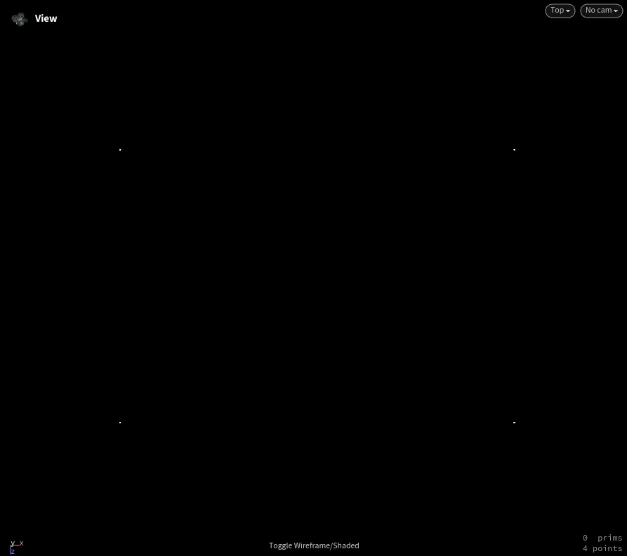 | 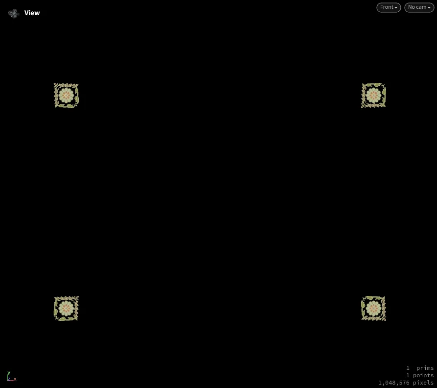 |

grid의 경계 부분의 포인트 데이터로 러그의 마감 부분의 짜임 패턴을 인스턴싱하였다.
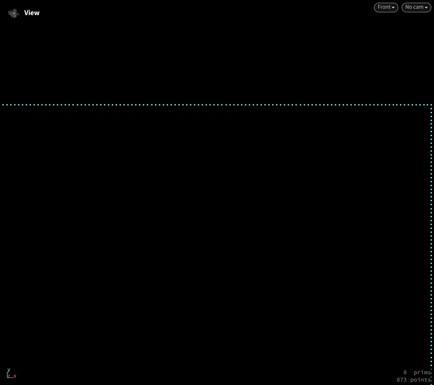 | 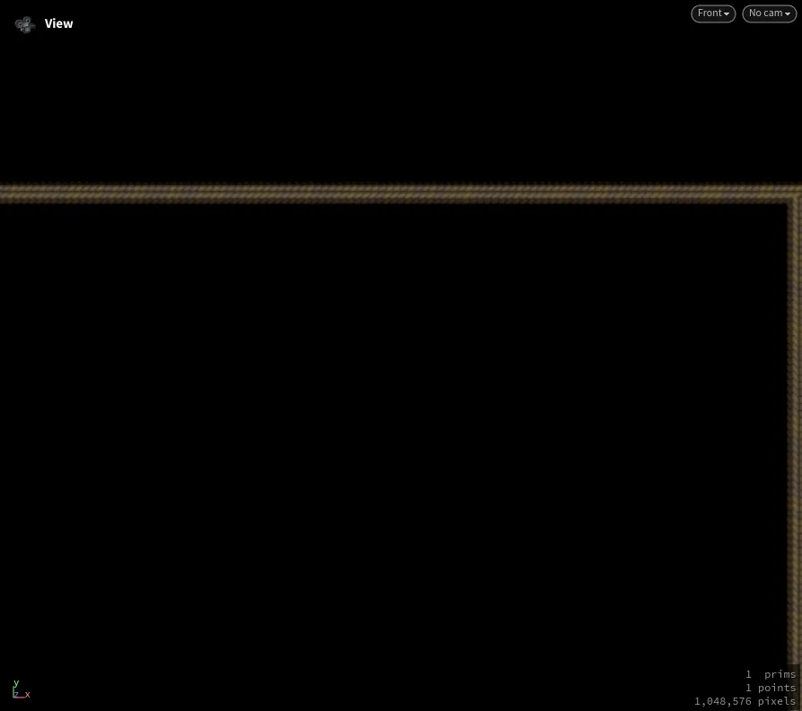 |
--- | --- |

### Weave Pattern

`tilepattern` 노드는 Substance Designer의 tile 노드들과 동일한 기능을 한다.
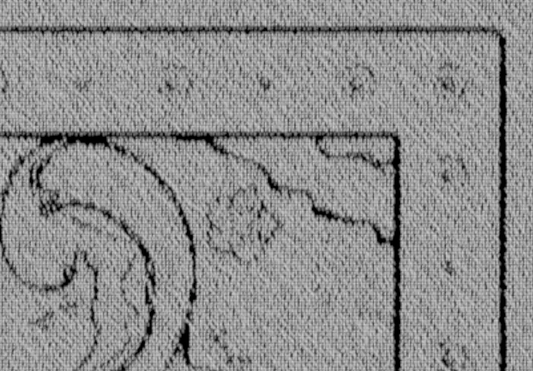 | 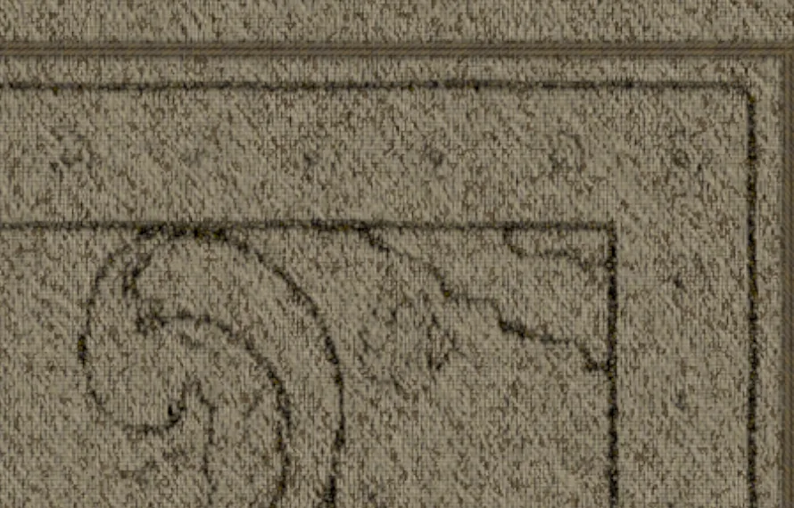 |
--- | --- |

## Result
지오메트리 데이터를 텍스처 제작에 직접 활용하는 COPs만의 워크플로우로, 패턴의 배치, 방향, 밀도를 그리드 인풋 하나로 일괄 제어할 수 있었다. COPs는 Houdini의 지오메트리와 시뮬레이션을 활용한 독특한 패턴 제작에서 강점을 보이지만, 노드의 안정성과 다양성 면에서는 Substance Designer에 비해 아쉬운 부분이 있어 일반적인 텍스처 작업에는 후자가 더 효율적인 선택이 될 수 있다.