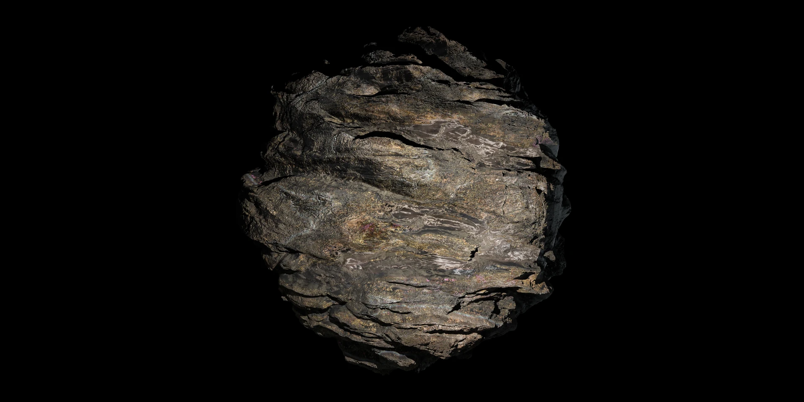
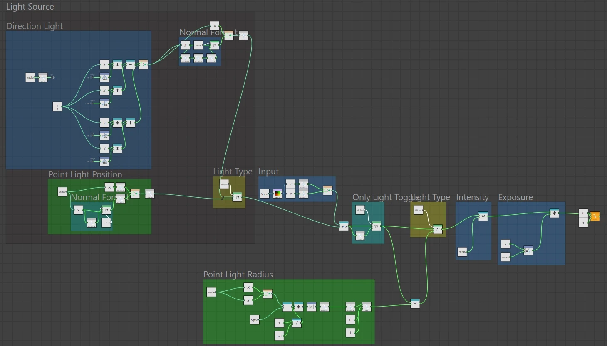
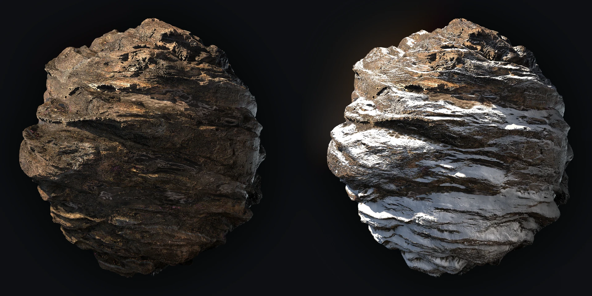
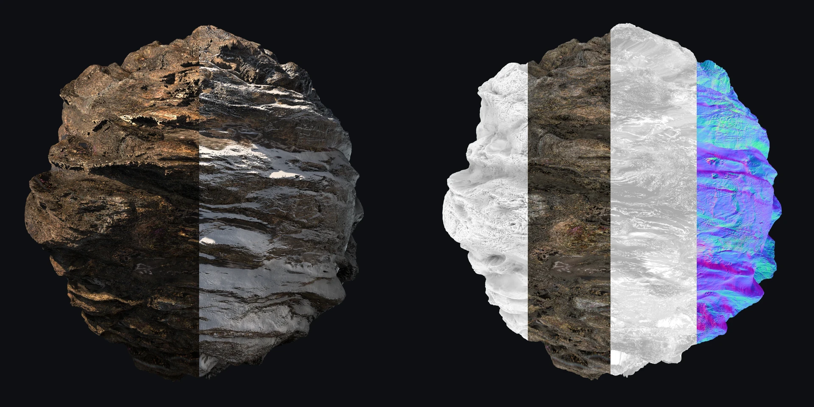

## Overview

Substance Designer 공부를 위한 텍스쳐 제작

## Workflow
HDA 같은 에셋을 만들어 보고 싶어 이것 저것 건드려보다가 Pixel Processor 를 발견했고, 이것을 이용하여 간단 한 마스크 툴을 제작해 보았다.
Substance Painter 에 있는 light 와 동일한 기능을 가진 툴이다. 라이트 종류는 direction, point 두가지를 지원한다.

만든 light map 을 이용해 눈을 만들어 보았다.

