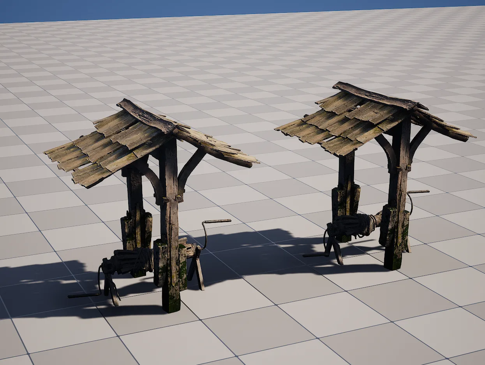
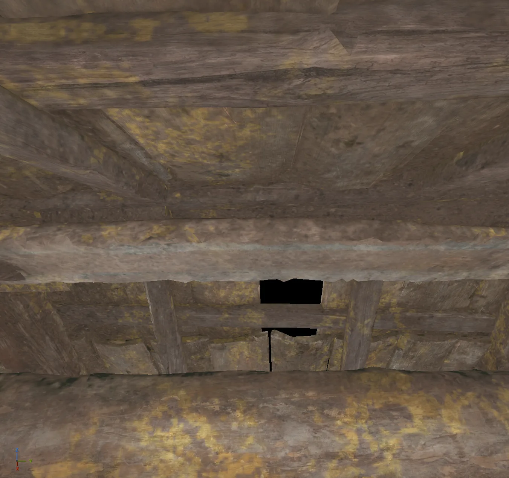
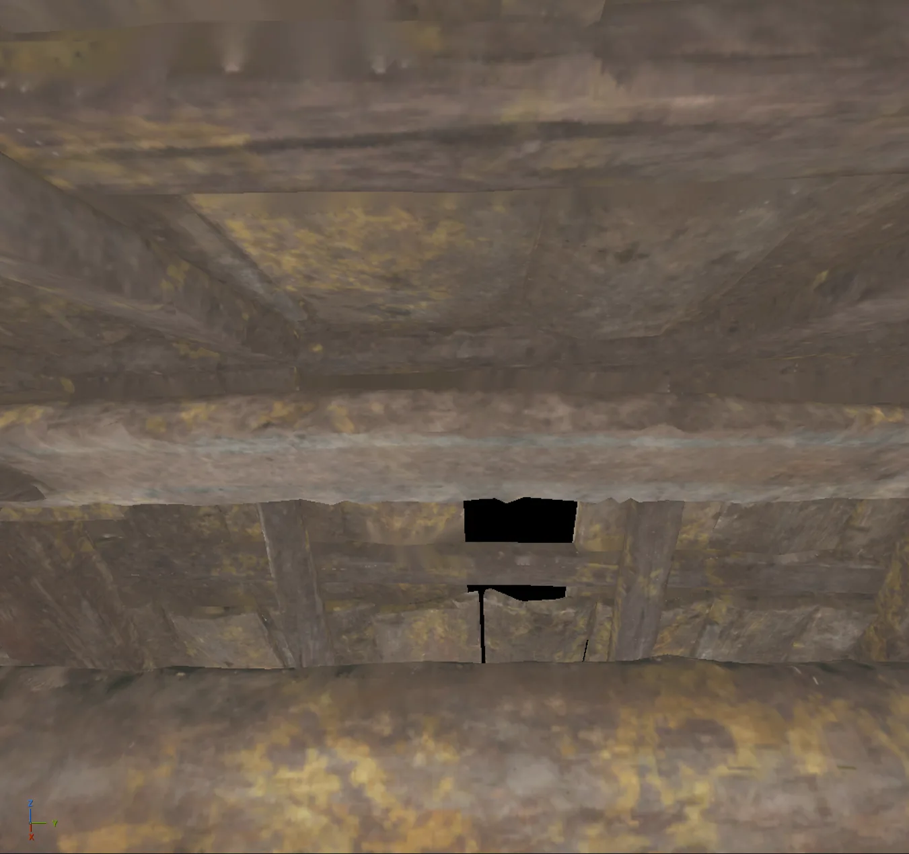
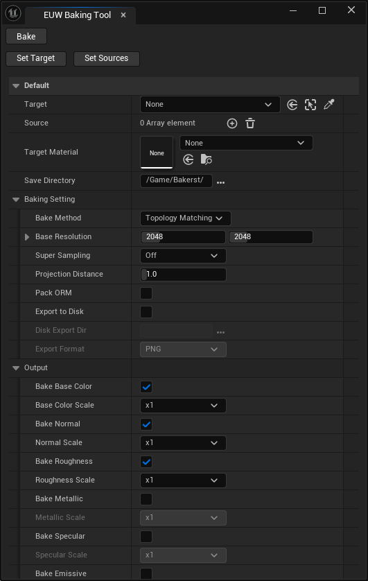
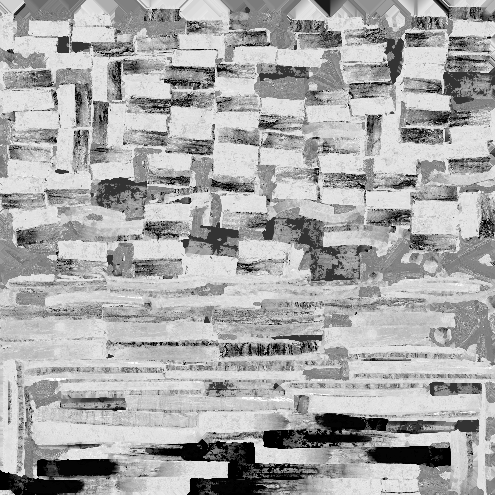
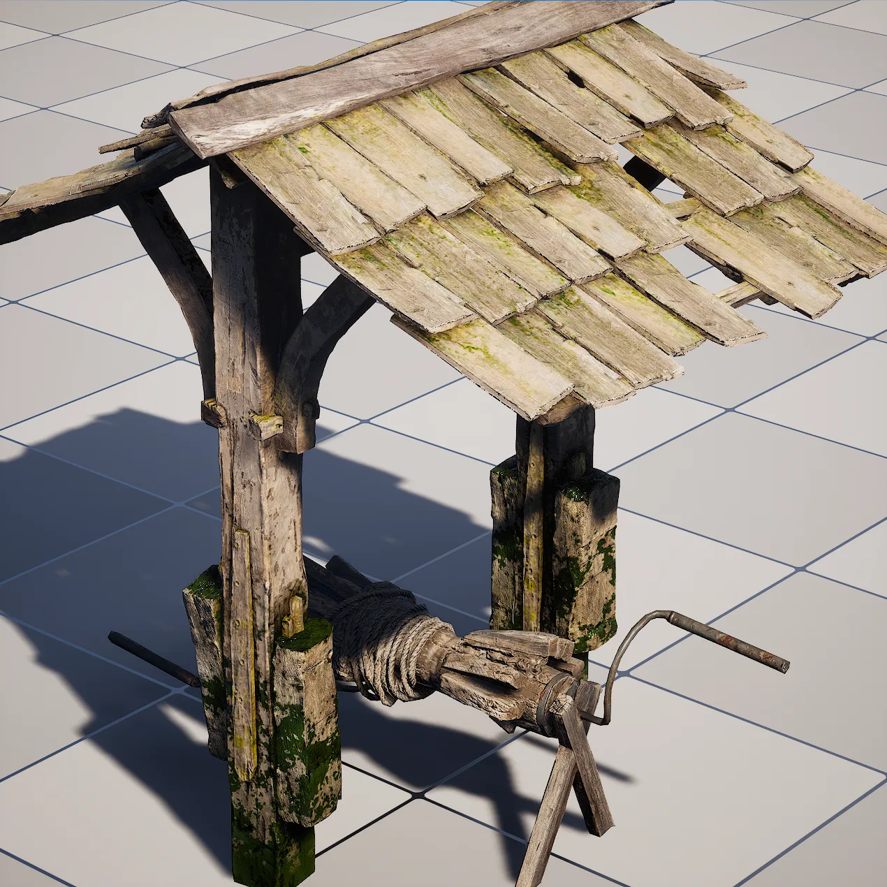
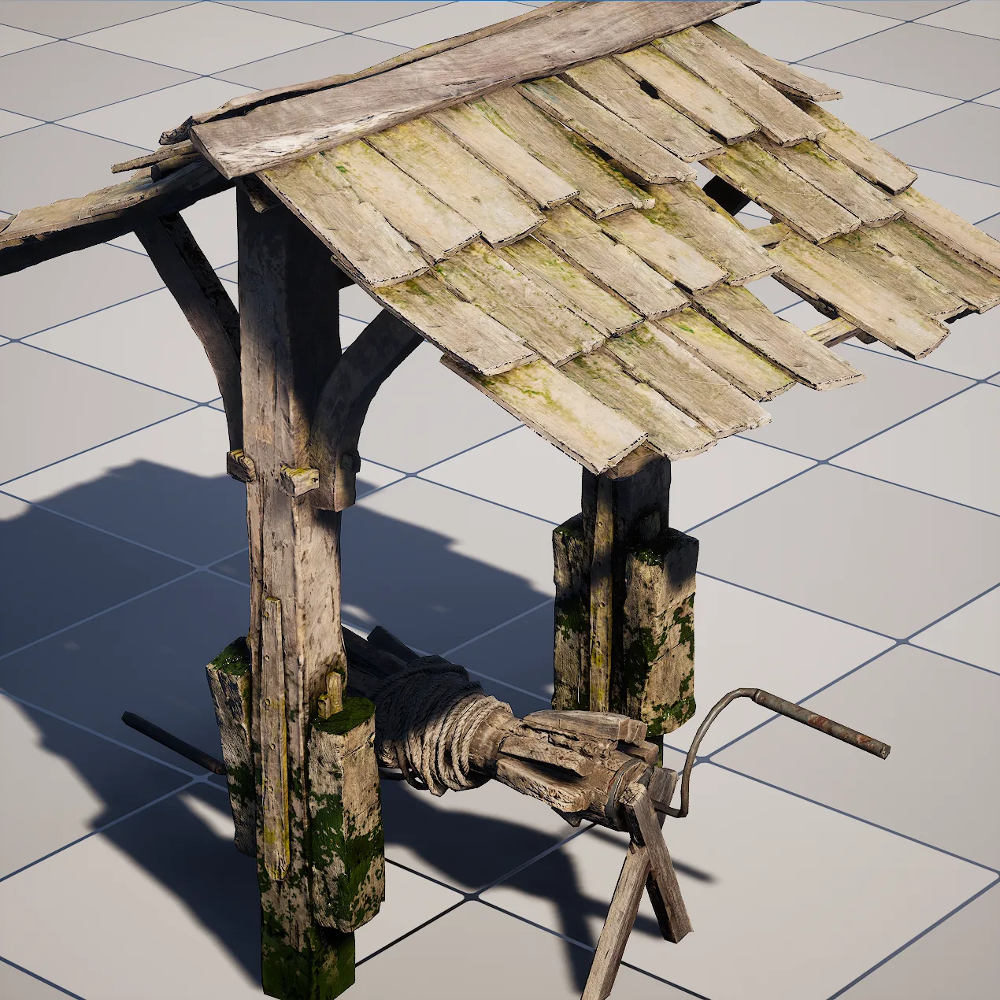
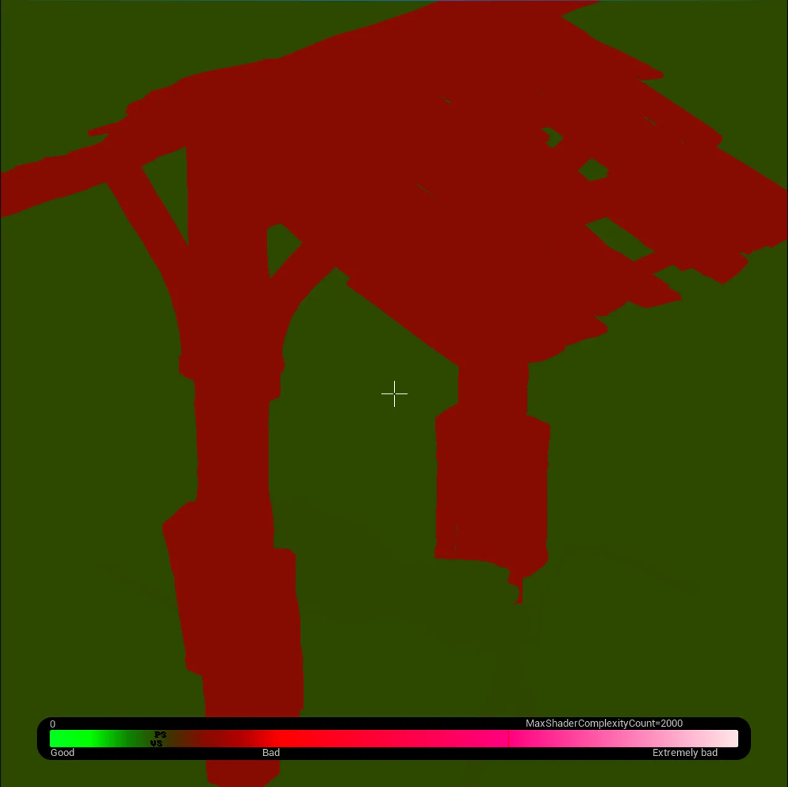
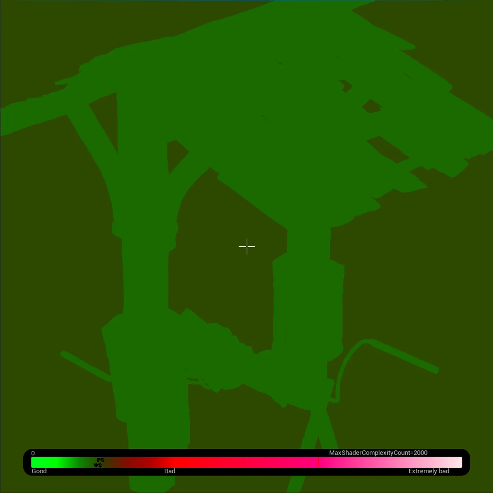

## Overview


머티리얼 단일화 플러그인

언리얼 엔진에도 다양한 베이크 기능이 있지만, 한 컴포넌트에 복잡한 여러 메테리얼을 사용 하는 오브젝트는 베이크의 결과물이 아쉽다. 또한 높은 해상도는 작업 시간이 오래 걸리기도 하기 때문에 AI 의 도움을 받아 플러그인을 제작 했다.

### 기존 Bake의 한계
- **Actor Merge — Material Merge** : 여러 액터를 하나로 병합하면서 머티리얼도 합쳐주지만, 다양한 머티리얼을 하나로 베이크 할때는 UV 레이아웃이 비효율적인 모양을 보인다.(화질이 너무 떨어져 보임)
- **BakeTextureFromRenderCaptures (BakeRC)** : GeometryScript에서 제공하는 렌더 캡처 기반 베이크 함수. 복잡한 머티리얼도 베이크가 가능하다. 하지만 카메라 6개를 자동 배치해 캡처하므로, 코너나 오목면처럼 카메라 시야에 들어오지 않는 부분은 텍스처가 비어버리고 조금의 왜곡이 존재한다.

Original | BakeRC | *Bakerst* |
--- | --- | --- |
|||

Bakerst는 이 한계를 해결하기 위해 만든 플러그인으로, **여러 소스 메시의 머티리얼을 하나의 아틀라스 텍스처로 베이크해 단일 머티리얼로 병합할 수 있게 한다.**


## 구조
```
Source Actors 
        ↓  BakeSourceActorsToTarget()
Target Mesh (clean UV0)
        ↓
Atlas Textures (BaseColor, Normal, Roughness, Metallic …)
```

### Workflow
1. 타겟 메시는 소스 메시들을 병합하고 UV를 깔끔하게 펼쳐 준비한다. - 여기서는 Houdini 에서 가공했지만, 언리얼 모델링 모드에서도 충분히 가능 할 것 같다. 타겟 메시를 소스 메시들과 동일한 공간에 위치한다.
2. 월드에서 소스 액터들 선택
3. 해상도, 경로, 원하는 텍스쳐맵을 선택하고 베이크 한다.


## Setting




Parm | Description |
--- | --- |
**Set Sources** | 월드 액터들 선택 후 버튼을 누르면 자동으로 파라미터가 작성된다. |
**Target Material** | 머티리얼의 같은 이름을 공유하는 Texture 2D Parm 이 있다면, 자동을 텍스쳐를 넣어 메쉬에 적용 시켜 준다. |
**Projection Distance** | 소스-타겟 간 최대 허용 거리 (기본 1.0 cm) |
**Export to Disk** | 이미지 플렛폼으로 익스포트 |
**Output** | 텍스쳐맵별로 해상도를 개별 조정 |
**SuperSample** | 경계 품질 향상 |


BaseColor | Normal | Roughness |
--- | --- | --- |
|||


## Algorithm

두 가지 베이크 방식을 지원한다.

### TopologyMatching
카메라 없이 UV 공간에서 직접 베이크한다.
소스 삼각형의 무게중심을 기준으로 타겟 표면에 가장 가까운 삼각형을 찾아 UV를 대응시킨다.
노멀 필터로 앞·뒤면을 분리해 겹치는 얇은 판재에서 생기는 검은 얼룩을 방지한다.
소스·타겟이 동일 월드 위치에 있어야 하지만 해상도 손실이 없고 전체 10종 맵을 지원한다.

### RaycastProjection
소스 메시 주변에 렌더 캡처 카메라 6개를 자동 배치해 머티리얼을 캡처한 뒤 타겟 UV로 투영한다.
임의의 형상 차이에도 동작하지만 카메라 사각지대(코너·오목면)는 누락될 수 있다.


## Result
Original | Bake |
--- | --- |
 |  |
 |  |


