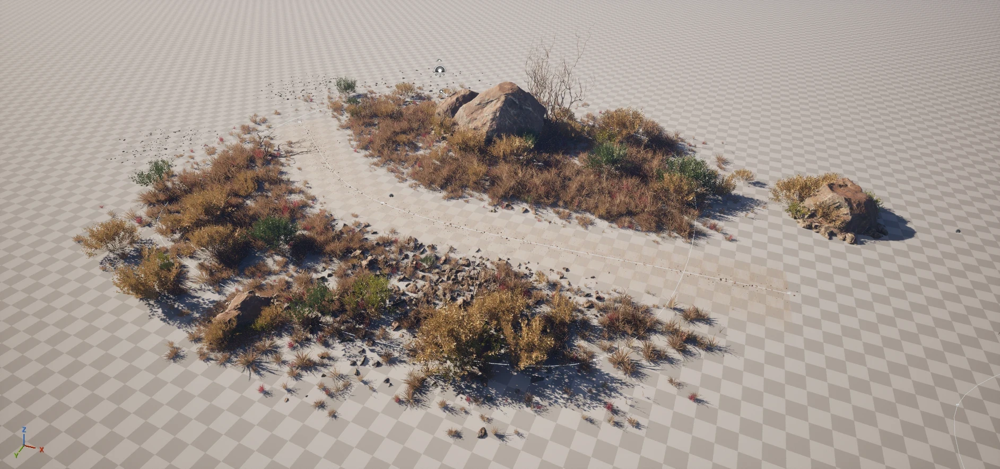
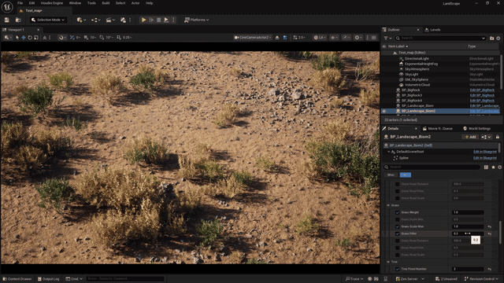
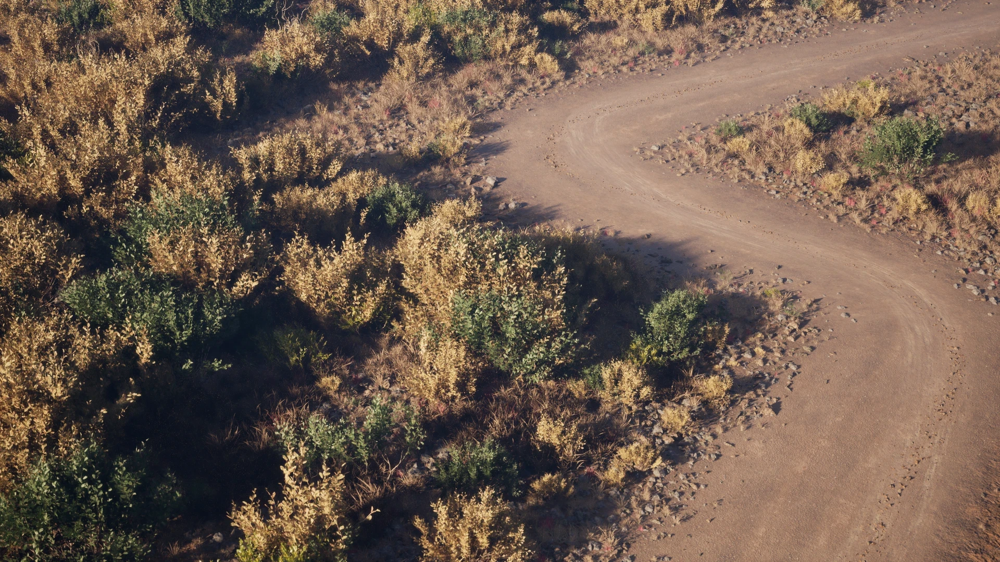
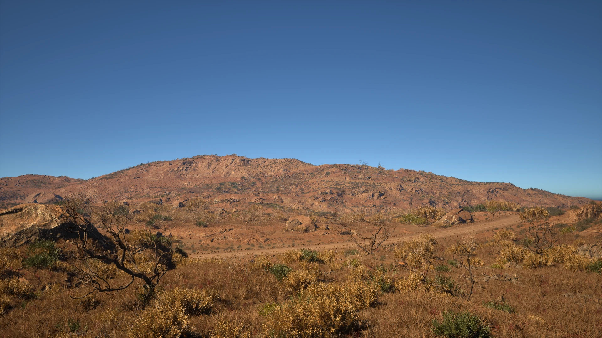
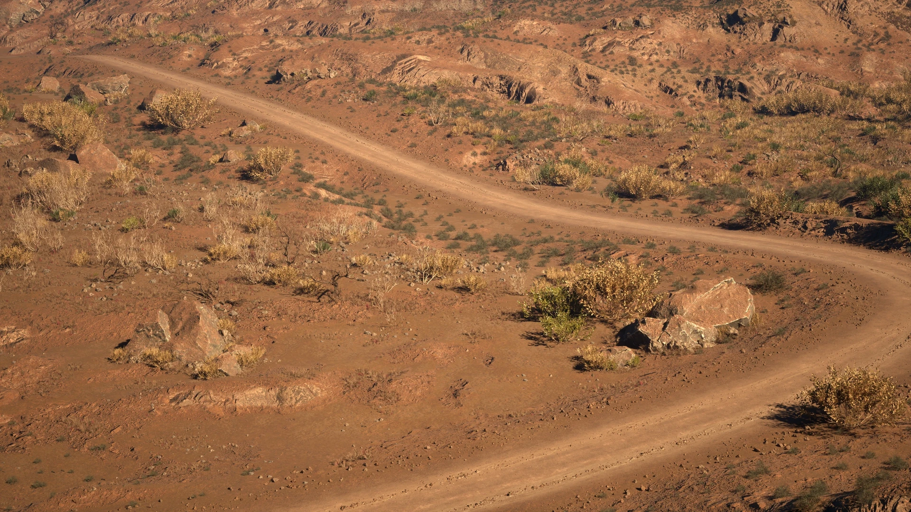

## Overview
PCG 공부를 위해서 작업해본 바이옴 셋업.
## Workflow
유연한 영역 설정이 가능한 Spline 을 채택했고 노이즈의 조합으로 인스턴싱 되는 요소들을 조합했다. 자연적인 패턴을 노이즈의 적당한 비율로 구현하는 것이 시간이 조금 걸렸다. 아무래도 너무 뭉치거나 퍼지거나 해도 안되고 패턴이 너무 보이는 것도 피해야 했다.

### Landscape
Houdini 에서 제작 되었다.

#### Material
[MW_Landscape Auto Material](https://fab.com/s/0c488c6f4347) 을 참고해서 구현했다. 지형의 slope 값을 이용한 mask 로 텍스쳐를 배치 했다.

### PCG_Biom
가장 많이 쓰이고 베이스가 되는 셋업이다.
기본 요소로는 돌, 부쉬, 풀, 나무, 마른 나무 가지 - 총 5개로 구성 되어 있다.

파라미터의 조합으로 다양한 컨셉을 구현할 수 있다. 

### PCG_Rock

큰 바위는 Zbrush 에서 작업 되었으며, 하나의 메쉬를 최대한으로 활용하고 싶었기 때문에 한 메쉬에서 3가지 정도의 실루엣이 나올 수 있게 디자인 했다. `PCG_Biom`을 응용해서 큰 바위 주변에 `PCG_Biom`과 같은 패턴의 메쉬들이 인스턴싱 될 수 있게 셋업 했다. 그 결과 landscape 와 바위 메쉬의 경계선도 가릴수 있게 되었고 더욱 자연스러운 느낌을 만들 수 있었다.

### PCG_Road
Unreal 의 spline road 시스템을 이용해서 주변에 돌을 인스턴싱 했다. 추가로 차 바퀴 자국 용 PCG 를 제작해서 기존에 있는 길의 패턴을 깨주는 용도로 사용했다. 도로의 텍스쳐는 Substance Designer에서 제작 되었으며 Virtual Texture 를 이용해서 landscape와 블렌딩 시켜 주었다.

## Result

