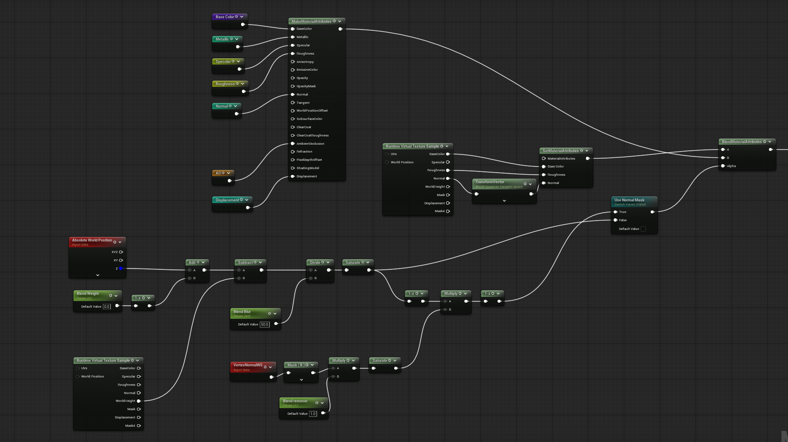
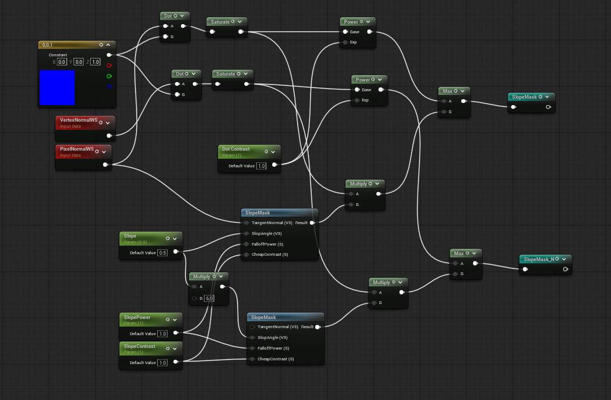
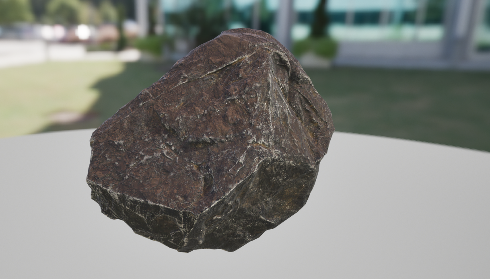
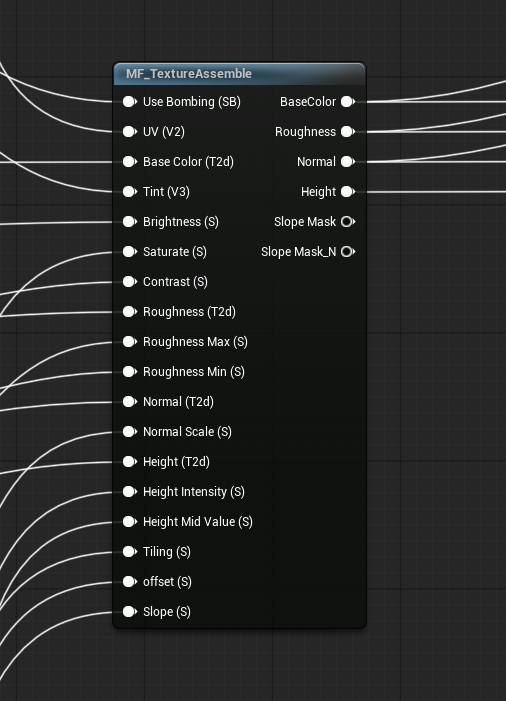
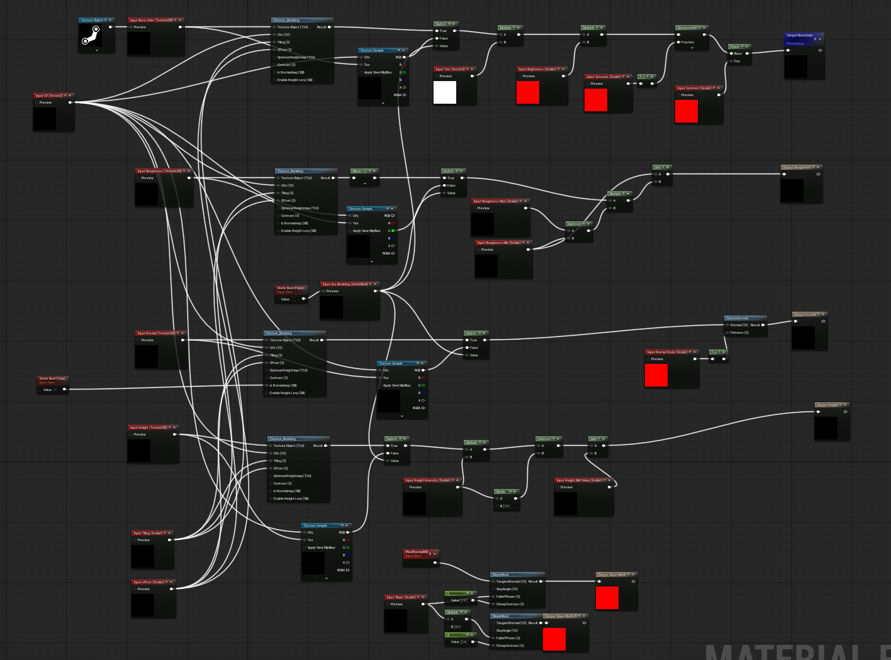
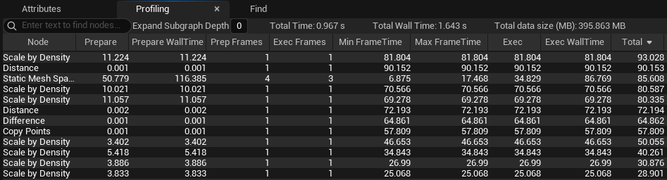
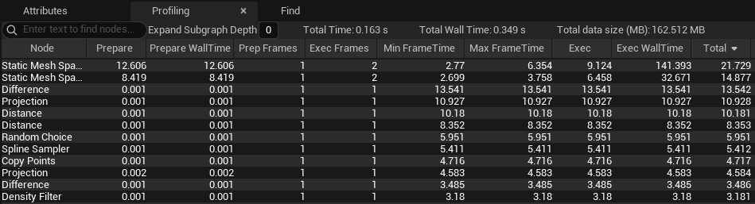
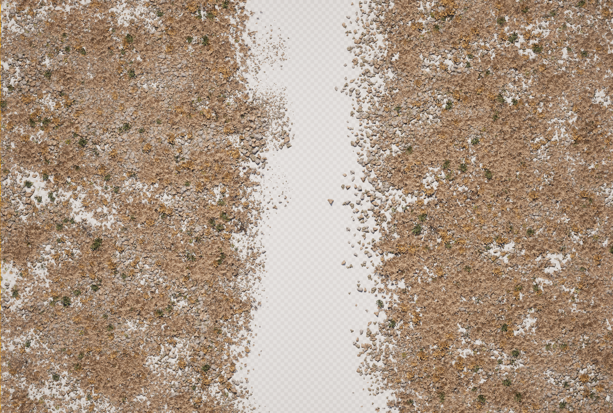

## Overview
PCG 공부를 위해서 작업해본 바이옴 셋업.
## Workflow
유연한 영역 설정이 가능한 Spline을 채택했고 노이즈의 조합으로 인스턴싱되는 요소들을 배치했다. 자연적인 패턴을 노이즈의 적당한 비율로 구현하는 것이 시간이 조금 걸렸다. 아무래도 너무 뭉치거나 퍼지거나 해도 안 되고 패턴이 너무 보이는 것도 피해야 했다.

### Landscape
Houdini에서 제작되었다.

#### Material
[MW_Landscape Auto Material](https://fab.com/s/0c488c6f4347) 을 참고해서 구현했다. 지형의 slope 값을 이용한 mask로 텍스쳐를 배치했다.

### PCG_Biom
가장 많이 쓰이고 베이스가 되는 셋업이다.
기본 요소로는 돌, 부쉬, 풀, 나무, 마른 나무 가지 - 총 5개로 구성 되어 있다.

파라미터의 조합으로 다양한 컨셉을 구현할 수 있다. 

### PCG_Rock

큰 바위는 Zbrush 에서 작업 되었으며, 하나의 메쉬를 최대한으로 활용하고 싶었기 때문에 한 메쉬에서 3가지 정도의 실루엣이 나올 수 있게 디자인 했다. `PCG_Biom`을 응용해서 큰 바위 주변에 `PCG_Biom`과 같은 패턴의 메쉬들이 인스턴싱 될 수 있게 셋업 했다. 그 결과 landscape와 바위 메쉬의 경계선도 가릴 수 있게 되었고 더욱 자연스러운 느낌을 만들 수 있었다.

### PCG_Road
Unreal 의 spline road 시스템을 이용해서 주변에 돌을 인스턴싱 했다. 추가로 차 바퀴 자국 용 PCG 를 제작해서 기존에 있는 길의 패턴을 깨주는 용도로 사용했다. 도로의 텍스쳐는 Substance Designer에서 제작되었으며 Virtual Texture 를 이용해서 landscape와 블렌딩 시켜 주었다.

### Material

#### Big Rock
바위는 씬에서 비교적 큰 오브젝트이기때문에 메테리얼을 따로 제작 해주었다. 버츄얼 텍스처링으로 랜드스케이프와 블렌딩 시켜 주었고 픽셀 노말을 이용하여 모래가 덮인 느낌을 구현 했다.
 |  |  |
--- | --- | --- |

#### LandScape

랜드스케이프의 기울기를 통해 여러장의 텍스쳐를 레이어링 하였다. 각 레이어의 텍스쳐 팩들은 메테리얼 펑션을 제작해 파라미터로 조작 가능하다.
 |  |
--- | --- |

### Optimiazation
셋업을 마친 후에 PCG 내부에서 `Profiling` 탭을 이용한 노드 프로파일링을 진행했다. `Scale by Density` 노드가 상당 부분 연산 시간을 잡아 먹는 것을 볼 수 있다. `Density` 어트리뷰트를 이용해서 스케일을 조정 하는 노드이다. `Scale by Density` 는 `PointBodyLoop` 가 내장 되어있어 포인트가 많을 경우 연산 시간이 많이 늘어난다. 때문에 간단한 연산은 네이티브 노드들로 교체하는 것이 가장 좋다.
블루 프린트 노드의 교체와 전체적으로 노드 수를 줄이는 최적화도 진행 했다. 아래는 같은 파라미터를 가진 최적화 전후의 차이 이다.

왼쪽이 기본 셋업 오른쪽이 최적화 후 셋업

## Result

