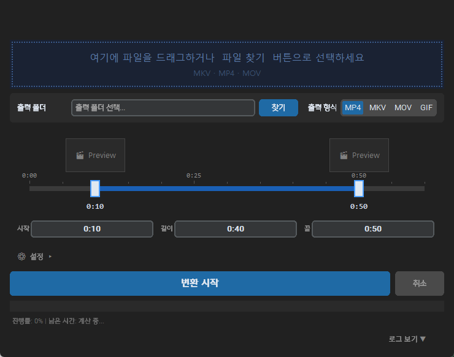
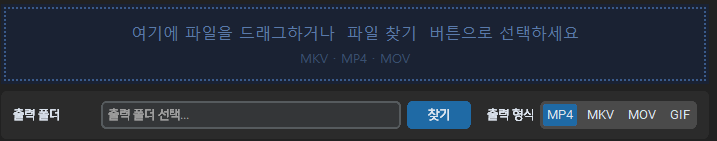
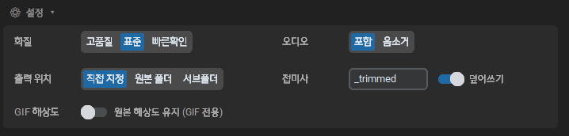

## Overview
레퍼런스나 클립으로 제작한 mp4, mkv, mov 등을 상호 컨버팅하는 툴이다. gif를 지원하며 trim 기능이 있어 영상을 간단하게 잘라서 보관할 수 있다.

### 구조

####  Input
파일을 드래그하거나 파란 박스를 선택해서 파일을 찾는다. 첨부된 파일 확장자를 자동으로 인식한다. 출력 포맷을 설정할 수 있다.

#### Trim
간단한 핸들로 영상을 자르는 기능을 제공한다.
스크롤 - 타임라인 확대
드래그 - 클립 영역 이동     

### 설정
간단한 아웃풋 설정이 가능하다.

