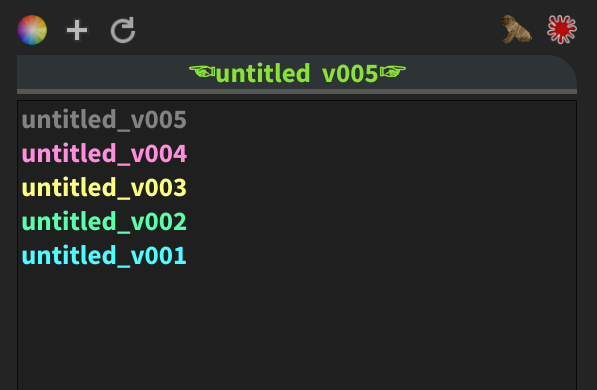
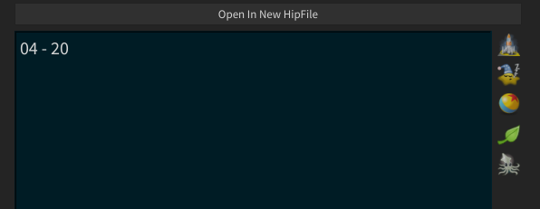
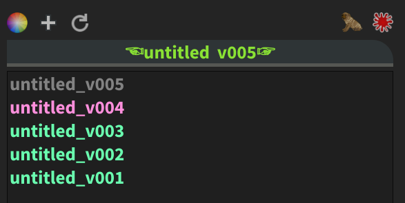
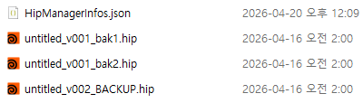

## Overview

프로젝트가 진행되다가 이전의 셋업이 필요하거나 할 때 찾기가 힘든 경우가 있어 hip 파일의 버전 관리를 조금 더 세분화하기 위한 Houdini python panel이다. 1차적으로 색상을 통해 시각적으로 분류하고 메모로 세분화한다. 날짜나 시간도 기입이 가능하고, preset 버튼으로 pub, render, submit 등 체크해 놓을 수 있다. 메모 내용 검색을 통해 파일을 찾을 수도 있다.

왼쪽 상단 부터 - `색상`, `버전 추가`, `새로고침`, `검색`, `파일 삭제`


`새창에서 파일 열기`, `메모 창`, `preset 버튼`


#### Color
텍스트의 색상을 통해 먼저 선별하는 것이 흐름을 알기 좋다.


#### Note, Search
노트의 내용을 통해 버전을 검색할 수 있다.


#### JSON
노트와 색상 같은 정보는 전부 hip 경로에 있는 backup 폴더에 저장된다. 그렇기 때문에 새로운 프로젝트 씬이라면 저장을 한번 해주어야 한다.
경로 : `./backup/HipManagerInfos.json`


### 설치

#### PySide 모듈 설치
```
pip install pyside6
```
#### Houdini python panel
```
import sys, imp
sys.path.append('경로')
import VersionManager_v02

imp.reload(VersionManager_v02)

def onCreateInterface():
    widget = VersionManager_v02.VersionManager()
    return widget

```
