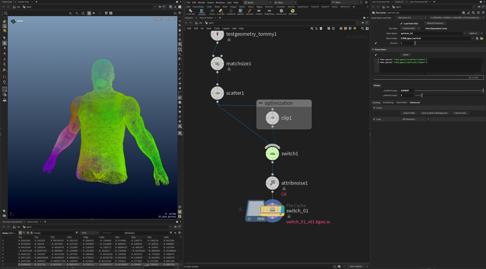
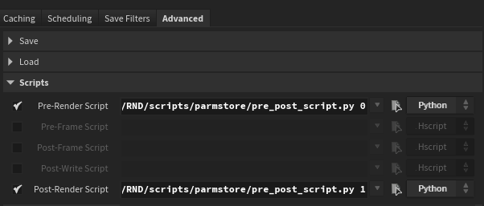

## Overview

많은 지오메트리나 작은 복셀의 시뮬레이션에 대한 뷰포트 연산 속도나 노드 네트워크 cook 시간에 영향을 주게 되면서, 작업시 버퍼링을 대기하는 시간이 길어진다. 이를 조금이나마 해결하고자 고안한 툴. 렌더팜과 함께 사용하면 효과가 좋다. 셋업을 마무리하고 복셀 사이즈나 포인트를 살짝만 더 높은 값으로 저장해 놓으면 로우 셋업에서 작업을 쉽게 진행한 후 결과만 저장된 값으로 볼 수 있다.
>[!note]
>PDG와 유사한 메커니즘이지만 파라미터만 저장하기 때문에 훨씬 단순하고 쉽게 사용할 수 있다.

## How to use
1. 원하는 파라미터 첨부 (드래그 드랍)
2. build 버튼 클릭
3. 원하는 값 기입
4. 캐시

셋업을 수정할때 최적화 셋업을 꺼놓고 확인 해 보는 경우가 많은데, 이 경우 스위치 파라미터를 저장함으로써 최종 결과에 반영되는 최적화를 쉽게 보존시킬 수 있다.

Advanced -> Script 섹션의 render script에서 경로의 python 파일을 받아와 작동한다. HDA가 아니기 때문에 houdini module을 사용할 수 없었고, 코드를 따로 관리하고 싶어서 이 방식을 따랐다.
