# Overview

모듈식 프로시쥬얼 에셋에 대한 이해를 위해 구현해본 작업물. Houdini와 비슷한 SpeedTree의 노드식 워크플로우에 기인하여 만들어졌다. 실제로 구현이나 파라미터 디자인에 참고를 많이 했다. 확장성에 최대한 집중하며, 최대한 많은 것들을 구현할 수 있는 툴을 지향했다.
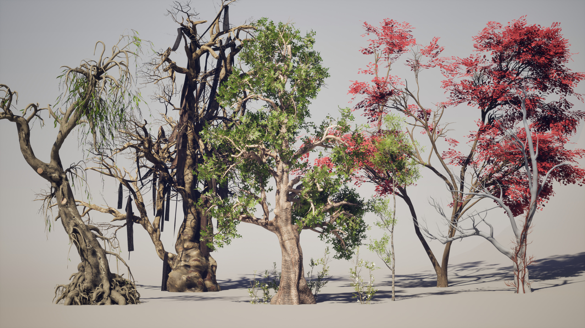
https://www.youtube.com/watch?v=IOFI6T4mfyU

## 목표
1. bake는 하지 않고 재사용 가능한 텍스쳐 소스로 제작 하는 워크 플로우
2. 노드 구조 적극 활용
3. 확장성
4. 아트
5. 개인 작업이라고 대충 만들기 않기

---

# Workflow

## Nodes

- Trunk
- Branch
- Convert Card
- Scattering
- Card Layout
https://www.youtube.com/watch?v=mKwSIvJYMk4&feature=youtu.be

## Key Attributes
모듈식 워크플로우를 구현하려면 어트리뷰트 관리가 아주 중요하단걸 느꼈다. 아래는 모듈식 구성의 핵심 어트리뷰트들이다.
```
s@part : trunk, branch, leaf
s@type : skin, card, curve, ribbon, ribbon_curve
s@name
    - 가지 하나당 고유 이름
s@path
    - 가지가 생성된 부모 가지의 경로
i@level
    - 가지 레벨 (트렁크 = 0)
s@tag
    - 노드에서 생성될 때마다 부여되는 고유 태그
s[]@tags
    - 나무에 들어간 모든 태그들
```

## Trunk, Branch
기본적으로 하위 노드의 아웃풋을 받아오며 레벨을 쌓아가는 구조이다. 다양한 그룹핑과 조건으로 랜덤한 생성이 가능하고 여러 파라미터를 조합하여 많은 패턴을 생성 가능하다. Branch 노드는 유일하게 input, output 모두 공유하는 노드이기 때문에 내부적으로 재사용이 가능한 어트리뷰트의 관리가 아주 중요했다. 그 결과 노드 구조를 응용한다면 만들어놓은 가지 셋업을 여러 나무에 붙여 재사용한다던지, for 노드 안에서 가지를 반복시킬 수도 있다.
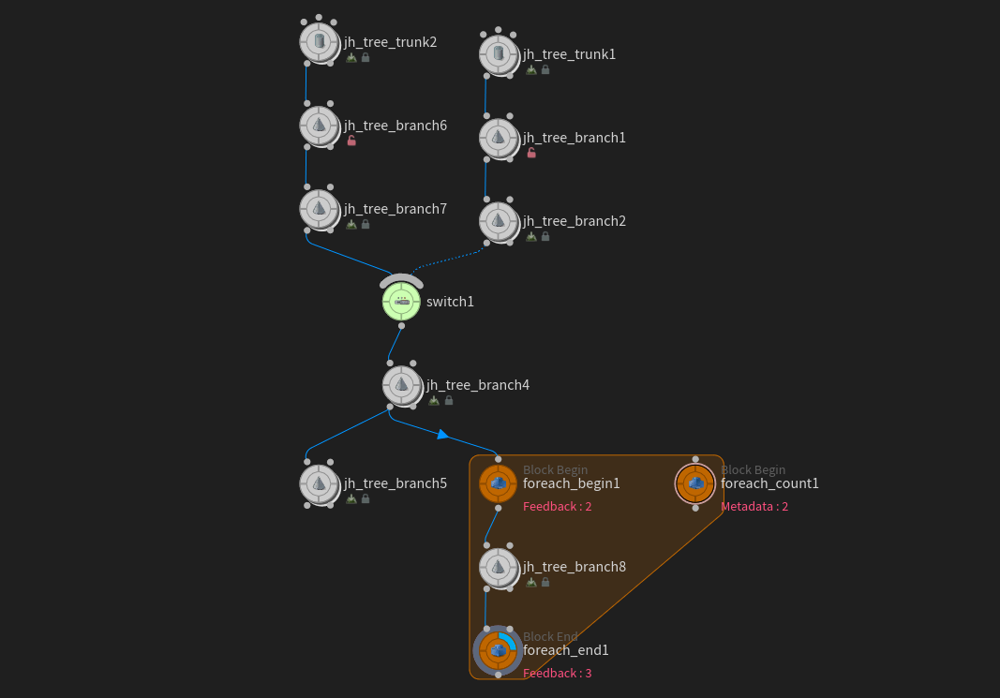

나무를 디자인할 때는 원하는 부분은 독립적으로 만들고 후에 합쳐 완성할 수 있다. 이 기능은 어떤 걸 추가하고 있는지 명확하게 보이는 장점도 있지만, 노드 가독성에도 효과가 좋았다.


가지들은 분기를 가지고 부모 레벨에서 자라나는데 이때 **이어지게 보이는 것** 이 중요하다. VDB나 boolean으로 지오메트리를 강제적으로 붙일 수도 있겠으나 폴리곤이 중요한 게임용 에셋에선 비싼 비용이 들어가는 방법들을 마구잡이로 쓸 수 없었다. 때문에 다른 방법을 쓰기로 했는데 그것이 노말 블렌딩이다. **가지가 돋아나는 시작점의 노말을 부모 가지와 블렌딩시켜 주는 것이다.** 노말 블렌딩은 게임에서 자주 쓰이는 방법으로 폴리곤을 건들지 않아도 된다는 장점이 있다. 기존 labs Tree 노드에도 이러한 기법을 사용한다.
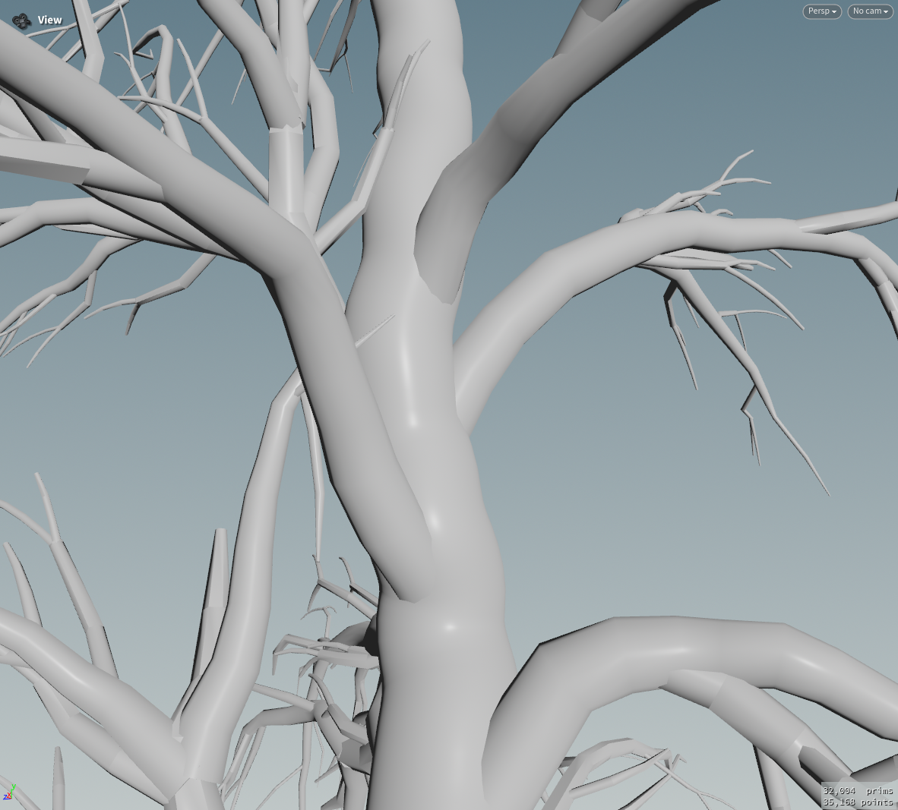|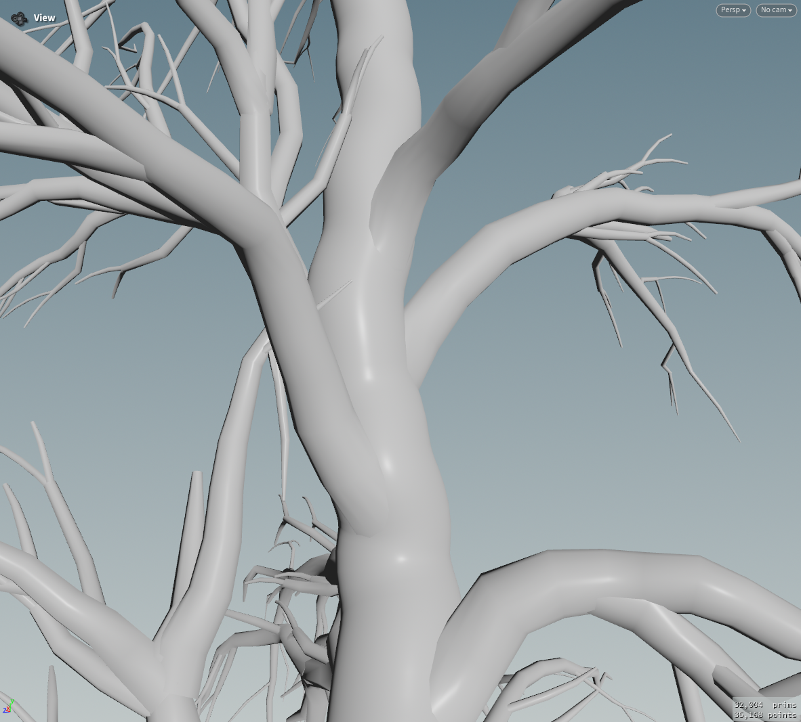|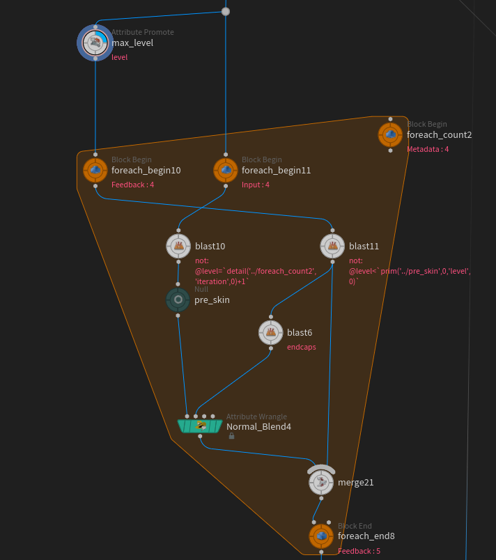|
--- | --- | --- |
`before` | `after` | 

나무는 랜덤하게 뻗어나가는 가지만 있는 것은 아니다. 수종에 따라 독특한 패턴을 띠며 자라는 것들 중 white pine tree를 참고했다. 이 수종은 가지들이 수평적으로 자라나면서 옆으로 퍼져나간다. 이 부분에선 labs tree를 참조해 가지의 중심각을 파라미터를 통해 패턴화시켜 주었다. **90, 180, 137.5, random 총 4가지의 패턴을 사용할 수 있으며 특정 패턴을 반복적으로 사용하며 원하는 모양의 나무를 디자인할 수 있게 만들었다.**


같은 맥락으로 force 파라미터는 나무의 컨셉을 잡는 데 중요한 기능을 한다. 말 그대로 가지가 힘을 받고 변형되는 방향과 세기를 정한다. **force는 중첩시킬 수 있으며 force가 적용되는 순서를 변경하면서 다양한 모양을 만들 수 있다.**


## Convert Card, Scattering
Card convert와 Scattering 노드는 이 HDA의 핵심 기능이다. 어떻게 조합하느냐에 따라서 다양한 디테일을 추가하고, 폴리곤 비용을 줄일 수 있다. Card convert 노드는 외부에서 가져오거나 모듈에서 자체 제작한 3D 지오메트리를 에셋에서 사용할 수 있는 card 형태의 지오메트리로 변환된다. 이때 UV를 저장하여 마지막 Layout 노드에서 아틀라스로 변환된다. Scattering 노드는 이렇게 만들어진 카드들을 기존에 있는 skin 또는 card에 인스턴싱시켜준다. **이 과정에서 폴리곤을 25% 수준으로 줄일 수 있었다.**

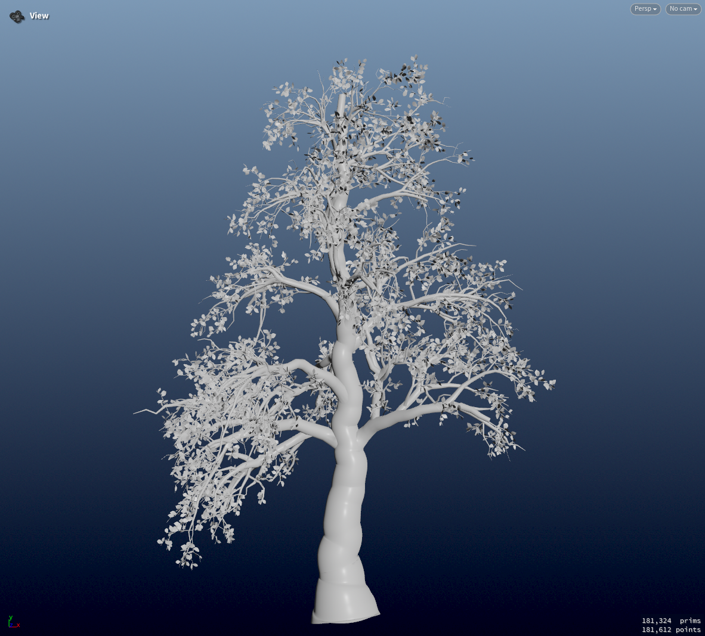|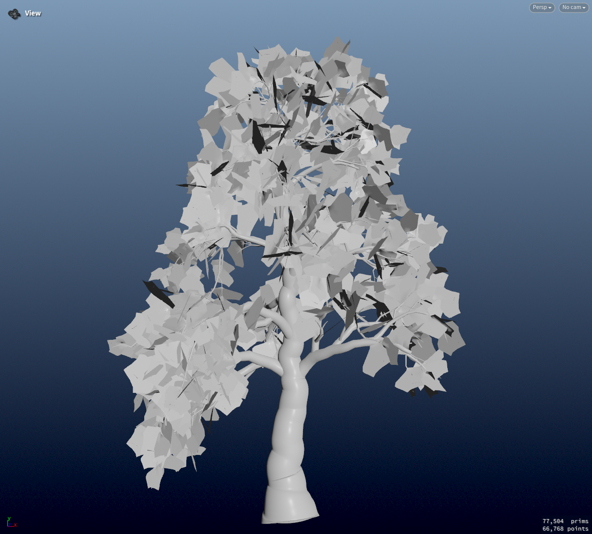|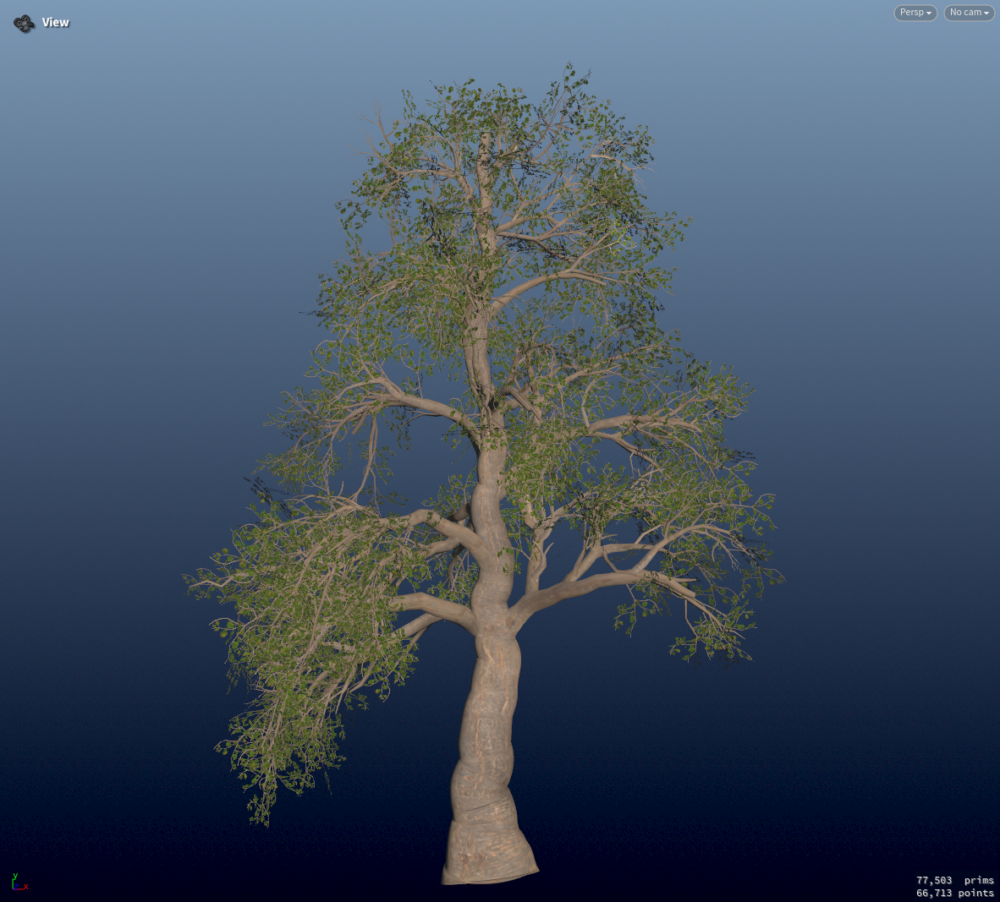|
--- | --- | --- |
`High Poly`|`Card Converting`|`Texturing`


1차원의 커브 위에 가지를 인스턴싱 하는 방법과 달리 2차원의 카드 위에 인스턴싱 할 때에는 다른 필터링이 필요 했다. 처음엔 scatter 노드로 포인트를 생성하고 그 위에 인스턴싱을 하는 구조를 생각했으나, 포인트를 생성하는 2차 비용이 발생하고, 필터링도 복잡한 공정이 예상되어 더 간단한 구조를 생각했다. 어차피 card로 메쉬를 가공할 때 일정한 간격의 포인트들이 카드 안에 존재하기 때문에 이를 활용하면 더 싸고 직관적인 조작이 가능했다. 카드는 기본적으로 root(B), mid(R), tip(G) 그룹을 가진다. **root는 카드를 인스턴싱할 때 피봇으로 사용된다. mid와 tip은 다른 카드들을 인스턴싱할 때 소스 포인트로 사용된다.** mid와 tip을 나눈 이유는 잎과 가지의 관계 때문이다. 중간용 가지를 따로 만들면 문제가 되진 않겠지만, 상대적으로 얇은 가지 끝에서 또 다른 가지가 난다는 것이 어색하기 때문이다.


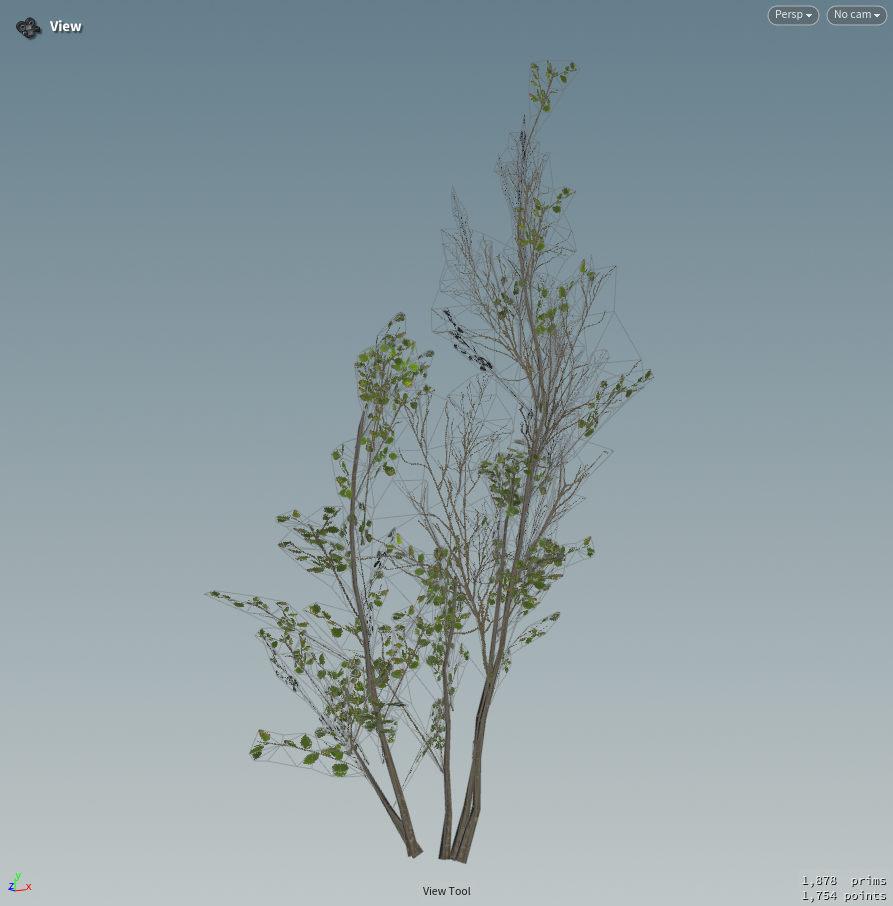|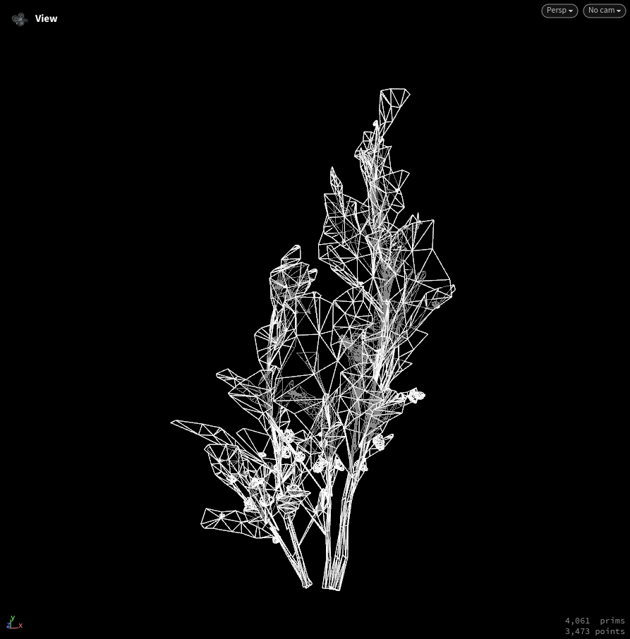|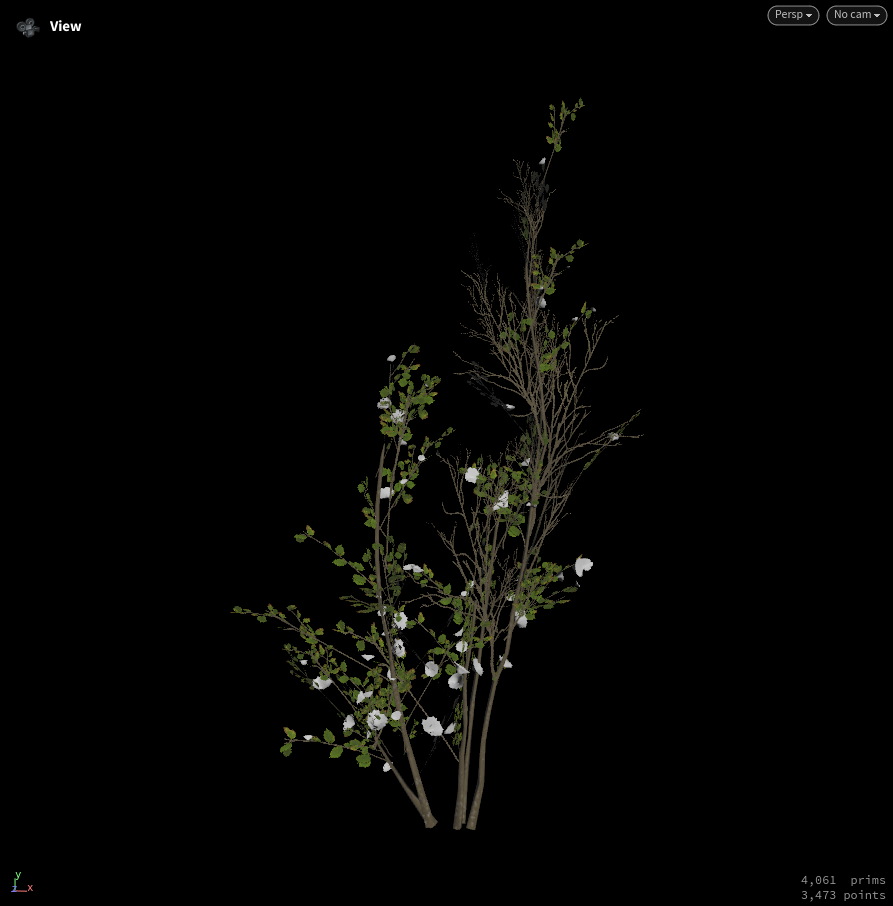|
--- | --- | --- |
`prims 1,878` `points 1,754` |||

가지를 카드로 만들고 인스턴싱하는 방법은 원하는 모양을 찾기 힘들 수 있기 때문에 다른 워크플로우를 추가적으로 고안해 내었는데, 하이 폴리로 만들어진 나무에서 원하는 레벨의 특정한 가지를 카드로 선별하는 기능이다. 해당 기능은 파라미터로 가지를 선별하고 원하는 방향에서 프로젝션하여 카드로 만들 수 있다. 이 과정에서 x, y, z 평면을 참조하는 방법을 사용했지만 **좀 더 직관적인 조작이 필요하다고 느껴 파이선과 VEX를 통해 카메라 프로젝션을 도입했다.** 확실히 원하는 모양의 레퍼런스를 쉽고 빠르게 찾을 수 있었다.


Card Convert 노드는 ribbon 타입을 지원한다. **ribbon 타입은 카드보다 폴리곤을 조금 더 쓰지만 훨씬 입체적**이며 상황에 따라서는 카드보다 훨씬 뛰어난 룩을 얻을 수 있다. 특히 작은 가지들의 디테일을 가진 경우 효과가 좋다.

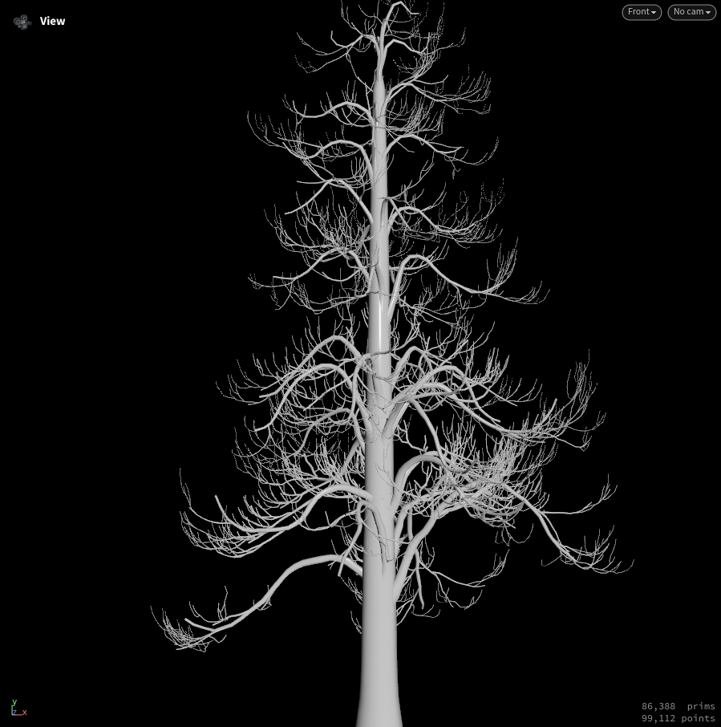 |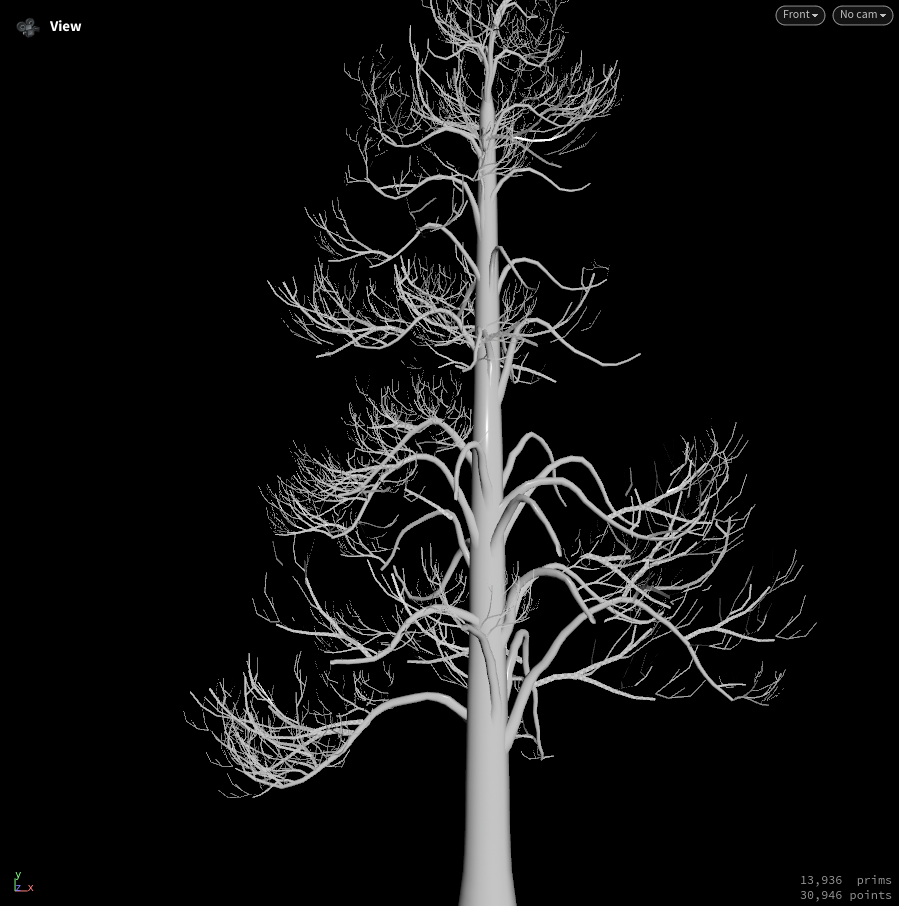  |
---|---|
`prims 86,388` `points 99,112` `highpoly`| `prims 13,936` `points 30,946` `ribbon`|

또한 texture 모드를 지원하여 아틀라스 텍스쳐 팩이 있다면 해당 잎의 폴리지 카드를 쉽게 뽑아낼 수 있다.
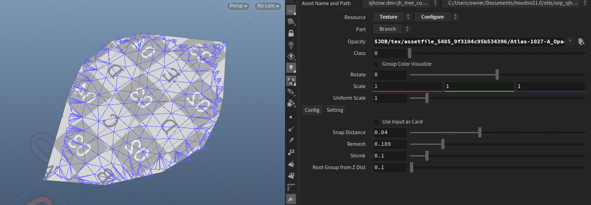

## Card Layout

최종적으로 uv 정리, 아틀라스 제작, normal 블렌딩, vertex color 생성 등이 이루어지는 마지막 노드이다. Layout 노드 사용 시 사용되었던 모든 카드의 `skin`과 `card` 지오메트리를 인풋 2, 3에 연결시켜 주어야 한다.

COPs를 이용해서 아틀라스의 basecolor, normal, roughness, mask를 제작했다. `card`에서 uv를 보존하여 texture를 샘플링하고 Extrapolate Boundaries 노드로 마무리 해주었다. normal 같은 경우는 나뭇잎이나 가지의 height 텍스쳐를 Height to Normal 노드로 변환하는 과정을 거친다.

같은 카드를 재사용하면 아틀라스 리소스 하나로 여러 개의 나무를 제작할 수 있다.

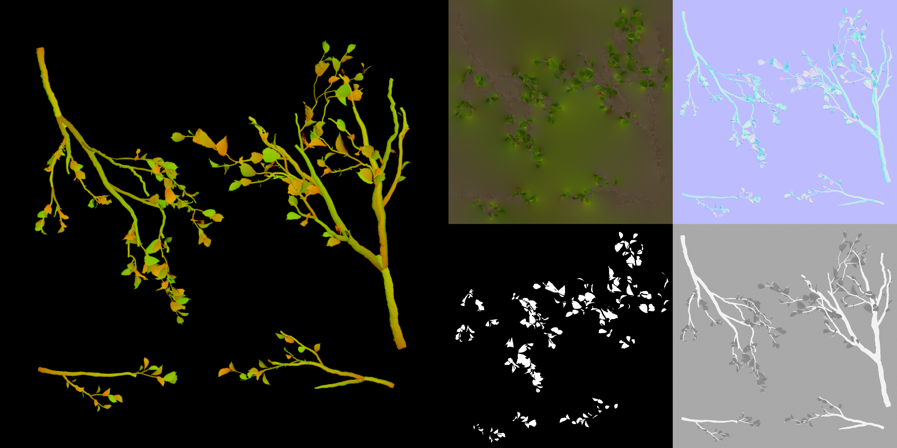
<!-- | |
--- | --- | -->

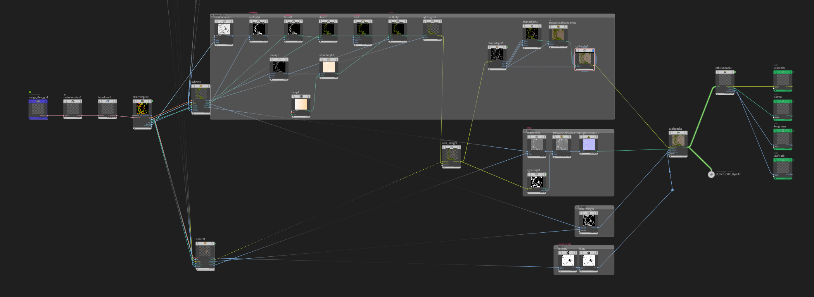

Layout 노드에서 부여되는 vertex color는 아웃풋 어트리뷰트 중 엔진에서 쓸만한 것들을 다듬어 놓은 것이다.
```
R = AO
G = Value ( 뿌리와 멀어질 수록 낮은 값. )
B = Curvature
```
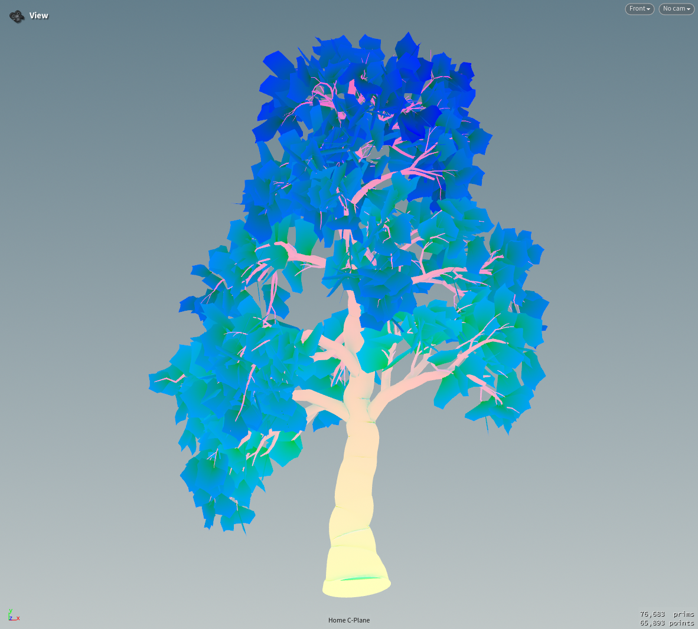

---

# Result
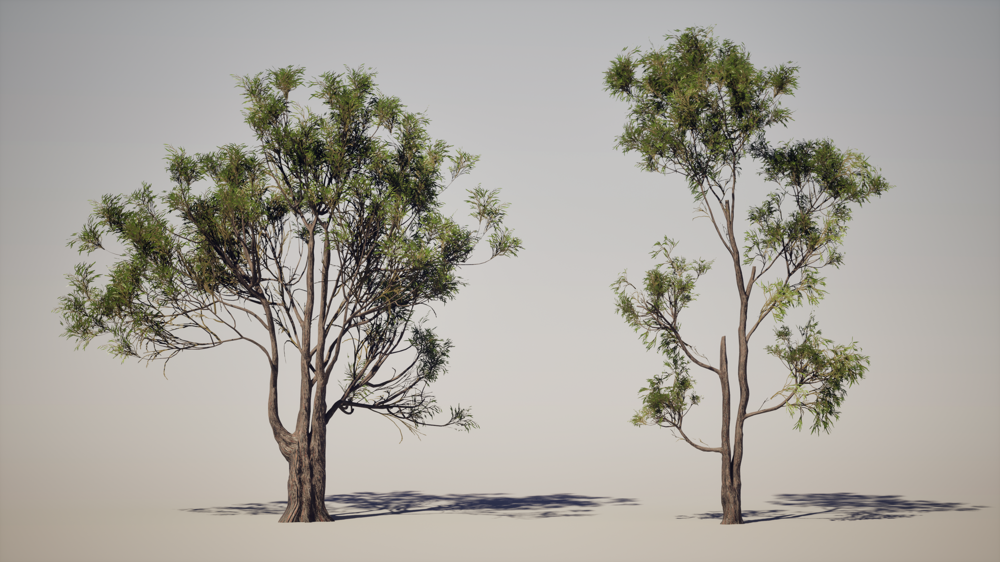
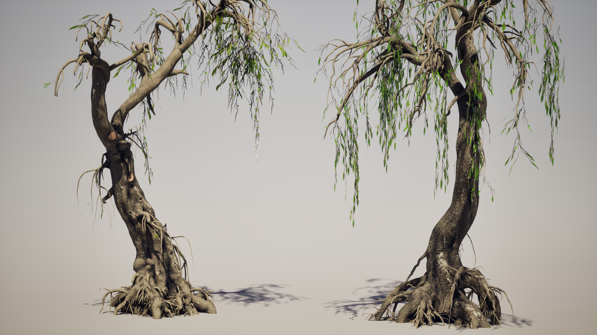
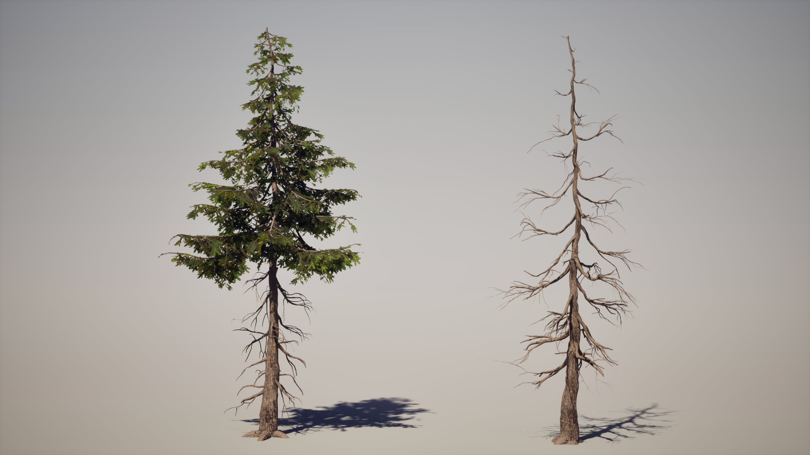
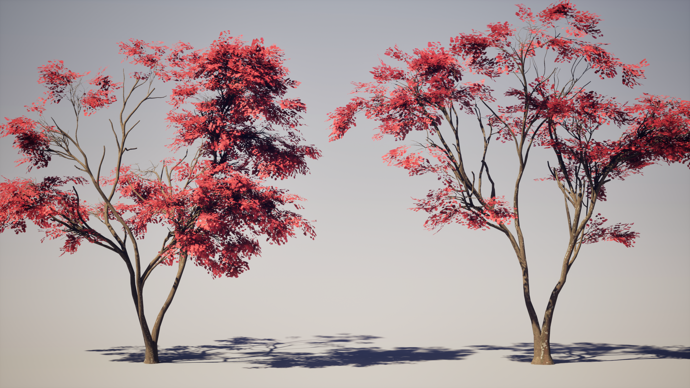
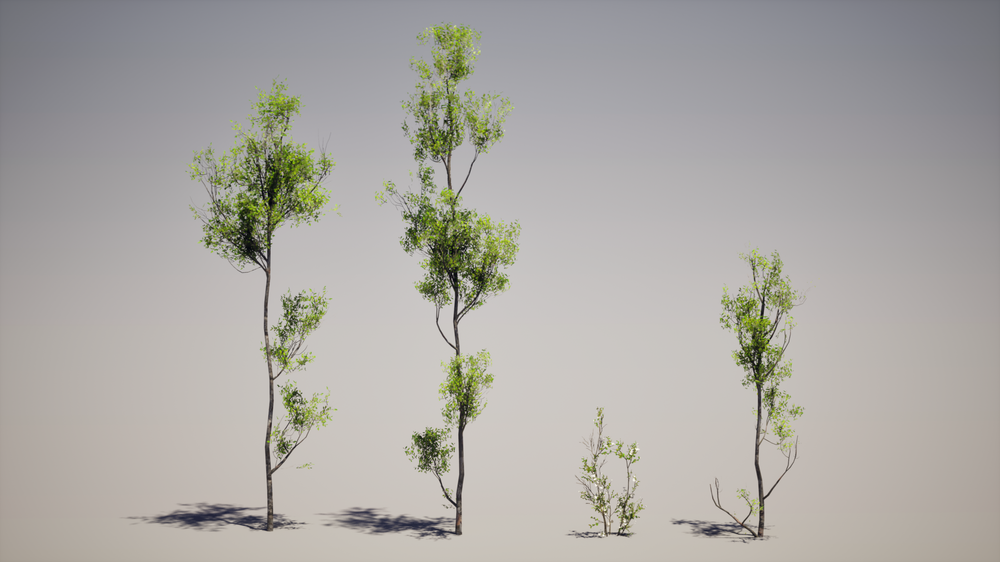
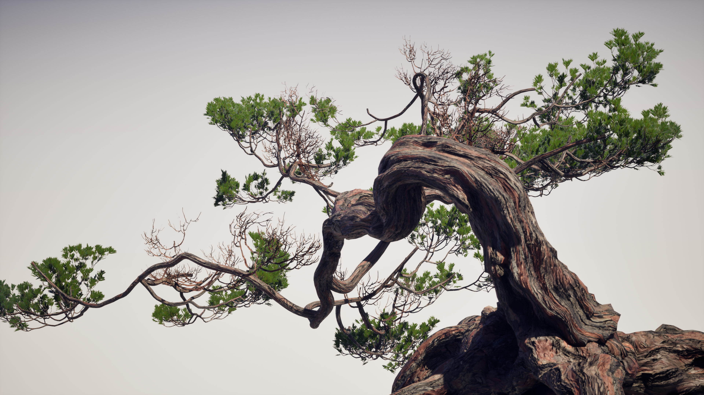
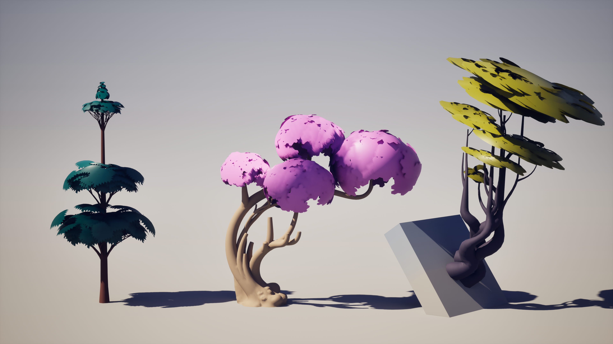
